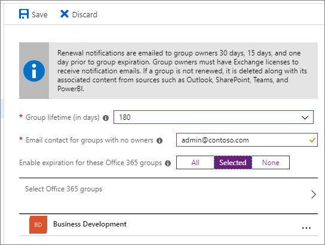

# Microsoft 365-Gruppen AblaufrichtlinieMicrosoft 365 group expiration policy

Durch die zunehmende Nutzung von Microsoft 365-Gruppen und Microsoft Teams benötigen Administratoren und Benutzer eine Möglichkeit, nicht verwendete Gruppen und Teams zu bereinigen.With the increase in usage of Microsoft 365 groups and Microsoft Teams, administrators and users need a way to clean up unused groups and teams. Eine Ablaufrichtlinie für Microsoft 365-Gruppen kann dazu beitragen, inaktive Gruppen aus dem System zu entfernen und die Dinge sauberer zu machen.A Microsoft 365 groups expiration policy can help remove inactive groups from the system and make things cleaner.

Wenn eine Gruppe abläuft, werden auch alle zugehörigen Dienste (Postfach, Planer, SharePoint-Website, Team usw.) gelöscht.When a group expires, all of its associated services (the mailbox, Planner, SharePoint site, team, etc.) are also deleted.

Wenn eine Gruppe abläuft, wird Sie "vorläufig gelöscht", was bedeutet, dass Sie noch bis zu 30 Tage wiederhergestellt werden kann.When a group expires it is "soft-deleted" which means it can still be recovered for up to 30 days.

Administratoren können einen Ablaufzeitraum angeben, und alle inaktiven Gruppen, die das Ende dieses Zeitraums erreichen und nicht erneuert werden, werden gelöscht.Administrators can specify an expiration period and any inactive group that reaches the end of that period, and is not renewed, will be deleted. (Dies umfasst Archivierte Teams.) Der Ablaufzeitraum beginnt mit der Erstellung der Gruppe oder mit dem Datum, an dem Sie zuletzt erneuert wurde.(This includes archived teams.) The expiration period begins when the group is created, or on the date it was last renewed. Gruppenbesitzer erhalten vor dem Ablauf automatisch eine E-Mail, die es ihnen erlaubt, die Gruppe für ein weiteres Ablaufintervall zu erneuern.Group owners will automatically be sent an email before the expiration that allows them to renew the group for another expiration interval. Microsoft Teams-Benutzer können persistente Benachrichtigungen in Microsoft Teams anzeigen.Teams users will see persistent notifications in Teams.

Gruppen, die aktiv verwendet werden, werden automatisch erneuert.Groups that are actively in use are renewed automatically. Durch eine der folgenden Aktionen wird automatisch eine Gruppe erneuert:Any of the following actions will auto-renew a group:
- SharePoint – anzeigen, bearbeiten, herunterladen, weiterleiten, freigeben oder Hochladen von Dateien.SharePoint - view, edit, download, move, share, or upload files.
- Outlook – beitreten einer Gruppe, lesen oder Schreiben von Gruppen Nachrichten der Gruppe und wie eine Nachricht (Outlook im Web).Outlook - join group, read or write group message from the group, and like a message (Outlook on the web).
- Teams – besuchen eines Teams-Kanals.Teams - visiting a teams channel.

> [!IMPORTANT]
> Wenn Sie die Ablaufrichtlinie ändern, berechnet der Dienst das Ablaufdatum für jede Gruppe neu.When you change the expiration policy, the service recalculates the expiration date for each group. Er beginnt immer ab dem Datum, an dem die Gruppe erstellt wurde, und wendet dann die neue Ablaufrichtlinie an.It always starts counting from the date when the group was created, and then applies the new expiration policy.

Es ist wichtig zu wissen, dass der Ablauf standardmäßig deaktiviert ist.It's important to know that expiration is turned off by default. Administratoren müssen Sie für Ihre Organisation aktivieren, wenn Sie Sie verwenden möchten.Administrators have to enable it for their organization if they want to use it.

> [!NOTE]
> Bei der Konfiguration und Verwendung der Ablaufrichtlinie für Microsoft 365-Gruppen müssen Sie Azure AD Premium-Lizenzen für die Mitglieder aller Gruppen, auf die die Ablaufrichtlinie angewendet wird, besitzen, jedoch nicht unbedingt zuweisen.Configuring and using the expiration policy for Microsoft 365 groups requires you to possess but not necessarily assign Azure AD Premium licenses for the members of all groups to which the expiration policy is applied. Weitere Informationen finden Sie unter [Erste Schritte mit Azure Active Directory Premium](https://docs.microsoft.com/azure/active-directory/active-directory-get-started-premium).For more information see [Getting started with Azure Active Directory Premium](https://docs.microsoft.com/azure/active-directory/active-directory-get-started-premium).

## Wer kann die Ablaufrichtlinie für Microsoft 365-Gruppen konfigurieren und verwenden?Who can configure and use the Microsoft 365 groups expiration policy?

|RolleRole|Was Sie tun könnenWhat they can do|
|---------|---------|
|Office 365 globaler Administrator (in Azure, der Unternehmensadministrator), Benutzer AdministratorOffice 365 global admin (in Azure, the Company administrator), User administrator|Erstellen, lesen, aktualisieren oder löschen Sie die Microsoft 365 Groups-Ablaufrichtlinien Einstellungen.Create, read, update, or delete the Microsoft 365 groups expiration policy settings.|
|UserUser|Erneuern oder [Wiederherstellen](https://docs.microsoft.com/azure/active-directory/users-groups-roles/groups-restore-deleted) einer eigenen Microsoft 365-GruppeRenew or [restore](https://docs.microsoft.com/azure/active-directory/users-groups-roles/groups-restore-deleted) an Microsoft 365 group that they own|

## Vorgehensweise Festlegen der AblaufrichtlinieHow to set the expiration policy

Wie oben erwähnt, ist ablaufy standardmäßig deaktiviert.As noted above, expiry is turned off by default. Ein Administrator muss die Ablaufrichtlinie aktivieren und die Eigenschaften festlegen, damit diese wirksam werden.An administrator will have to enable the expiration policy and set the properties for it to take effect. Um Sie zu aktivieren, gehen Sie zu **Azure Active Directory**  >  **Gruppen**  >  **Ablauf**.To enable it go to **Azure Active Directory** > **Groups** > **Expiration**. Hier können Sie die standardmäßige Gruppen Lebensdauer festlegen und angeben, wie weit im Voraus die ersten und zweiten Ablaufbenachrichtigungen zum Gruppenbesitzer wechseln sollen.Here you can set the default group lifetime and specify how far in advance you want the first and second expiration notifications to go to the group owner.

Die Gruppen Lebensdauer wird in Tagen angegeben und kann auf 180, 365 oder auf einen benutzerdefinierten Wert festgelegt werden, den Sie angeben.The group lifetime is specified in days and can be set to 180, 365 or to a custom value that you specify. Der benutzerdefinierte Wert muss mindestens 30 Tage lang sein.The custom value has to be at least 30 days.

Wenn die Gruppe keinen Besitzer hat, werden die Ablauf-e-Mails an den angegebenen Administrator weitergegeben.If the group does not have an owner, the expiration emails will go to the specified administrator.

Sie können die Richtlinie für alle Gruppen oder nur für ausgewählte Gruppen festlegen oder vollständig deaktivieren, indem Sie **keine**auswählen.You can set the policy for all of your groups, only selected groups, or turn it off completely by selecting **None**. Beachten Sie, dass Sie derzeit keine unterschiedlichen Richtlinien für verschiedene Gruppen haben können.Note that currently you can't have different policies for different groups.

## Funktionsweise des Ablaufs mit der AufbewahrungsrichtlinieHow expiry works with the retention policy

Wenn Sie eine Aufbewahrungsrichtlinie für Gruppen im Security and Compliance Center eingerichtet haben, funktioniert die Ablaufrichtlinie nahtlos mit der Aufbewahrungsrichtlinie.If you have set up a retention policy for groups in the Security and Compliance center, the expiration policy works seamlessly with retention policy. Wenn eine Gruppe abläuft, werden die Post Fach Unterhaltungen und-Dateien der Gruppe auf der Gruppen Website im Aufbewahrungscontainer für die bestimmte Anzahl von Tagen aufbewahrt, die in der Aufbewahrungsrichtlinie definiert sind.When a group expires, the group's mailbox conversations and files in the group site are retained in the retention container for the specific number of days defined in the retention policy. Benutzer sehen die Gruppe oder deren Inhalt nach Ablauf allerdings nicht.Users will not see the group, or its content, after expiration however.

## Wie und wann ein Gruppenbesitzer lernt, ob seine Gruppen ablaufenHow and when a group owner learns if their groups are going to expire

Gruppenbesitzer werden nur per e-Mail benachrichtigt.Group owners will only be notified via email. Wenn die Gruppe über Planner, SharePoint oder eine andere App erstellt wurde, werden die Ablaufbenachrichtigungen immer per e-Mail gesendet.If the group was created via Planner, SharePoint, or any other app, the expiration notifications will always come via email. Wenn die Gruppe über Teams erstellt wurde, erhält der Gruppenbesitzer eine Benachrichtigung, die über den Abschnitt "Aktivität" erneuert wird.If the group was created via Teams, the group owner will receive a notification to renew through the activity section. Es wird nicht empfohlen, den Ablauf für eine Gruppe zu aktivieren, wenn der Gruppenbesitzer keine gültige e-Mail-Adresse hat.It's not recommended that you enable expiration on a group if your group owner doesn't have a valid email address.

Dreißig Tage vor Ablauf der Gruppe erhalten die Gruppenbesitzer (oder die e-Mail-Adressen, die Sie für Gruppen ohne Besitzer angegeben haben) eine e-Mail-Nachricht, mit der Sie die Gruppe problemlos erneuern können.Thirty days before the group expires, the group owners (or the email addresses that you specified for groups that don't have an owner) will receive an email allowing them to easily renew the group. Wenn Sie es nicht erneuern, erhalten Sie eine weitere Verlängerungs-e-Mail 15 Tage vor Ablauf.If they don't renew it, they'll receive another renewal email 15 days before expiration. Wenn Sie es noch nicht erneuert haben, erhalten Sie eine weitere e-Mail-Benachrichtigung am Tag vor Ablauf.If they still haven't renewed it, they will receive one more email notification the day before expiration.

Wenn aus irgendeinem Grund keine der Besitzer oder Administratoren die Gruppe erneuern, bevor Sie abläuft, kann der Administrator die Gruppe noch bis zu 30 Tage nach Ablauf wiederherstellen.If for some reason none of the owners or admins renew the group before it expires, the admin can still restore the group for up to 30 days after expiration. Ausführliche Informationen finden Sie unter: [Wiederherstellen einer gelöschten Microsoft 365-Gruppe](https://support.office.com/article/restore-a-deleted-office-365-group-b7c66b59-657a-4e1a-8aa0-8163b1f4eb54).For details see: [Restore a deleted Microsoft 365 group](https://support.office.com/article/restore-a-deleted-office-365-group-b7c66b59-657a-4e1a-8aa0-8163b1f4eb54).

## Archivieren von GruppeninhaltenArchiving group contents

Wenn Sie über eine Gruppe verfügen, die Sie nicht mehr verwenden möchten, den Inhalt jedoch beibehalten möchten, finden Sie unter [Archive Groups, Teams und jammern](end-life-cycle-groups-teams-sites-yammer.md) Informationen zum Exportieren von Informationen aus den verschiedenen Gruppen Diensten.If you have a group that you no longer plan to use, but you want to retain its content, see [Archive groups, teams, and Yammer](end-life-cycle-groups-teams-sites-yammer.md) for information about how to export information from the different groups services.

## Verwandte ArtikelRelated articles

[Übersicht über AufbewahrungsrichtlinienOverview of retention policies](https://support.office.com/article/5e377752-700d-4870-9b6d-12bfc12d2423)

[Zuweisen eines neuen Besitzers zu einer verwaisten GruppeAssign a new owner to an orphaned group](https://support.office.com/article/86bb3db6-8857-45d1-95c8-f6d540e45732)

[Konfigurieren des Ablaufs von Microsoft 365-GruppenConfigure Microsoft 365 groups expiration](https://docs.microsoft.com/azure/active-directory/active-directory-groups-lifecycle-azure-portal)
