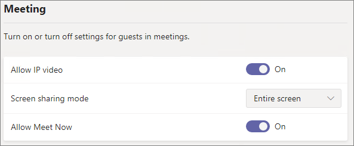

# Referenz zu Gastfreigabeeinstellungen für Microsoft 365Microsoft 365 guest sharing settings reference

Dieser Artikel bietet eine Referenz zu den verschiedenen Einstellungen, die sich auf die Freigabe für Personen außerhalb Ihrer Organisation für Microsoft 365-Workloads auswirken können: Teams, Microsoft 365-Gruppen, SharePoint und OneDrive.This article provides a reference for the various settings that can affect sharing with people outside your organization for the Microsoft 365 workloads: Teams, Microsoft 365 Groups, SharePoint, and OneDrive. Diese Einstellungen befinden sich in Azure Active Directory, Microsoft 365, Teams und SharePoint Admin Center.These settings are located in the Azure Active Directory, Microsoft 365, Teams, and SharePoint admin centers.

## Azure Active DirectoryAzure Active Directory

**Administratorrolle:** Globaler Administrator**Admin role:** Global administrator

Azure Active Directory ist der von Microsoft 365 verwendete Verzeichnisdienst.Azure Active Directory is the directory service used by Microsoft 365. Die Einstellungen für Azure Active Directory-Organisationsbeziehungen wirken sich unmittelbar auf die Freigabe in Teams, Microsoft 365-Gruppen, SharePoint und OneDrive aus.The Azure Active Directory Organizational relationships settings directly affect sharing in Teams, Microsoft 365 Groups, SharePoint, and OneDrive.

> [!NOTE]
> Diese Einstellungen betreffen SharePoint nur, wenn die [SharePoint- und OneDrive-Integration in Azure AD B2B](/sharepoint/sharepoint-azureb2b-integration-preview) konfiguriert wurde.These settings only affect SharePoint when [SharePoint and OneDrive integration with Azure AD B2B](/sharepoint/sharepoint-azureb2b-integration-preview) has been configured. Die nachstehende Tabelle setzt voraus, dass diese Konfiguration vorgenommen wurde.The table below assumes that this has been configured.

### Einstellungen für die externe ZusammenarbeitExternal collaboration settings

**Navigation:** [Azure Active Directory Admin Center](https://aad.portal.azure.com) > Azure Active Directory-> externe Identitäten >-Einstellungen für die externe Zusammenarbeit**Navigation:** [Azure Active Directory admin center](https://aad.portal.azure.com) > Azure Active Directory > External Identities > External collaboration settings

| EinstellungSetting | StandardDefault | BeschreibungDescription |
|:-----|:-----|:-----|
|GastbenutzerzugriffGuest user access|Gastbenutzer haben eingeschränkten Zugriff auf Eigenschaften und Mitgliedschaften von Verzeichnisobjekten.Guest users have limited access to properties and memberships of directory objects|Bestimmt die [Berechtigungen von Gästen in Azure Active Directory](/azure/active-directory/fundamentals/users-default-permissions).Determines the [permissions that guests have in Azure Active Directory](/azure/active-directory/fundamentals/users-default-permissions).|
|GasteinladungseinstellungenGuest invite settings|Jede Person in der Organisation kann Gastbenutzer einladen, einschließlich Gastbenutzer und Nicht-Administratoren.Anyone in the organization can invite guest users including guests and non-admins|Bestimmt, ob Gäste, Mitglieder und Administratoren Gäste zur Organisation einladen können.Determines whether guests, members, and admins can invite guests to the organization. 
 Diese Einstellung wirkt sich auf Microsoft 365-Freigabefunktionen wie Teams und SharePoint aus.This setting affects  Microsoft 365 sharing experiences such as Teams and SharePoint.|
|Self-Service-Registrierung für Gäste über Benutzerabläufe aktivierenEnable guest self-service sign up via user flows|NeinNo|Bestimmt, ob Sie Benutzerabläufe erstellen können, die es einer Person ermöglichen, sich für eine von Ihnen erstellte App zu registrieren und ein neues Gastkonto zu erstellen.Determines if you can create user flows that allow someone to sign up for an app that you created and create a new guest account.|
|Einschränkungen für die ZusammenarbeitCollaboration restrictions|Senden von Einladungen an beliebige Domäne zulassenAllow invitations to be sent to any domain|Diese Einstellung ermöglicht es Ihnen, eine Liste der zulässigen oder gesperrte Domänen für die Freigabe festzulegen.This setting allows you to specify a list of allowed or blocked domains for sharing. Wenn zulässige Domänen angegeben sind, können Freigabeeinladungen nur an diese Domänen gesendet werden.When allowed domains are specified, then sharing invitations can only be sent to those domains. Wenn gesperrte Domänen angegeben sind, können keine Freigabeeinladungen an diese Domänen gesendet werden.When denied domains are specified, then sharing invitations cannot be sent to those domains. 
 Diese Einstellung wirkt sich auf Microsoft 365-Freigabefunktionen wie Teams und SharePoint aus.This setting affects  Microsoft 365 sharing experiences such as Teams and SharePoint. Mit der Domänenfilterung in SharePoint oder Teams können Sie Domänen auf einer differenzierteren Ebene zulassen oder sperren.You can allow or block domains at a more granular level by using domain filtering in SharePoint or Teams.|

Diese Einstellungen wirken sich auf die Art und Weise aus, wie Benutzer in das Verzeichnis eingeladen werden.These settings affect how users are invited to the directory. Sie wirken sich nicht auf die Freigabe für Gäste aus, die sich bereits im Verzeichnis befinden.They do not affect sharing with guests who are already in the directory.

## Microsoft 365Microsoft 365

**Administratorrolle:** Globaler Administrator**Admin role:** Global administrator

Das Microsoft 365 Admin Center bietet Einstellungen auf Organisationsebene für die Freigabe und für Microsoft 365-Gruppen.The Microsoft 365 admin center has organization-level settings for sharing and for Microsoft 365 Groups.

### FreigabeSharing

**Navigation:**[Microsoft 365 Admin Center](https://admin.microsoft.com) > Einstellungen > Org Einstellungen > Sicherheit und Datenschutz > Freigabe**Navigation:** [Microsoft 365 admin center](https://admin.microsoft.com) > Settings > Org Settings > Security & privacy tab > Sharing

| EinstellungSetting | StandardDefault | BeschreibungDescription |
|:-----|:-----|:-----|
|Benutzer dürfen neue Gäste zur Organisation hinzufügenLet users add new guests to the organization|EinOn|Ist diese Option auf **Ja** festgelegt, können Azure AD-Mitglieder Gäste über Azure AD einladen. Ist die Option auf **Nein** festgelegt, ist dies nicht möglich.When set to **Yes**, Azure AD members can invite guests via Azure AD; when set to **No**, they cannot. Ist diese Option auf **Ja** festgelegt, können Microsoft 365-Gruppenmitglieder Gäste mit Genehmigung des Besitzers einladen. Ist die Option auf **Nein** festgelegt, können Microsoft 365-Gruppenmitglieder Gäste mit Genehmigung des Besitzers einladen, die Besitzer müssen jedoch globale Administratoren sein, um die Genehmigung zu erteilen.When set to **Yes**, Microsoft 365 Group members can invite guests with owner approval; when set to **No**, Microsoft 365 Group members can invite guests with owner approval but owners must be global administrators to approve. 
 Bitte beachten Sie, dass **können einladen** sich auf Mitglieder in Azure AD (im Gegensatz zu Gästen) bezieht und nicht auf Website- oder Gruppenmitglieder in Microsoft 365.Note that **Members can invite** refers to members in Azure AD (as opposed to guests) and not to site or group members in  Microsoft 365. 
 Dieser Wert ist mit der Einstellung **Mitglieder können einladen** in den Azure Active Directory-Einstellungen für Organisationsbeziehungen identisch.This is identical to the **Members can invite** setting in Azure Active Directory Organizational relationships settings.|

### Microsoft 365-GruppenMicrosoft 365 Groups

**Navigation:**[Microsoft 365 Admin Center](https://admin.microsoft.com) > Einstellungen > Einstellungen > Microsoft 365-Gruppen**Navigation:** [Microsoft 365 admin center](https://admin.microsoft.com) > Settings > Settings > Microsoft 365 Groups

| EinstellungSetting | StandardDefault | BeschreibungDescription |
|:-----|:-----|:-----|
|Gruppenmitglieder von außerhalb Ihrer Organisation dürfen auf Gruppeninhalte zugreifenLet group members outside your organization access group content|EinOn|Ist diese Option aktiviert, können Gäste auf Gruppeninhalte zugreifen. Ist die Option deaktiviert, ist dies nicht möglich.When set to **On**, guests can access groups content; when set to **Off**, they can't. Diese Einstellung sollte für alle Szenarien **aktiviert** sein, in denen Gastbenutzer mit Microsoft 365-Gruppen oder Teams interagieren.This setting should be **On** for any scenario where guests are interacting with Microsoft 365 Groups or Teams.|
|Erlauben Sie Gruppenbesitzern, Personen von außerhalb Ihrer Organisation zu Gruppen hinzuzufügenLet group owners add people outside your organization to groups|EinOn|Ist diese Option **aktiviert**, können Besitzer von Microsoft 365-Gruppen oder -Teams neue Gäste zur Gruppe einladen.When **On**, Owners of Microsoft 365 Groups or Teams can invite new guests to the group. Ist diese Option deaktiviert, können Besitzer nur Gäste einladen, die sich bereits im Verzeichnis befinden.When **Off**, owners can only invite guests who are already in the directory.|

Diese Einstellungen erfolgen auf Organisationsebene.These settings are at the organization level. Informationen zum Ändern dieser Einstellungen auf Gruppenebene mithilfe von PowerShell finden Sie unter [Erstellen von Einstellungen für eine bestimmte Gruppe](/azure/active-directory/users-groups-roles/groups-settings-cmdlets#create-settings-for-a-specific-group).See [Create settings for a specific group](/azure/active-directory/users-groups-roles/groups-settings-cmdlets#create-settings-for-a-specific-group) for information about how to change these settings at the group level by using PowerShell.

## Microsoft TeamsTeams

Die Teams-Masteroption für den Gastzugriff, **Gastzugriff in Teams ermöglichen**, muss aktiviert sein, damit die übrigen Gasteinstellungen verfügbar sind.The Teams master guest access switch, **Allow guest access in Teams**, must be **On** for the other guest settings to be available.

**Administratorrolle:** Teams-Dienstadministrator**Admin role:** Teams service administrator

### GastzugriffGuest access

**Navigation:** [Teams Admin Center](https://admin.teams.microsoft.com) > Organisationsweite Einstellungen > Gastzugriff**Navigation:** [Teams admin center](https://admin.teams.microsoft.com) > Org-wide settings > Guest access

| EinstellungSetting | StandardDefault | BeschreibungDescription |
|:-----|:-----|:-----|
|Gastzugriff in Teams ermöglichenAllow guest access in Teams|AusOff|Aktiviert oder deaktiviert den Gastzugriff für Teams insgesamt.Turns guest access on or off for Teams overall. Es kann bis zu 24 Stunden dauern, bis eine Änderung dieser Einstellung wirksam wird.This setting can take 24 hours to take effect once changed.|

### Anrufeinstellungen für GästeGuest calling

**Navigation:** [Teams Admin Center](https://admin.teams.microsoft.com) > Organisationsweite Einstellungen > Gastzugriff**Navigation:** [Teams admin center](https://admin.teams.microsoft.com) > Org-wide settings > Guest access

| EinstellungSetting | StandardDefault | BeschreibungDescription |
|:-----|:-----|:-----|
|Private Anrufe führenMake private calls|EinOn|Ist diese Option aktiviert, können Gäste in Teams Peer-to-Peer-Anrufe führen. Ist die Option deaktiviert, ist dies nicht möglich.When **On**, guests can make peer-to-peer calls in Teams; when **Off**, they can't.|

### Besprechungseinstellungen für GästeGuest meeting

**Navigation:** [Teams Admin Center](https://admin.teams.microsoft.com) > Organisationsweite Einstellungen > Gastzugriff**Navigation:** [Teams admin center](https://admin.teams.microsoft.com) > Org-wide settings > Guest access

| EinstellungSetting | StandardDefault | BeschreibungDescription |
|:-----|:-----|:-----|
|IP-Video zulassenAllow IP video|EinOn|Ist diese Option aktiviert, können Gäste in ihren Anrufen und Besprechungen Video verwenden. Ist die Option deaktiviert, ist dies nicht möglich.When **On**, guests can use video in their calls and meetings; when **Off**, they can't.|
|BildschirmfreigabemodusScreen sharing mode|Gesamter BildschirmEntire screen|Ist diese Option auf **Deaktiviert** festgelegt, können Gäste ihre Bildschirme nicht in Teams freigeben.When **Disabled**, guests can't share their screens in Teams. Ist die Option auf **Einzelne Anwendung** festgelegt, können Gäste nur eine einzelne Anwendung auf ihrem Bildschirm freigeben.When set to **Single application**, guests can only share a single application on their screen. Ist die Option auf **Gesamter Bildschirm** festgelegt, können Gäste wählen, ob sie eine Anwendung oder ihren gesamten Bildschirm freigeben möchten.When set to **Entire screen**, guests can choose to share an application or their entire screen.|
|Sofortbesprechungen zulassenAllow Meet Now|EinOn|Ist diese Option aktiviert, können Gäste das Feature "Sofortbesprechungen zulassen" in Teams verwenden. Ist die Option deaktiviert, ist dies nicht möglich.When **On**, guests can use the Meet Now feature in Teams; when **Off**, they can't.|

### Messagingeinstellungen für GästeGuest messaging

**Navigation:** [Teams Admin Center](https://admin.teams.microsoft.com) > Organisationsweite Einstellungen > Gastzugriff**Navigation:** [Teams admin center](https://admin.teams.microsoft.com) > Org-wide settings > Guest access

| EinstellungSetting | StandardDefault | BeschreibungDescription |
|:-----|:-----|:-----|
|Gesendete Nachrichten bearbeitenEdit sent messages|EinOn|Ist diese Option aktiviert, können Gäste zuvor gesendete Nachrichten bearbeiten. Ist die Option deaktiviert, ist dies nicht möglich.When **On**, guests can edit messages they previously sent; when **Off**, they can't.|
|Gesendete Nachrichten löschenDelete sent messages|EinOn|Ist diese Option aktiviert, können Gäste zuvor gesendete Nachrichten löschen. Ist die Option deaktiviert, ist dies nicht möglich.When **On**, guests can delete messages they previously sent; when **Off**, they can't.|
|ChatChat|EinOn|Ist diese Option aktiviert, können Gäste den Chat in Teams verwenden. Ist die Option deaktiviert, ist dies nicht möglich.When **On**, guests can use chat in Teams; when **Off**, they can't.|
|Giphys in Unterhaltungen verwendenUse Giphys in conversations|EinOn|Ist diese Option aktiviert, können Gäste Giphys in Unterhaltungen verwenden. Ist die Option deaktiviert, ist dies nicht möglich.When **On**, guests can use Giphys in conversations; when **Off**, they can't.|
|Giphy-InhaltsklassifikationGiphy content rating|MittelModerate|Ist diese Option auf **Alle Inhalte zulassen** festgelegt, können Gäste alle Giphys in Chats einfügen, unabhängig von der Inhaltsbewertung.When set to **Allow all content**, guests will can insert all Giphys in chats, regardless of the content rating. Ist diese Option auf **Moderat** festgelegt, können Gäste Giphys in Chats einfügen, der Zugriff auf nicht jugendfreie Inhalte wird aber moderat eingeschränkt.When set to **Moderate** guests can insert Giphys in chats, but will be moderately restricted from adult content. Ist diese Option auf **Streng** festgelegt, können Gäste Giphys in Chats einfügen, der Zugriff auf nicht jugendfreie Inhalte wird aber eingeschränkt.When set to **Strict** guests can insert Giphys in chats, but will be restricted from inserting adult content.|
|Memes in Unterhaltungen verwendenUse Memes in conversations|EinOn|Ist diese Option aktiviert, können Gäste Memes in Unterhaltungen verwenden. Ist die Option deaktiviert, ist dies nicht möglich.When **On**, guests can use memes in conversations; when **Off**, they can't.|
|Sticker in Unterhaltungen verwendenUser stickers in conversations|EinOn|Ist diese Option aktiviert, können Gäste Sticker in Unterhaltungen verwenden. Ist die Option deaktiviert, ist dies nicht möglich.When **On**, guests can use stickers in conversations; when **Off**, they can't.|
|Plastischen Reader zum Anzeigen von Nachrichten zulassenAllow immersive reader for viewing messages|EinOn|Ist diese Option aktiviert, können Gäste Nachrichten im plastischen Reader anzeigen. Ist die Option deaktiviert, ist dies nicht möglich.When **On**, guests can view messages in Immersive Reader; when **Off**, they can't.|

## SharePoint-und OneDrive (Organisationsebene)SharePoint and OneDrive (organization-level)

**Administratorrolle:** SharePoint-Administrator**Admin role:** SharePoint administrator

Diese Einstellungen wirken sich auf alle Websites in der Organisation aus.These settings affect all of the sites in the organization. Sie wirken sich nicht direkt auf Microsoft 365-Gruppen oder -Teams aus. Es wird jedoch empfohlen, diese Einstellungen mit den Einstellungen für Microsoft 365-Gruppen und -Teams zu vereinheitlichen, um Probleme mit der Benutzererfahrung zu vermeiden.They do not affect Microsoft 365 Groups or Teams directly, however we recommend that you align these settings with the settings for Microsoft 365 Groups and Teams to avoid user experience issues. (Wenn die Gastfreigabe z. B. in Teams, aber nicht in SharePoint zulässig ist, haben Gäste in Teams keinen Zugriff auf die Registerkarte "Dateien", da Teams-Dateien in SharePoint gespeichert werden.)(For example, if guest sharing is allowed in Teams but not SharePoint, then guests in Teams will not have access to the Files tab because Teams files are stored in SharePoint.)

### SharePoint- und OneDrive-FreigabeeinstellungenSharePoint and OneDrive sharing settings

Da OneDrive eine Hierarchie von Websites in SharePoint ist, wirken sich die Freigabeeinstellungen auf Organisationsebene direkt auf OneDrive aus, genau wie für andere SharePoint-Websites.Because OneDrive is a hierarchy of sites within SharePoint, the organization-level sharing settings directly affect OneDrive just as they do other SharePoint sites.

**Navigation:** SharePoint Admin Center-> Freigabe**Navigation:** SharePoint admin center > Sharing

| EinstellungSetting | StandardDefault | BeschreibungDescription |
|:-----|:-----|:-----|
|SharePointSharePoint|JederAnyone|Die am wenigsten restriktiven Freigabeberechtigungen für SharePoint-Websites.Specifies the most permissive sharing permissions allowed for SharePoint sites.|
|OneDriveOneDrive|JederAnyone|Die am wenigsten restriktiven Freigabeberechtigungen für OneDrive-Websites.Specifies the most permissive sharing permissions allowed for OneDrive sites. Diese Einstellung kann nicht weniger restriktiv sein als die SharePoint-Einstellung.This setting cannot be more permissive than the SharePoint setting.|

### Erweiterte Freigabeeinstellungen für SharePoint und OneDriveSharePoint and OneDrive advanced sharing settings

**Navigation:** SharePoint Admin Center-> Freigabe**Navigation:** SharePoint admin center > Sharing

| EinstellungSetting | StandardDefault | BeschreibungDescription |
|:-----|:-----|:-----|
|Einschränken der externen Freigabe mithilfe von DomänenLimit external sharing by domain|AusOff|Diese Einstellung ermöglicht es Ihnen, eine Liste der zulässigen oder gesperrte Domänen für die Freigabe festzulegen.This setting allows you to specify a list of allowed or blocked domains for sharing. Wenn zulässige Domänen angegeben sind, können Freigabeeinladungen nur an diese Domänen gesendet werden.When allowed domains are specified, then sharing invitations can only be sent to those domains. Wenn gesperrte Domänen angegeben sind, können keine Freigabeeinladungen an diese Domänen gesendet werden.When denied domains are specified, then sharing invitations cannot be sent to those domains. 
 Diese Einstellung wirkt sich auf alle SharePoint- und OneDrive-Websites in der Organisation aus.This setting affects all SharePoint and OneDrive sites in the organization.|
|Ausschließlich Benutzern in bestimmten Sicherheitsgruppen die externe Freigabe erlaubenAllow only users in specific security groups to share externally|AusOff|Wenn Sie einschränken möchten, welche Personen in SharePoint und OneDrive Elemente für Gäste freigeben können, können Sie die Freigabe für Personen in bestimmten Sicherheitsgruppen einschränken.If you want to limit who can share with guests in SharePoint and OneDrive, you can do so by limiting sharing to people in specified security groups. Diese Einstellungen wirken sich nicht auf die Freigabe über Microsoft 365-Gruppen oder -Teams aus.These settings do not affect sharing via Microsoft 365 Groups or Teams. Gäste, die über eine Gruppe oder ein Team eingeladen wurden, haben auch Zugriff auf die zugehörige Website, obwohl die Freigabe von Dokumenten und Ordnern nur von Personen in den angegebenen Sicherheitsgruppen ausgeführt werden kann.Guests invited via a group or team would also have access to the associated site, though document and folder sharing could only be done by people in the specified security groups. 
 Für jede angegebene Gruppe können Sie auswählen, welche dieser Benutzer mit „Jeder“-Links teilen können.For each specified group, you can choose of those users can share with Anyone links.|
|Gäste müssen sich mit dem gleichen Konto anmelden, an das auch Freigabeeinladungen gesendet werdenGuests must sign in using the same account to which sharing invitations are sent|AusOff|Hindert Gäste daran, Websitefreigabeeinladungen mit einer anderen E-Mail-Adresse als der Adresse einzulösen, an die die Einladung gesendet wurde.Prevents guests from redeeming site sharing invitations using a different email address than the invitation was sent to. 
 In [SharePoint- und OneDrive-Integration in Azure AD B2B (Vorschau)](/sharepoint/sharepoint-azureb2b-integration-preview) wird diese Einstellung nicht verwendet, da alle Gäste dem Verzeichnis basierend auf der E-Mail-Adresse, an die die Einladung gesendet wurde, hinzugefügt werden.[SharePoint and OneDrive integration with Azure AD B2B (Preview)](/sharepoint/sharepoint-azureb2b-integration-preview) does not use this setting because all guests are added to the directory based on the email address that the invitation was sent to. Alternative E-Mail-Adressen können für den Zugriff auf die Website nicht verwendet werden.Alternate email addresses cannot be used to access the site.|
|Gästen das Freigeben von Elementen erlauben, die sich nicht in ihrem Besitz befindenAllow guests to share items they don't own|EinOn|Ist diese Option aktiviert, können Gäste Elemente, die Sie nicht besitzen, für andere Benutzer oder Gäste freigeben. Ist die Option deaktiviert, ist dies nicht möglich.When **On**, guests can share items that they don't own with other users or guests; when **Off** they cannot. Gäste können Elemente, für die Sie über Vollzugriff verfügen, immer freigeben.Guests can always share items for which they have full control.|
|Personen, die einen Verifizierungscode verwenden, müssen sich nach so vielen Tagen wieder authentifizieren.People who use a verification code must reauthenticate after this many days|AusOff|Mit dieser Einstellung können Sie festlegen, dass Benutzer, die sich mit einem Einmalkennung authentifizieren, sich nach einer bestimmten Anzahl von Tagen erneut authentifizieren müssen.This setting allows you to require that users authenticating with a one-time passcode need to reauthenticate after a certain number of days.|

### Linkeinstellungen für Dateien und Ordner in SharePoint und OneDriveSharePoint and OneDrive file and folder link settings

Wenn Dateien und Ordner in SharePoint und OneDrive freigegeben werden, wird den Freigabeempfängern ein Link mit Berechtigungen für die Datei oder den Ordner gesendet, anstatt ihnen direkten Zugriff auf die Datei oder den Ordner zu gewähren.When files and folders are shared in SharePoint and OneDrive, sharing recipients are sent a link with permissions to the file or folder rather than being granted direct access to the file or folder themselves. Neben dem Standardlinktyp, der Benutzern beim Freigeben einer Datei oder eines Ordners angezeigt wird, stehen verschiedene weitere Arten von Links zur Verfügung.Several types of links are available, and you can choose the default link type presented to users when they share a file or folder. Sie können auch Berechtigungen und Ablaufoptionen für *Jeder*-Links festlegen.You can also set permissions and expiration options for *Anyone* links.

**Navigation:** SharePoint Admin Center-> Freigabe**Navigation:** SharePoint admin center > Sharing

| EinstellungSetting | StandardDefault | BeschreibungDescription |
|:-----|:-----|:-----|
|Datei- und OrdnerlinksFile and folder links|Jeder mit diesem LinkAnyone with the link|Gibt an, welcher Freigabelink standardmäßig angezeigt wird, wenn ein Benutzer eine Datei oder einen Ordner freigibt.Specifies which sharing link is shown by default when a user shares a file or folder. Benutzer können die Option bei Bedarf vor der Freigabe ändern.Users can change the option before sharing if they want. Wenn die Standardeinstellung auf **Jeder mit diesem Link** festgelegt ist und die *Jeder*-Freigabe für eine bestimmte Website nicht zulässig ist, wird **Nur Personen in Ihrer Organisation** als Standard für diese Website angezeigt.If the default is set to **Anyone with the link** and *Anyone* sharing is not allowed for a given site, then **Only people in your organization** will be shown as the default for that site.|
|Diese Links müssen innerhalb dieser Anzahl von Tagen ablaufenThese links must expire within this many days|Aus (kein Ablaufdatum)Off (no expiration)|Gibt an, wie viele Tage nach Erstellung ein *Jeder*-Link abläuft.Specifies the number of days after an *Anyone* link is created that it expires. Abgelaufene Links können nicht verlängert werden.Expired links cannot be renewed. Erstellen Sie einen neuen Link, wenn die Freigabe über das Ablaufdatum hinaus fortgesetzt werden soll.Create a new link if you need to continue sharing past the expiration.|
|DateiberechtigungenFile permissions|Anzeigen und bearbeitenView and edit|Gibt die Dateiberechtigungsstufen an, die für Benutzer beim Erstellen eines *Jeder*-Links verfügbar sind.Specifies the file permission levels available to users when creating an *Anyone* link. Wird **Anzeigen** ausgewählt, können Benutzer nur *Jeder*-Dateilinks mit der Berechtigung "Anzeigen" erstellen.If **View** is selected, then users can only create *Anyone* file links with view permissions. Wird **Anzeigen und bearbeiten** ausgewählt, können Benutzer beim Erstellen des Links zwischen den Berechtigungen "Anzeigen" und "Anzeigen und bearbeiten" auswählen.If **View, and edit** is selected, then users can choose between view and view and edit permissions when they create the link.|
|OrdnerberechtigungenFolder permissions|Anzeigen, bearbeiten und hochladenView, edit, and upload|Gibt die Ordnerberechtigungsstufen an, die für Benutzer beim Erstellen eines *Jeder*-Links verfügbar sind.Specifies the folder permission levels available to users when creating an *Anyone* link. Wird **Anzeigen** ausgewählt, können Benutzer nur *Jeder*-Ordnerlinks mit der Berechtigung "Anzeigen" erstellen.If **View** is selected, then users can only create *Anyone* folder links with view permissions. Wird **Anzeigen, bearbeiten und hochladen** ausgewählt, können Benutzer beim Erstellen des Links zwischen den Berechtigungen "Anzeigen" und "Anzeigen, bearbeiten und hochladen" auswählen.If **View, edit, and upload** is selected, then users can choose between view and view, edit, and upload permissions when they creat the link.|

## SharePoint (Websiteebene)SharePoint (site level)

**Administratorrolle:** SharePoint-Administrator**Admin role:** SharePoint administrator

Da diese Einstellungen den organisationsweiten Einstellungen für SharePoint unterliegen, kann sich die effektive Freigabeeinstellung für die Website ändern, wenn sich die Einstellung auf Organisationsebene ändert.Because these settings are subject to the organization-wide settings for SharePoint, the effective sharing setting for the site may change if the organization-level setting changes. Wenn Sie hier eine Einstellung auswählen und auf Organisationsebene später ein restriktiverer Wert festgelegt wird, gilt für diese Website der restriktivere Wert.If you choose a setting here and the organization-level is later set to a more restrictive value, then this site will operate at that more restrictive value. Wenn Sie beispielsweise **Jeder** auswählen und die Einstellung auf Organisationsebene später auf **Neue und vorhandene Gäste** festgelegt wird, lässt diese Website nur neue und vorhandene Gäste zu.For example, if you choose **Anyone** and the organization-level setting is later set to **New and existing guests**, then this site will only allow new and existing guests. Wird die Einstellung auf Organisationsebene dann wieder auf **Jeder** zurückgesetzt, lässt die Website wieder *Jeder*-Links zu.If the organization-level setting is then set back to **Anyone**, this site would again allow *Anyone* links.

### Freigabeeinstellungen für WebsitesSite sharing

Sie können Gastfreigabeberechtigungen für jede Website in SharePoint festlegen.You can set guest sharing permissions for each site in SharePoint. Diese Einstellung gilt sowohl für die Freigabe von Websites als auch die Freigabe von Dateien und Ordnern.This setting applies to both site sharing and file and folder sharing. (Die *Jeder*-Freigabe ist für die Websitefreigabe nicht verfügbar.(*Anyone* sharing is not available for site sharing. Wenn Sie **Jeder** auswählen, können Benutzer Dateien und Ordner unter Verwendung von *Jeder*-Links freigeben, und die Website selbst kann mit neuen und vorhandenen Gästen geteilt werden.)If you choose **Anyone**, users will be able to share files and folders by using *Anyone* links, and the site itself with new and existing guests.)

Wenn auf die Website eine Vertraulichkeitsbezeichnung angewendet wird, kann diese Bezeichnung die externen Freigabeeinstellungen kontrollieren.If the site has a sensitivity label applied, that label may control the external sharing settings. Weitere Informationen finden Sie unter [Verwenden von Vertraulichkeitsbezeichnungen zum Schutz von Inhalten in Microsoft Teams, Microsoft 365-Gruppen und SharePoint-Websites](../compliance/sensitivity-labels-teams-groups-sites.md).For more information, see [Use sensitivity labels to protect content in Microsoft Teams, Microsoft 365 groups, and SharePoint sites](../compliance/sensitivity-labels-teams-groups-sites.md).

**Navigation:** SharePoint Admin Center > Aktive Websites > Website auswählen > Registerkarte "Richtlinien" > Externe Freigabe bearbeiten**Navigation:** SharePoint admin center > Active sites > select the site > Policies tab > Edit External sharing

| EinstellungSetting | StandardDefault | BeschreibungDescription |
|:-----|:-----|:-----|
|Websiteinhalt kann freigegeben werden für:Site content can be shared with|Variiert je nach Websitetyp (siehe Tabelle unten)Varies by site type (see the table below)|Gibt den Typ der für diese Website zulässigen externen Freigabe an.Indicates the type of external sharing allowed for this site. Die hier verfügbaren Optionen unterliegen den Freigabeeinstellungen auf Unternehmensebene für SharePoint.Options available here are subject to the organization-level sharing settings for SharePoint.|

### Link-Einstellungen für Website-Dateien und -OrdnerSite file and folder link settings

Sie können Standardeinstellungen für Verknüpfungstyp und Berechtigungen sowie für Ablaufeinstellungen für *Jeder*-Links für jede einzelne Website festlegen.You can set defaults for link type and permissions, and expiration settings for *Anyone* links for each site. Wenn die Einstellungen auf Websiteebene festgelegt sind, werden dadurch die Einstellungen auf Organisationsebene außer Kraft gesetzt.When set at the site level, these settings override the organization-level settings. Beachten Sie: Wenn *Jeder*-Links auf Organisationsebene deaktiviert sind, ist der Linktyp *Jeder* auf Websiteebene nicht verfügbar.Note that if *Anyone* links are disabled at the organization level, *Anyone* will not be an available link type at the site level.

**Navigation:** SharePoint Admin Center > Aktive Websites > Website auswählen > Registerkarte "Richtlinien" > Externe Freigabe bearbeiten**Navigation:** SharePoint admin center > Active sites > select the site > Policies tab > Edit External sharing

| EinstellungSetting | StandardDefault | BeschreibungDescription |
|:-----|:-----|:-----|
|Einschränken der Freigabe nach DomäneLimit sharing by domain|OffOff|Diese Einstellung ermöglicht es Ihnen, eine Liste der zulässigen oder gesperrte Domänen für die Freigabe festzulegen.This setting allows you to specify a list of allowed or blocked domains for sharing. Wenn zulässige Domänen angegeben sind, können Freigabeeinladungen nur an diese Domänen gesendet werden.When allowed domains are specified, then sharing invitations can only be sent to those domains. Wenn gesperrte Domänen angegeben sind, können keine Freigabeeinladungen an diese Domänen gesendet werden.When denied domains are specified, then sharing invitations cannot be sent to those domains. 
 Diese Einstellung kann nicht dazu verwendet werden, die auf Organisations- oder Azure AD-Ebene festgelegten Domäneneinschränkungen außer Kraft zu setzen.This setting cannot be used to override domain restrictions set at the organization or Azure AD level.|
|Standardmäßiger Freigabe-LinktypDefault sharing link type|Identisch mit der Einstellung auf OrganisationsebeneSame as organization-level setting|Diese Einstellung ermöglicht es Ihnen, den standardmäßigen Freigabelink anzugeben, der Benutzern auf dieser Website angezeigt wird.This setting allows you to specify the default sharing link presented to users in this site. Die Option *Identisch mit der Einstellung auf Organisationsebene* wird durch eine Kombination aus Organisations- und Website Freigabeeinstellungen definiert.The *Same as organization-level setting* option is defined by a combination of organization and site sharing settings.|
|Erweiterte Einstellungen für &quot;Jeder&quot;-LinksAdvanced settings for Anyone links|Identisch mit der Einstellung auf OrganisationsebeneSame as organization-level setting|Gibt an, wie viele Tage nach dessen Erstellung ein *Jeder*-Link für eine Datei auf der betreffenden Seite abläuft.Specifies the number of days after an *Anyone* link is created for a file in this site that it expires. Abgelaufene Links können nicht verlängert werden.Expired links cannot be renewed. Erstellen Sie einen neuen Link, wenn die Freigabe über das Ablaufdatum hinaus fortgesetzt werden soll.Create a new link if you need to continue sharing past the expiration.|
|StandardlinkberechtigungDefault link permission|Identisch mit der Einstellung auf OrganisationsebeneSame as organization-level setting|Über diese Einstellung können Sie die Standardberechtigung (&quot;Anzeigen&quot; oder &quot;Bearbeiten") für Freigabelinks angeben, die für Dateien auf der betreffenden Website erstellt wurden.This setting allows you to specify the default permission (View or Edit) for sharing links created for files in this site.|

### Standardeinstellungen für die Website-FreigabeDefault site sharing settings

Die folgende Tabelle zeigt die Standardfreigabeeinstellung für jeden Websitetyp.The table below shows the default sharing setting for each site type.

| WebsitetypSite type | StandardfreigabeeinstellungDefault sharing setting |
|:-----|:-----|
|KlassischClassic|**Nur Personen in Ihrer Organisation****Only people in your organization**|
|OneDriveOneDrive|**Jeder****Anyone**|
|Mit Gruppen verbundene Websites (einschließlich Teams)Group-connected sites (including Teams)|**Neue und vorhandene Gäste**, wenn die Einstellung für Microsoft 365-Gruppen **Gruppenbesitzer dürfen Personen außerhalb der Organisation zu Gruppen hinzufügen** **aktiviert** ist. Andernfalls **Nur vorhandene Gäste****New and existing guests** if the Microsoft 365 Groups setting **Let group owners add people outside the organization to groups** is **On**; otherwise **Existing guests only**|
|KommunikationCommunication|**Nur Personen in Ihrer Organisation****Only people in your organization**|
|Moderne Websites ohne Gruppe (#STS3 TeamSite)Modern sites with no group (#STS3 TeamSite)|**Nur Personen in Ihrer Organisation****Only people in your organization**|

> [!NOTE]
> Die Stammkommunikationswebsite (tenant-name.sharepoint.com) verfügt über die Standardfreigabeeinstellung **Jeder**.The root communication site (tenant-name.sharepoint.com) has a default sharing setting of **Anyone**.

## Siehe auchSee also

[Übersicht über die externe Freigabe in SharePoint und OneDriveSharePoint and OneDrive external sharing overview](/sharepoint/external-sharing-overview)

[Gastzugriff in Microsoft TeamsGuest access in Microsoft Teams](/MicrosoftTeams/guest-access)

[Hinzufügen von Gästen zu Microsoft 365-GruppenAdding guests to Microsoft 365 Groups](https://support.office.com/article/bfc7a840-868f-4fd6-a390-f347bf51aff6)
