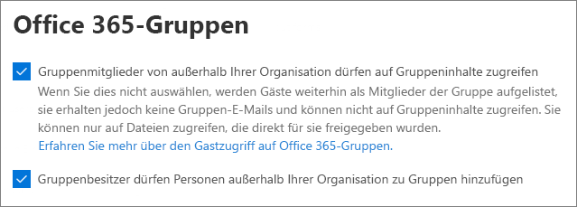

# Referenz zu Gastfreigabeeinstellungen für Microsoft 365

Dieser Artikel bietet eine Referenz zu den verschiedenen Einstellungen, die sich auf die Freigabe für Personen außerhalb Ihrer Organisation für Microsoft 365-Workloads auswirken können: Teams, Microsoft 365-Gruppen, SharePoint und OneDrive. Diese Einstellungen befinden sich in Azure Active Directory, Microsoft 365, Teams und SharePoint Admin Center.

## Azure Active Directory

**Administratorrolle:** Globaler Administrator

Azure Active Directory ist der von Microsoft 365 verwendete Verzeichnisdienst. Die Einstellungen für Azure Active Directory-Organisationsbeziehungen wirken sich unmittelbar auf die Freigabe in Teams, Microsoft 365-Gruppen, SharePoint und OneDrive aus.

> [!NOTE]
> Diese Einstellungen betreffen SharePoint nur, wenn die [SharePoint- und OneDrive-Integration in Azure AD B2B](/sharepoint/sharepoint-azureb2b-integration-preview) konfiguriert wurde. Die nachstehende Tabelle setzt voraus, dass diese Konfiguration vorgenommen wurde.

### Einstellungen für Organisationsbeziehungen

**Navigation:** [Azure Active Directory Admin Center](https://aad.portal.azure.com) > Azure Active Directory-> externe Identitäten >-Einstellungen für die externe Zusammenarbeit

| Einstellung | Standard | Beschreibung |
|:-----|:-----|:-----|
|Berechtigungen für Gastbenutzer sind eingeschränkt|Ja|Diese Einstellung wirkt sich auf die Verzeichnisaufgaben aus, die ein Gast ausführen kann.|
|Administratoren und Benutzer mit der Rolle "Einladender" können einladen|Ja|Ist diese Option auf **Ja** festgelegt, können Administratoren Gäste über Azure AD- und Microsoft 365-Freigabefunktionen wie Teams und SharePoint einladen. Ist die Option auf **Nein** festgelegt, ist dies nicht möglich.|
|Mitglieder können einladen|Ja|Ist diese Option auf **Ja** festgelegt, können Azure AD-Mitglieder Gäste über Azure AD einladen. Ist die Option auf **Nein** festgelegt, ist dies nicht möglich. Ist diese Option auf **Ja** festgelegt, können Microsoft 365-Gruppenmitglieder Gäste mit Genehmigung des Besitzers einladen. Ist die Option auf **Nein** festgelegt, können Microsoft 365-Gruppenmitglieder Gäste mit Genehmigung des Besitzers einladen, die Besitzer müssen jedoch globale Administratoren sein, um die Genehmigung zu erteilen.   Bitte beachten Sie, dass **können einladen** sich auf Mitglieder in Azure AD (im Gegensatz zu Gästen) bezieht und nicht auf Website- oder Gruppenmitglieder in Microsoft 365.   Dies ist identisch mit der Einstellung **Benutzer dürfen neue Gäste zur Organisation hinzufügen** in Microsoft 365 Sicherheit und Datenschutz hinzufügen.|
|Gäste können einladen|Ja|Ist diese Option auf **Ja** festgelegt, können Gäste im Verzeichnis andere Gäste einladen, an Azure AD-Ressourcen sowie an Dateien und Ordnern in SharePoint und OneDrive zusammenzuarbeiten. Ist die Option auf **Nein** festgelegt, ist dies nicht möglich.   Beachten Sie, dass **Externen Benutzern das Auffinden von Benutzerkonten im Verzeichnis durch Eingabe exakter E-Mail-Adressübereinstimmungen gestatten** im SharePoint Admin Center aktiviert sein muss, damit Gäste Dateien und Ordner für andere Gäste freigeben können.|
|Einmalkennung per E-Mail für Gastbenutzer aktivieren (Vorschauversion)|Nein|Ist diese Option auf **Ja** festgelegt, können Gäste ohne MSA bzw. ein Geschäfts-, Schul- oder Unikonto [sich bei Azure AD mit einem einmaligen Zugangscode authentifizieren](/azure/active-directory/b2b/one-time-passcode). Ist die Option auf **Nein** festgelegt, müssen Benutzer ein Microsoft-Konto erstellen, um sich authentifizieren zu können. Dieser Einstellung muss auf **Ja** festgelegt sein, damit [SharePoint- und OneDrive-Integration in Azure AD B2B (Vorschau)](/sharepoint/sharepoint-azureb2b-integration-preview) funktioniert.|
|Einschränkungen für die Zusammenarbeit|Senden von Einladungen an beliebige Domäne zulassen|Diese Einstellung ermöglicht es Ihnen, eine Liste der zulässigen oder gesperrte Domänen für die Freigabe festzulegen. Wenn zulässige Domänen angegeben sind, können Freigabeeinladungen nur an diese Domänen gesendet werden. Wenn gesperrte Domänen angegeben sind, können keine Freigabeeinladungen an diese Domänen gesendet werden.   Diese Einstellung wirkt sich auf Microsoft 365-Freigabefunktionen wie Teams und SharePoint aus. Mit der Domänenfilterung in SharePoint oder Teams können Sie Domänen auf einer differenzierteren Ebene zulassen oder sperren.|

Diese Einstellungen wirken sich auf die Art und Weise aus, wie Benutzer in das Verzeichnis eingeladen werden. Sie wirken sich nicht auf die Freigabe für Gäste aus, die sich bereits im Verzeichnis befinden.

## Microsoft 365

**Administratorrolle:** Globaler Administrator

Das Microsoft 365 Admin Center bietet Einstellungen auf Organisationsebene für die Freigabe und für Microsoft 365-Gruppen.

### Freigabe

**Navigation:**[Microsoft 365 Admin Center](https://admin.microsoft.com) > Einstellungen > Org Einstellungen > Sicherheit und Datenschutz > Freigabe

| Einstellung | Standard | Beschreibung |
|:-----|:-----|:-----|
|Benutzer dürfen neue Gäste zur Organisation hinzufügen|Ein|Ist diese Option auf **Ja** festgelegt, können Azure AD-Mitglieder Gäste über Azure AD einladen. Ist die Option auf **Nein** festgelegt, ist dies nicht möglich. Ist diese Option auf **Ja** festgelegt, können Microsoft 365-Gruppenmitglieder Gäste mit Genehmigung des Besitzers einladen. Ist die Option auf **Nein** festgelegt, können Microsoft 365-Gruppenmitglieder Gäste mit Genehmigung des Besitzers einladen, die Besitzer müssen jedoch globale Administratoren sein, um die Genehmigung zu erteilen.   Bitte beachten Sie, dass **können einladen** sich auf Mitglieder in Azure AD (im Gegensatz zu Gästen) bezieht und nicht auf Website- oder Gruppenmitglieder in Microsoft 365.   Dieser Wert ist mit der Einstellung **Mitglieder können einladen** in den Azure Active Directory-Einstellungen für Organisationsbeziehungen identisch.|

### Microsoft 365-Gruppen

**Navigation:**[Microsoft 365 Admin Center](https://admin.microsoft.com) > Einstellungen > Einstellungen > Microsoft 365-Gruppen

| Einstellung | Standard | Beschreibung |
|:-----|:-----|:-----|
|Gruppenmitglieder von außerhalb Ihrer Organisation dürfen auf Gruppeninhalte zugreifen|Ein|Ist diese Option aktiviert, können Gäste auf Gruppeninhalte zugreifen. Ist die Option deaktiviert, ist dies nicht möglich. Diese Einstellung sollte für alle Szenarien **aktiviert** sein, in denen Gastbenutzer mit Microsoft 365-Gruppen oder Teams interagieren.|
|Erlauben Sie Gruppenbesitzern, Personen von außerhalb Ihrer Organisation zu Gruppen hinzuzufügen|Ein|Ist diese Option **aktiviert**, können Besitzer von Microsoft 365-Gruppen oder -Teams neue Gäste zur Gruppe einladen. Ist diese Option deaktiviert, können Besitzer nur Gäste einladen, die sich bereits im Verzeichnis befinden.|

Diese Einstellungen erfolgen auf Organisationsebene. Informationen zum Ändern dieser Einstellungen auf Gruppenebene mithilfe von PowerShell finden Sie unter [Erstellen von Einstellungen für eine bestimmte Gruppe](/azure/active-directory/users-groups-roles/groups-settings-cmdlets#create-settings-for-a-specific-group).

## Microsoft Teams

Die Teams-Masteroption für den Gastzugriff, **Gastzugriff in Teams ermöglichen**, muss aktiviert sein, damit die übrigen Gasteinstellungen verfügbar sind.

**Administratorrolle:** Teams-Dienstadministrator

### Gastzugriff

**Navigation:** [Teams Admin Center](https://admin.teams.microsoft.com) > Organisationsweite Einstellungen > Gastzugriff

| Einstellung | Standard | Beschreibung |
|:-----|:-----|:-----|
|Gastzugriff in Teams ermöglichen|Aus|Aktiviert oder deaktiviert den Gastzugriff für Teams insgesamt. Es kann bis zu 24 Stunden dauern, bis eine Änderung dieser Einstellung wirksam wird.|

### Anrufeinstellungen für Gäste

**Navigation:** [Teams Admin Center](https://admin.teams.microsoft.com) > Organisationsweite Einstellungen > Gastzugriff

| Einstellung | Standard | Beschreibung |
|:-----|:-----|:-----|
|Private Anrufe führen|Ein|Ist diese Option aktiviert, können Gäste in Teams Peer-to-Peer-Anrufe führen. Ist die Option deaktiviert, ist dies nicht möglich.|

### Besprechungseinstellungen für Gäste

**Navigation:** [Teams Admin Center](https://admin.teams.microsoft.com) > Organisationsweite Einstellungen > Gastzugriff

| Einstellung | Standard | Beschreibung |
|:-----|:-----|:-----|
|IP-Video zulassen|Ein|Ist diese Option aktiviert, können Gäste in ihren Anrufen und Besprechungen Video verwenden. Ist die Option deaktiviert, ist dies nicht möglich.|
|Bildschirmfreigabemodus|Gesamter Bildschirm|Ist diese Option auf **Deaktiviert** festgelegt, können Gäste ihre Bildschirme nicht in Teams freigeben. Ist die Option auf **Einzelne Anwendung** festgelegt, können Gäste nur eine einzelne Anwendung auf ihrem Bildschirm freigeben. Ist die Option auf **Gesamter Bildschirm** festgelegt, können Gäste wählen, ob sie eine Anwendung oder ihren gesamten Bildschirm freigeben möchten.|
|Sofortbesprechungen zulassen|Ein|Ist diese Option aktiviert, können Gäste das Feature "Sofortbesprechungen zulassen" in Teams verwenden. Ist die Option deaktiviert, ist dies nicht möglich.|

### Messagingeinstellungen für Gäste

**Navigation:** [Teams Admin Center](https://admin.teams.microsoft.com) > Organisationsweite Einstellungen > Gastzugriff

| Einstellung | Standard | Beschreibung |
|:-----|:-----|:-----|
|Gesendete Nachrichten bearbeiten|Ein|Ist diese Option aktiviert, können Gäste zuvor gesendete Nachrichten bearbeiten. Ist die Option deaktiviert, ist dies nicht möglich.|
|Gesendete Nachrichten löschen|Ein|Ist diese Option aktiviert, können Gäste zuvor gesendete Nachrichten löschen. Ist die Option deaktiviert, ist dies nicht möglich.|
|Chat|Ein|Ist diese Option aktiviert, können Gäste den Chat in Teams verwenden. Ist die Option deaktiviert, ist dies nicht möglich.|
|Giphys in Unterhaltungen verwenden|Ein|Ist diese Option aktiviert, können Gäste Giphys in Unterhaltungen verwenden. Ist die Option deaktiviert, ist dies nicht möglich.|
|Giphy-Inhaltsklassifikation|Mittel|Ist diese Option auf **Alle Inhalte zulassen** festgelegt, können Gäste alle Giphys in Chats einfügen, unabhängig von der Inhaltsbewertung. Ist diese Option auf **Moderat** festgelegt, können Gäste Giphys in Chats einfügen, der Zugriff auf nicht jugendfreie Inhalte wird aber moderat eingeschränkt. Ist diese Option auf **Streng** festgelegt, können Gäste Giphys in Chats einfügen, der Zugriff auf nicht jugendfreie Inhalte wird aber eingeschränkt.|
|Memes in Unterhaltungen verwenden|Ein|Ist diese Option aktiviert, können Gäste Memes in Unterhaltungen verwenden. Ist die Option deaktiviert, ist dies nicht möglich.|
|Sticker in Unterhaltungen verwenden|Ein|Ist diese Option aktiviert, können Gäste Sticker in Unterhaltungen verwenden. Ist die Option deaktiviert, ist dies nicht möglich.|
|Plastischen Reader zum Anzeigen von Nachrichten zulassen|Ein|Ist diese Option aktiviert, können Gäste Nachrichten im plastischen Reader anzeigen. Ist die Option deaktiviert, ist dies nicht möglich.|

## SharePoint-und OneDrive (Organisationsebene)

**Administratorrolle:** SharePoint-Administrator

Diese Einstellungen wirken sich auf alle Websites in der Organisation aus. Sie wirken sich nicht direkt auf Microsoft 365-Gruppen oder -Teams aus. Es wird jedoch empfohlen, diese Einstellungen mit den Einstellungen für Microsoft 365-Gruppen und -Teams zu vereinheitlichen, um Probleme mit der Benutzererfahrung zu vermeiden. (Wenn die Gastfreigabe z. B. in Teams, aber nicht in SharePoint zulässig ist, haben Gäste in Teams keinen Zugriff auf die Registerkarte "Dateien", da Teams-Dateien in SharePoint gespeichert werden.)

### SharePoint- und OneDrive-Freigabeeinstellungen

Da OneDrive eine Hierarchie von Websites in SharePoint ist, wirken sich die Freigabeeinstellungen auf Organisationsebene direkt auf OneDrive aus, genau wie für andere SharePoint-Websites.

**Navigation:** SharePoint Admin Center-> Freigabe

| Einstellung | Standard | Beschreibung |
|:-----|:-----|:-----|
|SharePoint|Jeder|Die am wenigsten restriktiven Freigabeberechtigungen für SharePoint-Websites.|
|OneDrive|Jeder|Die am wenigsten restriktiven Freigabeberechtigungen für OneDrive-Websites. Diese Einstellung kann nicht weniger restriktiv sein als die SharePoint-Einstellung.|

### Erweiterte Freigabeeinstellungen für SharePoint und OneDrive

**Navigation:** SharePoint Admin Center-> Freigabe

| Einstellung | Standard | Beschreibung |
|:-----|:-----|:-----|
|Einschränken der externen Freigabe mithilfe von Domänen|Aus|Diese Einstellung ermöglicht es Ihnen, eine Liste der zulässigen oder gesperrte Domänen für die Freigabe festzulegen. Wenn zulässige Domänen angegeben sind, können Freigabeeinladungen nur an diese Domänen gesendet werden. Wenn gesperrte Domänen angegeben sind, können keine Freigabeeinladungen an diese Domänen gesendet werden.   Diese Einstellung wirkt sich auf alle SharePoint- und OneDrive-Websites in der Organisation aus.|
|Gäste müssen sich mit dem gleichen Konto anmelden, an das auch Freigabeeinladungen gesendet werden|Aus|Hindert Gäste daran, Websitefreigabeeinladungen mit einer anderen E-Mail-Adresse als der Adresse einzulösen, an die die Einladung gesendet wurde.  In [SharePoint- und OneDrive-Integration in Azure AD B2B (Vorschau)](/sharepoint/sharepoint-azureb2b-integration-preview) wird diese Einstellung nicht verwendet, da alle Gäste dem Verzeichnis basierend auf der E-Mail-Adresse, an die die Einladung gesendet wurde, hinzugefügt werden. Alternative E-Mail-Adressen können für den Zugriff auf die Website nicht verwendet werden.|
|Gästen das Freigeben von Elementen erlauben, die sich nicht in ihrem Besitz befinden|Ein|Ist diese Option aktiviert, können Gäste Elemente, die Sie nicht besitzen, für andere Benutzer oder Gäste freigeben. Ist die Option deaktiviert, ist dies nicht möglich. Gäste können Elemente, für die Sie über Vollzugriff verfügen, immer freigeben.|

### Linkeinstellungen für Dateien und Ordner in SharePoint und OneDrive

Wenn Dateien und Ordner in SharePoint und OneDrive freigegeben werden, wird den Freigabeempfängern ein Link mit Berechtigungen für die Datei oder den Ordner gesendet, anstatt ihnen direkten Zugriff auf die Datei oder den Ordner zu gewähren. Neben dem Standardlinktyp, der Benutzern beim Freigeben einer Datei oder eines Ordners angezeigt wird, stehen verschiedene weitere Arten von Links zur Verfügung. Sie können auch Berechtigungen und Ablaufoptionen für *Jeder*-Links festlegen.

**Navigation:** SharePoint Admin Center-> Freigabe

| Einstellung | Standard | Beschreibung |
|:-----|:-----|:-----|
|Datei- und Ordnerlinks|Jeder mit diesem Link|Gibt an, welcher Freigabelink standardmäßig angezeigt wird, wenn ein Benutzer eine Datei oder einen Ordner freigibt. Benutzer können die Option bei Bedarf vor der Freigabe ändern. Wenn die Standardeinstellung auf **Jeder mit diesem Link** festgelegt ist und die *Jeder*-Freigabe für eine bestimmte Website nicht zulässig ist, wird **Nur Personen in Ihrer Organisation** als Standard für diese Website angezeigt.|
|Diese Links müssen innerhalb dieser Anzahl von Tagen ablaufen|Aus (kein Ablaufdatum)|Gibt an, wie viele Tage nach Erstellung ein *Jeder*-Link abläuft. Abgelaufene Links können nicht verlängert werden. Erstellen Sie einen neuen Link, wenn die Freigabe über das Ablaufdatum hinaus fortgesetzt werden soll.|
|Dateiberechtigungen|Anzeigen und bearbeiten|Gibt die Dateiberechtigungsstufen an, die für Benutzer beim Erstellen eines *Jeder*-Links verfügbar sind. Wird **Anzeigen** ausgewählt, können Benutzer nur *Jeder*-Dateilinks mit der Berechtigung "Anzeigen" erstellen. Wird **Anzeigen und bearbeiten** ausgewählt, können Benutzer beim Erstellen des Links zwischen den Berechtigungen "Anzeigen" und "Anzeigen und bearbeiten" auswählen.|
|Ordnerberechtigungen|Anzeigen, bearbeiten und hochladen|Gibt die Ordnerberechtigungsstufen an, die für Benutzer beim Erstellen eines *Jeder*-Links verfügbar sind. Wird **Anzeigen** ausgewählt, können Benutzer nur *Jeder*-Ordnerlinks mit der Berechtigung "Anzeigen" erstellen. Wird **Anzeigen, bearbeiten und hochladen** ausgewählt, können Benutzer beim Erstellen des Links zwischen den Berechtigungen "Anzeigen" und "Anzeigen, bearbeiten und hochladen" auswählen.|

### Einstellungen für SharePoint- und OneDrive-Sicherheitsgruppen

Wenn Sie einschränken möchten, welche Personen in SharePoint und OneDrive Elemente für Gäste freigeben können, können Sie die Freigabe für Personen in bestimmten Sicherheitsgruppen einschränken. Diese Einstellungen wirken sich nicht auf die Freigabe über Microsoft 365-Gruppen oder -Teams aus. Gäste, die über eine Gruppe oder ein Team eingeladen wurden, haben auch Zugriff auf die zugehörige Website, obwohl die Freigabe von Dokumenten und Ordnern nur von Personen in den angegebenen Sicherheitsgruppen ausgeführt werden kann.

**Navigation:** SharePoint Admin Center > Freigabe > Externes Teilen auf bestimmte Sicherheitsgruppen einschränken

| Einstellung | Standard | Beschreibung |
|:-----|:-----|:-----|
|Zulassen, dass nur Benutzer in ausgewählten Sicherheitsgruppen mit authentifizierten externen Benutzern teilen:|Aus|Ist diese Option **aktiviert**, können nur die Personen in den angegebenen Sicherheitsgruppen Elemente für Personen außerhalb der Organisation freigeben. Es sind nur *Bestimmte Personen*-Links verfügbar. Die *Jeder*-Freigabe wird effektiv deaktiviert, es sei denn, **Nur Benutzer in ausgewählten Sicherheitsgruppen dürfen mit authentifizierten externen Benutzern und mittels anonymer Links teilen** ist ebenfalls aktiviert.|
|Nur Benutzer in ausgewählten Sicherheitsgruppen dürfen mit authentifizierten externen Benutzern und mittels anonymer Links teilen|Aus|Ist diese Option aktiviert, können nur die Personen in den angegebenen Sicherheitsgruppen Elemente für Gäste freigeben. Es sind *Jeder*- und *Bestimmte Personen*- Links verfügbar.|

Beide Einstellungen können gleichzeitig verwendet werden. Wenn ein Benutzer in Sicherheitsgruppen für beide Einstellungen enthalten ist, hat die höhere Berechtigungsstufe Vorrang (*Jeder* plus *Bestimmter Benutzer*). Geschachtelte Sicherheitsgruppen werden unterstützt.

## SharePoint (Websiteebene)

**Administratorrolle:** SharePoint-Administrator

Da diese Einstellungen den organisationsweiten Einstellungen für SharePoint unterliegen, kann sich die effektive Freigabeeinstellung für die Website ändern, wenn sich die Einstellung auf Organisationsebene ändert. Wenn Sie hier eine Einstellung auswählen und auf Organisationsebene später ein restriktiverer Wert festgelegt wird, gilt für diese Website der restriktivere Wert. Wenn Sie beispielsweise **Jeder** auswählen und die Einstellung auf Organisationsebene später auf **Neue und vorhandene Gäste** festgelegt wird, lässt diese Website nur neue und vorhandene Gäste zu. Wird die Einstellung auf Organisationsebene dann wieder auf **Jeder** zurückgesetzt, lässt die Website wieder *Jeder*-Links zu.

### Freigabeeinstellungen für Websites

Sie können Gastfreigabeberechtigungen für jede Website in SharePoint festlegen. Diese Einstellung gilt sowohl für die Freigabe von Websites als auch die Freigabe von Dateien und Ordnern. (Die *Jeder*-Freigabe ist für die Websitefreigabe nicht verfügbar. Wenn Sie **Jeder** auswählen, können Benutzer Dateien und Ordner unter Verwendung von *Jeder*-Links freigeben, und die Website selbst kann mit neuen und vorhandenen Gästen geteilt werden.)

Wenn auf die Website eine Vertraulichkeitsbezeichnung angewendet wird, kann diese Bezeichnung die externen Freigabeeinstellungen kontrollieren. Weitere Informationen finden Sie unter [Verwenden von Vertraulichkeitsbezeichnungen zum Schutz von Inhalten in Microsoft Teams, Microsoft 365-Gruppen und SharePoint-Websites](../compliance/sensitivity-labels-teams-groups-sites.md).

**Navigation:** SharePoint Admin Center > Aktive Websites > Website auswählen > Registerkarte "Richtlinien" > Externe Freigabe bearbeiten

| Einstellung | Standard | Beschreibung |
|:-----|:-----|:-----|
|Websiteinhalt kann freigegeben werden für:|Variiert je nach Websitetyp (siehe Tabelle unten)|Gibt den Typ der für diese Website zulässigen externen Freigabe an. Die hier verfügbaren Optionen unterliegen den Freigabeeinstellungen auf Unternehmensebene für SharePoint.|

### Link-Einstellungen für Website-Dateien und -Ordner

Sie können Standardeinstellungen für Verknüpfungstyp und Berechtigungen sowie für Ablaufeinstellungen für *Jeder*-Links für jede einzelne Website festlegen. Wenn die Einstellungen auf Websiteebene festgelegt sind, werden dadurch die Einstellungen auf Organisationsebene außer Kraft gesetzt. Beachten Sie: Wenn *Jeder*-Links auf Organisationsebene deaktiviert sind, ist der Linktyp *Jeder* auf Websiteebene nicht verfügbar.

**Navigation:** SharePoint Admin Center > Aktive Websites > Website auswählen > Registerkarte "Richtlinien" > Externe Freigabe bearbeiten

| Einstellung | Standard | Beschreibung |
|:-----|:-----|:-----|
|Einschränken der Freigabe nach Domäne|Off|Diese Einstellung ermöglicht es Ihnen, eine Liste der zulässigen oder gesperrte Domänen für die Freigabe festzulegen. Wenn zulässige Domänen angegeben sind, können Freigabeeinladungen nur an diese Domänen gesendet werden. Wenn gesperrte Domänen angegeben sind, können keine Freigabeeinladungen an diese Domänen gesendet werden.   Diese Einstellung kann nicht dazu verwendet werden, die auf Organisations- oder Azure AD-Ebene festgelegten Domäneneinschränkungen außer Kraft zu setzen.|
|Standardmäßiger Freigabe-Linktyp|Identisch mit der Einstellung auf Organisationsebene|Diese Einstellung ermöglicht es Ihnen, den standardmäßigen Freigabelink anzugeben, der Benutzern auf dieser Website angezeigt wird. Die Option *Identisch mit der Einstellung auf Organisationsebene* wird durch eine Kombination aus Organisations- und Website Freigabeeinstellungen definiert.|
|Erweiterte Einstellungen für "Jeder&quot;-Links|Identisch mit der Einstellung auf Organisationsebene|Gibt an, wie viele Tage nach dessen Erstellung ein *Jeder*-Link für eine Datei auf der betreffenden Seite abläuft. Abgelaufene Links können nicht verlängert werden. Erstellen Sie einen neuen Link, wenn die Freigabe über das Ablaufdatum hinaus fortgesetzt werden soll.|
|Standardlinkberechtigung|Identisch mit der Einstellung auf Organisationsebene|Über diese Einstellung können Sie die Standardberechtigung (&quot;Anzeigen&quot; oder &quot;Bearbeiten") für Freigabelinks angeben, die für Dateien auf der betreffenden Website erstellt wurden.|

### Standardeinstellungen für die Website-Freigabe

Die folgende Tabelle zeigt die Standardfreigabeeinstellung für jeden Websitetyp.

| Websitetyp | Standardfreigabeeinstellung |
|:-----|:-----|
|Klassisch|**Nur Personen in Ihrer Organisation**|
|OneDrive|**Jeder**|
|Mit Gruppen verbundene Websites (einschließlich Teams)|**Neue und vorhandene Gäste**, wenn die Einstellung für Microsoft 365-Gruppen **Gruppenbesitzer dürfen Personen außerhalb der Organisation zu Gruppen hinzufügen** **aktiviert** ist. Andernfalls **Nur vorhandene Gäste**|
|Kommunikation|**Nur Personen in Ihrer Organisation**|
|Moderne Websites ohne Gruppe (#STS3 TeamSite)|**Nur Personen in Ihrer Organisation**|

> [!NOTE]
> Die Stammkommunikationswebsite (tenant-name.sharepoint.com) verfügt über die Standardfreigabeeinstellung **Jeder**.

## Siehe auch

[Übersicht über die externe Freigabe in SharePoint und OneDrive](/sharepoint/external-sharing-overview)

[Gastzugriff in Microsoft Teams](/MicrosoftTeams/guest-access)

[Hinzufügen von Gästen zu Microsoft 365-Gruppen](https://support.office.com/article/bfc7a840-868f-4fd6-a390-f347bf51aff6)
