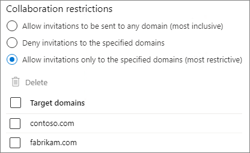
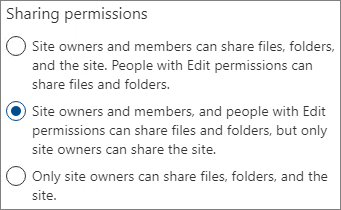
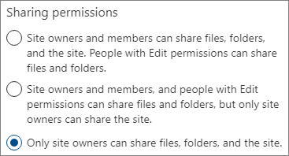
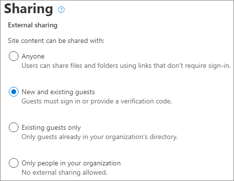

# Einschränken der Freigabe in Microsoft 365

Sie können die interne Freigabe zwar nicht vollständig deaktivieren oder die Schaltfläche "Teilen" von Websites entfernen, aber es gibt eine Vielzahl von Möglichkeiten, die Freigabe in Microsoft 365 zu beschränken, um den Anforderungen Ihrer Organisation gerecht zu werden.

Die Methoden zum Freigeben von Dateien sind in der nachstehenden Tabelle aufgeführt. Klicken Sie auf den Link in der Spalte **Freigabemethode**, um ausführliche Informationen zu erhalten.

|Freigabemethode|Beschreibung|Optionen für das Beschränken|
|:-------------|:----------|:-------------|
|[Microsoft 365-Gruppe oder -Team](#microsoft-365-group-or-team)|Personen, denen der Zugriff auf ein Microsoft Teams-Team oder eine Microsoft 365-Gruppe gewährt wird, können auf Dateien auf der zugehörigen SharePoint-Website zugreifen.|Bei privaten Gruppen oder Teams gehen Freigabeeinladungen, dem Team beizutreten, zur Genehmigung an den Besitzer der Gruppe oder des Teams. Administratoren können den Gastzugang deaktivieren, um den Zugriff von Personen von außerhalb der Organisation zu verhindern.|
|[SharePoint-Website](#sharepoint-site)|Personen können als Besitzer, Mitglied oder Besucher Zugriff auf eine SharePoint-Website erhalten und diese Zugriffsebene gilt auch für die Dateien auf der Website.|Die Websiteberechtigungen können eingeschränkt werden, sodass nur Websitebesitzer die Website freigeben können.|
|[Freigeben für bestimmte Personen](#sharing-with-specific-people)|Websitemitglieder und Personen mit Bearbeitungsberechtigungen können direkte Berechtigungen für Dateien und Ordner erteilen oder diese über *Bestimmte Personen*-Links freigeben.|Die Websiteberechtigungen können eingeschränkt werden, sodass nur Websitebesitzer Dateien und Ordner freigeben können. In diesem Fall gehen die Freigabe des direkten Zugriffs und die Freigabe von *Bestimmte Personen*-Links durch Websitemitglieder an den Websitebesitzer zur Genehmigung.|
|[SharePoint-Gastfreigabe](#sharepoint-guest-sharing)|Besitzer und Mitglieder von SharePoint-Websites können Dateien und Ordner für Personen außerhalb der Organisation freigeben.|Die Gastfreigabe kann für die gesamte Organisation oder für einzelne Websites deaktiviert werden.|
|[*Personen in Ihrer Organisation*-Freigabelinks](#people-in-your-organization-sharing-links)|Besitzer und Mitglieder von SharePoint-Websites können Dateien unter Verwendung von *Personen in Ihrer Organisation*-Links freigeben, die für jeden innerhalb der Organisation funktionieren.|*Personen in Ihrer Organisation*-Links können auf Websiteebene deaktiviert werden.|
|[E-Mail](#email)|Personen mit Zugriff auf eine Datei können diese per E-Mail an andere Personen versenden.|Administratoren können Dateien mithilfe von Vertraulichkeitsbezeichnungen verschlüsseln, um zu verhindern, dass sie an unbefugte Personen weitergegeben werden.|
|[Download oder Dateikopie](#download-or-file-copy)|Personen mit Zugriff auf eine Datei können diese herunterladen oder kopieren und sie mit anderen Personen außerhalb von Microsoft 365 teilen.|Administratoren können Dateien mithilfe von Vertraulichkeitsbezeichnungen verschlüsseln, um zu verhindern, dass sie an unbefugte Personen weitergegeben werden.|

Sie können die Freigabe in Ihrer Organisation zwar mit den in diesem Artikel beschriebenen Administratorsteuerelemente einschränken, wir empfehlen Ihnen aber dringend, die in Microsoft 365 verfügbaren Sicherheits- und Compliancefeatures zu verwenden, um eine sichere Freigabeumgebung zu schaffen. Siehe [Zusammenarbeit an Dateien in SharePoint mit Microsoft 365](https://docs.microsoft.com/sharepoint/deploy-file-collaboration) und [Teams für hochgradig regulierte Daten](https://docs.microsoft.com/microsoft-365/enterprise/secure-teams-highly-regulated-data-scenario) für Informationen.

Um zu verstehen, wie die Freigabe in Ihrer Organisation verwendet wird, [führen Sie einen Bericht über die Datei- und Ordnerfreigabe aus](https://docs.microsoft.com/sharepoint/sharing-reports).

## Microsoft 365-Gruppe oder -Team

Wenn Sie die Freigabe in einer Microsoft 365-Gruppe oder einem Microsoft Teams-Team einschränken möchten, ist es wichtig, die Gruppe oder das Team privat zu machen. Personen innerhalb Ihrer Organisation können einer öffentlichen Gruppe oder einem öffentlichen Team jederzeit beitreten. Wenn die Gruppe oder das Team nicht privat ist, gibt es keine Möglichkeit, die Freigabe des Teams oder seiner Dateien innerhalb der Organisation einzuschränken.

### Gastfreigabe

Wenn Sie den Gastzugriff in Teams verhindern möchten, können Sie die Gastfreigabe im Teams Admin Center deaktivieren.

So deaktivieren Sie die Gastfreigabe in Teams
1. Erweitern Sie im Teams Admin Center **Organisationsweite Einstellungen**, und klicken Sie dann auf **Gastzugriff**.
2. Deaktivieren Sie **Gastzugriff in Teams ermöglichen**.
3. Klicken Sie auf **Speichern**.

Wenn Sie den Gastzugriff in Microsoft 365-Gruppen verhindern möchten, können Sie die Gruppeneinstellungen für den Gastzugriff im Microsoft 365 Admin Center deaktivieren.

So deaktivieren Sie die Gastfreigabe in Microsoft 365-Gruppen
1. Klicken Sie im Microsoft 365 Admin Center auf **Einstellungen** und dann auf **Einstellungen**.
2. Klicken Sie auf der Registerkarte **Dienste** auf **Microsoft 365-Gruppen**.
3. Deaktivieren Sie die Kontrollkästchen **Gruppenmitglieder von außerhalb Ihrer Organisation dürfen auf Gruppeninhalte zugreifen** und **Gruppenbesitzer dürfen Personen außerhalb Ihrer Organisation zu Gruppen hinzufügen**.
4. Klicken Sie auf **Änderungen speichern**.

    

> [!NOTE]
> Wenn Sie die Gastfreigabe für eine bestimmte Gruppe oder ein bestimmtes Team verhindern möchten, können Sie dies mithilfe von Microsoft PowerShell tun. Details finden Sie unter [Blockieren von Gastbenutzern aus einer bestimmten Sicherheitsgruppe](https://docs.microsoft.com/office365/admin/create-groups/manage-guest-access-in-groups?view=o365-worldwide#block-guest-users-from-a-specific-group).

Sie können die Gastfreigabe auf Benutzer aus bestimmten Domänen beschränken, indem Sie Domänen in Azure Active Directory zulassen oder blockieren. Dies wirkt sich auch auf die Gastfreigabe in SharePoint aus, wenn Sie die [SharePoint- und OneDrive-Integration mit Azure AD B2B](https://docs.microsoft.com/sharepoint/sharepoint-azureb2b-integration-preview) aktiviert haben.

So erlauben Sie Freigabeeinladungen nur aus bestimmten Domänen
1. Klicken Sie in Azure Active Directory auf der Seite Übersicht auf **Organisationsbeziehungen**.
2. Klicken Sie auf **Einstellungen**.
3. Wählen Sie unter **Einschränkungen für die Zusammenarbeit**die Option **Einladungen für die angegebenen Domänen verweigern** oder **Einladungen nur für die angegebenen Domänen zulassen** aus, und geben Sie dann die gewünschten Domänen ein.
4. Klicken Sie auf **Speichern**.

    

## SharePoint-Website

Sie können die Freigabe von SharePoint-Websites auf Websitebesitzer beschränken. Dadurch wird verhindert, dass Websitemitglieder die Website freigeben. Bedenken Sie Folgendes: Wenn die Website mit einer Microsoft 365-Gruppe verbunden ist, können die Gruppenmitglieder andere in die Gruppe einladen, und diese Benutzer haben Zugriff auf die Website.

So beschränken Sie die Freigabe von Websites auf Besitzer
1. Klicken Sie in der Website auf das Zahnradsymbol und anschließend auf **Websiteberechtigungen**.
2. Klicken Sie unter **Freigabeeinstellungen** auf **Freigabeeinstellungen ändern**.
3. Wählen Sie **Websitebesitzer und -mitglieder sowie Personen mit Bearbeitungsberechtigungen können Dateien und Ordner freigeben, aber nur Websitebesitzer können die Website freigeben**.
4. Klicken Sie auf **Speichern**.

    

Durch Deaktivieren von Zugriffsanforderungen können Sie verhindern, dass Benutzer, die keine Mitglieder der Website sind, Zugriff anfordern.

So deaktivieren Sie Zugriffsanforderungen:
1. Klicken Sie in der Website auf das Zahnradsymbol und anschließend auf **Websiteberechtigungen**.
2. Klicken Sie unter **Freigabeeinstellungen** auf **Freigabeeinstellungen ändern**.
3. Deaktivieren Sie **Zugriffsanforderungen zulassen**, und klicken Sie dann auf **Speichern**.

Sie können die Freigabe der Website auf bestimmte Domänen beschränken, indem Sie Domänen für die Website zulassen oder blockieren.

So beschränken Sie die Freigabe von Websites auf Domänen
1. Klicken Sie im SharePoint Admin Center unter **Websites** auf **Aktive Websites**.
2. Klicken Sie auf die Website, die Sie konfigurieren möchten.
3. Klicken Sie auf der Registerkarte **Richtlinien** unter **Externe Freigabe** auf **Bearbeiten**.
4. Aktivieren Sie unter **Erweiterte Einstellungen für externe Freigabe** das Kontrollkästchen **Freigabe nach Domäne einschränken**.
5. Fügen Sie die Domänen hinzu, die Sie zulassen oder blockieren möchten, und klicken Sie dann auf **Speichern**.
6. Klicken Sie auf **Speichern**.

    

## Freigeben für bestimmte Personen

Wenn Sie die Freigabe einer Website oder ihrer Inhalte einschränken möchten, können Sie die Website so konfigurieren, dass nur Websitebesitzer Dateien, Ordner und die Website freigeben können. Wenn dies konfiguriert ist, gehen die Versuche von Websitemitgliedern, Dateien oder Ordner über *Bestimmte Personen*-Links freizugeben, an den Websitebesitzer zur Genehmigung.

So beschränken Sie die Freigabe von Websites, Dateien und Ordnern auf Besitzer
1. Klicken Sie in der Website auf das Zahnradsymbol und anschließend auf **Websiteberechtigungen**.
2. Klicken Sie unter **Freigabeeinstellungen** auf **Freigabeeinstellungen ändern**.
3. Wählen Sie **Nur Websitebesitzer können Dateien, Ordner und die Website teilen** aus.
4. Klicken Sie auf **Speichern**.

    

## SharePoint-Gastfreigabe

Wenn Sie die Freigabe von SharePoint- oder OneDrive-Dateien und -Ordnern für Personen außerhalb Ihrer Organisation verhindern möchten, können Sie die Gastfreigabe für die gesamte Organisation oder für eine einzelne Website ausschalten.

So deaktivieren Sie die SharePoint-Gastfreigabe für Ihre Organisation
1. Klicken Sie im SharePoint Admin Center unter **Richtlinien** auf **Freigabe**.
2. Ziehen Sie unter **Externe Freigabe** den SharePoint-Schieberegler nach unten auf **Nur Personen in Ihrer Organisation**.
3. Klicken Sie auf **Speichern**.

    

So deaktivieren Sie die Gastfreigabe für eine Website
1. Klicken Sie im SharePoint Admin Center unter **Websites** auf **Aktive Websites**.
2. Klicken Sie auf die Website, die Sie konfigurieren möchten.
3. Klicken Sie auf der Registerkarte **Richtlinien** unter **Externe Freigabe** auf **Bearbeiten**.
4. Wählen Sie unter **Externe Freigabe** die Option **Nur Personen in Ihrer Organisation** aus, und klicken Sie dann auf **Speichern**.

    

Wenn Sie die Freigabe für Personen außerhalb Ihrer Organisation erlauben, aber sicherstellen möchten, dass sich alle authentifizieren, können Sie *Jeder*-Links (anonyme Freigabe) für die gesamte Organisation oder für eine einzelne Website deaktivieren.

So deaktivieren Sie *Jeder*-Links auf Organisationsebene
1. Klicken Sie im SharePoint Admin Center unter **Richtlinien** auf **Freigabe**.
2. Ziehen Sie unter **Externe Freigabe** den SharePoint-Schieberegler nach unten auf **Neue und vorhandene Gäste**.
3. Klicken Sie auf **Speichern**.

    

So deaktivieren Sie *Jeder*-Links für eine Website
1. Klicken Sie im SharePoint Admin Center unter **Websites** auf **Aktive Websites**.
2. Klicken Sie auf die Website, die Sie konfigurieren möchten.
3. Klicken Sie auf der Registerkarte **Richtlinien** unter **Externe Freigabe** auf **Bearbeiten**.
4. Wählen Sie unter **Externe Freigabe** die Option **Neue und vorhandene Gäste** aus, und klicken Sie dann auf **Speichern**.

    

## *Personen in Ihrer Organisation*-Freigabelinks

Standardmäßig können die Mitglieder einer Website Dateien und Ordner für andere Personen in Ihrer Organisation, über einen *Personen in Ihrer Organisation*-Link freigeben. Sie können *Personen in Ihrer Organisation*-Links unter Verwendung von PowerShell deaktivieren:

`Set-SPOSite -Identity <site> -DisableCompanyWideSharingLinks`

Beispiel:

`Set-SPOSite -Identity https://contoso.sharepoint.com -DisableCompanyWideSharingLinks`

## E-Mail

Sie können die unerwünschte Freigabe von E-Mails durch Verschlüsselung verhindern. Dadurch wird verhindert, dass E-Mails weitergeleitet oder anderweitig für nicht autorisierte Benutzer freigegeben werden. Die E-Mail-Verschlüsselung kann mithilfe von Vertraulichkeitsbezeichnungen aktiviert werden. Weitere Details finden Sie unter [Einschränken des Zugriffs auf Inhalte mithilfe der Verschlüsselung in Vertraulichkeitsbezeichnungen](https://docs.microsoft.com/microsoft-365/compliance/encryption-sensitivity-labels).

## Download oder Dateikopie

Benutzer, die Zugriff auf Dateien und Ordner in Microsoft 365 haben, können Dateien herunterladen und auf externe Medien kopieren. Um das Risiko unerwünschter Dateifreigaben zu verringern, können Sie den Inhalt mithilfe von Vertraulichkeitsbezeichnungen verschlüsseln.

## Weitere Artikel

[Referenz zu Gastfreigabeeinstellungen für Microsoft 365](microsoft-365-guest-settings.md)
