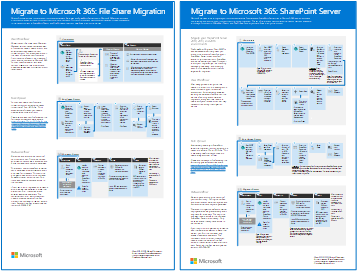
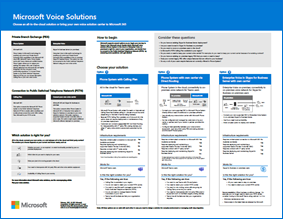

# Darstellungen zu Microsoft 365-Produktivitätslösungen

Die Microsoft 365 Unternehmenslösungsreihe bietet Anleitungen zum Implementieren Microsoft 365 Funktionen, insbesondere bei technologienübergreifenden Funktionen, einschließlich Teams Architekturdiagrammen.

## Microsoft Teams und verwandte Produktivitätsdienste in Microsoft 365 für IT-Architekten
Die logische Architektur von Produktivitätsdiensten in Microsoft 365, beginnend mit Microsoft Teams.

| Element | Beschreibung |
|:-----|:-----|
|   [PDF](https://github.com/MicrosoftDocs/microsoft-365-docs/raw/public/microsoft-365/downloads/msft-m365-teams-logical-architecture.pdf) \| [Visio](https://github.com/MicrosoftDocs/microsoft-365-docs/raw/public/microsoft-365/downloads/msft-m365-teams-logical-architecture.vsdx)   Aktualisiert Januar 2021   |Microsoft bietet eine Reihe von Produktivitätsdiensten für die Zusammenarbeit in den Bereichen Datengovernance, Sicherheit und Compliancefunktionen.    Diese Illustrationen geben einen Einblick in die logische Architektur der Produktivitätsdienste für Enterprise Architekten, beginnend mit Microsoft Teams.|

## Gruppen in Microsoft 365 für IT-Architekten
Diese Abbildung enthält Informationen für IT-Architekten zu Microsoft 365 Gruppen. Weitere Informationen zum Konfigurieren und Verwalten Microsoft 365 Gruppen und Teams für die Zusammenarbeit in Ihrer Organisation finden Sie unter Einrichten einer sicheren Zusammenarbeit mit [Microsoft 365](/microsoft-365/solutions/setup-secure-collaboration-with-teams) und Was ist Governance für [die Zusammenarbeit?](/microsoft-365/solutions/collaboration-governance-overview).

| Element | Beschreibung |
|:-----|:-----|
|   [PDF](https://github.com/MicrosoftDocs/microsoft-365-docs/raw/public/microsoft-365/downloads/msft-m365-groups.pdf) \| [Visio](https://github.com/MicrosoftDocs/OfficeDocs-Enterprise/raw/live/Enterprise/downloads/msft-m365-groups.vsdx)   Aktualisiert mai 2020|Diese Illustrationen erläutern die unterschiedlichen Arten von Gruppen, erklären, wie diese erstellt und verwaltet werden, und bieten einige Vorschläge für Governance.|

## Migrieren zu Microsoft 365

Microsoft bietet Tools zum Migrieren Ihrer lokalen Netzwerkdateifreigaben und SharePoint Serverwebsites zu Microsoft 365 mit dem Schwerpunkt auf dem Schutz und der Gewährleistung der Sicherheit Ihrer Inhalte während der Migration. Dieser Satz von Abbildungen veranschaulicht die verschiedenen Verfügbaren Methoden zum Verschieben ihrer Inhalte in SharePoint, Teams und OneDrive und wie Ihre Daten durch den Prozess fließen. 

| Element | Beschreibung |
|:-----|:-----|
|   [Als PDF herunterladen](https://download.microsoft.com/download/0/5/b/05b7fb7c-1557-4ebb-9036-c5fc3a4cd94c/Migration-posters-mm-spmt.pdf)  \| [Als Visio herunterladen](https://download.microsoft.com/download/0/5/b/05b7fb7c-1557-4ebb-9036-c5fc3a4cd94c/Migration-posters-mm-spmt.vsdx)   Aktualisiert märz 2021 |Enthält: <ul><li>  Migration von Dateifreigaben</li><li>SharePoint Server-Migration </li> </ul>  Weitere Informationen finden Sie unter [Migrate your content to Microsoft 365](/sharepointmigration/migrate-to-sharepoint-online).|

## Microsoft 365 und Compliancefunktionen

Microsoft 365 umfasst eine breite Palette von Informationsschutz- und Compliancefunktionen. Zusammen mit den Produktivitätstools von Microsoft sollen diese Funktionen Organisationen dabei helfen, in Echtzeit zusammenzuarbeiten und gleichzeitig strenge gesetzliche Compliance-Frameworks zu erfüllen. 

Dieser Abbildungssatz verwendet eine der am stärksten regulierten Branchen, Finanzdienstleistungen, um zu veranschaulichen, wie diese Funktionen zur Einhaltung gängiger gesetzlicher Anforderungen angewendet werden können. Sie können diese Illustrationen für Ihren eigenen Gebrauch anpassen. 

| Element | Beschreibung |
|:-----|:-----|
|   Englisch: [Als PDF herunterladen](https://download.microsoft.com/download/3/a/6/3a6ab1a3-feb0-4ee2-8e77-62415a772e53/m365-compliance-illustrations.pdf)  \| [Als Visio herunterladen](https://download.microsoft.com/download/3/a/6/3a6ab1a3-feb0-4ee2-8e77-62415a772e53/m365-compliance-illustrations.vsdx)   Japanische: [Als PDF herunterladen](https://download.microsoft.com/download/6/f/1/6f1a7d0e-dd8e-442e-b073-8e94327ae4f8/m365-compliance-illustrations.pdf)  \| [Als Visio herunterladen](https://download.microsoft.com/download/6/f/1/6f1a7d0e-dd8e-442e-b073-8e94327ae4f8/m365-compliance-illustrations.vsdx)   Aktualisiert: November 2020|Enthält: <ul><li>  Microsoft Information Protection und Verhinderung von Datenverlust</li><li>Aufbewahrungsrichtlinien und Aufbewahrungsbezeichnungen </li><li>Informationsbarrieren</li><li>Kommunikationscompliance</li><li>Insider-Risiko</li><li>Datenerfassung durch Drittanbieter</li>|

## Sicherheit und Datenschutz für Organisationen, die in mehreren Regionen agieren
Sicherheits- und Informationsschutz für organisationen mit mehreren Regionen mit einem Microsoft 365 Mandanten

| Element | Beschreibung |
|:-----|:-----|
|   [PDF](https://github.com/MicrosoftDocs/microsoft-365-docs/raw/public/microsoft-365/downloads/msft-security-info-protect-multi-region.pdf) \| [Visio](https://github.com/MicrosoftDocs/microsoft-365-docs/raw/public/microsoft-365/downloads/msft-security-info-protect-multi-region.vsdx) Aktualisiert: März 2020 |Die Verwendung eines einzelnen Microsoft 365-Mandanten für Ihre globale Organisation ist aus vielen Gründen die beste Wahl. Jedoch fällt es vielen Architekten schwer, den Sicherheits- und Datenschutzzielen der verschiedenen Regionen gleichmäßig gerecht zu werden. Diese Themengruppe bietet Empfehlungen dazu. |

## Bereitstellungsstrategie für Microsoft Defender for Endpoint

Je nach Ihrer Umgebung eignen sich einige Tools für bestimmte Architekturen besser.

| Element | Beschreibung |
|:-----|:-----|
|  [PDF](https://github.com/MicrosoftDocs/microsoft-365-docs/raw/public/microsoft-365/security/defender-endpoint/downloads/mdatp-deployment-strategy.pdf)  \| [Visio](https://github.com/MicrosoftDocs/microsoft-365-docs/raw/public/microsoft-365/security/defender-endpoint/downloads/mdatp-deployment-strategy.vsdx)  Aktualisiert: Februar 2020| Das Architekturmaterial hilft Ihnen bei der Planung der Bereitstellung für die folgenden Architekturen: <ul><li> Cloudspezifisch </li><li> Co-Management </li><li> Lokal</li><li>Auswertung und lokales Onboarding</li>

## Identitäts- und Geräteschutz für Microsoft 365

Empfohlene Funktionen zum Schutz von Identitäten und Geräten, die auf Microsoft 365, andere SaaS-Dienste und lokale Anwendungen zugreifen, die mit dem Azure AD-Anwendungsproxy veröffentlicht wurden.

| Element | Beschreibung |
|:-----|:-----|
|    [Anzeigen als PDF](../downloads/MSFT_cloud_architecture_identity&device_protection.pdf) \| [Als PDF herunterladen](https://github.com/MicrosoftDocs/microsoft-365-docs/raw/public/microsoft-365/downloads/MSFT_cloud_architecture_identity&device_protection.pdf) \| [Herunterladen als Visio](https://github.com/MicrosoftDocs/microsoft-365-docs/raw/public/microsoft-365/downloads/MSFT_cloud_architecture_identity&device_protection.vsdx)     Aktualisiert september 2020|Es ist wichtig, konsistente Schutzebenen für Daten, Identitäten und Geräte zu verwenden. Dieses Modell zeigt, welche Funktionen mit weiteren Informationen zu Funktionen zum Schutz von Identitäten und Geräten vergleichbar sind.    |
 

## Advanced eDiscovery architektur in Microsoft 365

Advanced eDiscovery End-to-End-Workflow und Datenfluss, auch innerhalb Microsoft 365 Multi-Geo-Umgebungen. 

| Element | Beschreibung |
|:-----|:-----|
|   [Anzeigen als Bild](../media/solutions-architecture-center/m365-advanced-ediscovery-architecture.png) \| [Als PDF herunterladen](https://download.microsoft.com/download/d/1/c/d1ce536d-9bcf-4d31-b75b-fcf0dc560665/m365-advanced-ediscovery-architecture.pdf) \| [Herunterladen als Visio](https://download.microsoft.com/download/d/1/c/d1ce536d-9bcf-4d31-b75b-fcf0dc560665/m365-advanced-ediscovery-architecture.vsdx)     Aktualisiert im Oktober 2020|Enthält: <ul><li>  End-to-End-Workflow in einer einzigen Umgebung</li><li>End-to-End-Workflow in einer Microsoft 365 Multi-Geo-Umgebung </li><li>End-to-End-Datenfluss, der den EDRM-Workflow unterstützt</li> |
  

## Microsoft-Telefonielösungen

Microsoft unterstützt mehrere Optionen, wenn Sie mit der Einführung von Teams in der Microsoft-Cloud beginnen. Dieses Poster hilft Ihnen zu entscheiden, welche Microsoft-Telefonielösung (Telefonsystem in der Cloud oder Enterprise-VoIP, lokal) für die Benutzer in Ihrer Organisation geeignet ist und wie Ihre Organisation die Telefonfestnetzanbindung (Public Switched Telephone Network, PSTN) herstellen kann.

| Element | Beschreibung |
|:-----|:-----|
|   [PDF](https://download.microsoft.com/download/4/3/5/435cd4e9-ca56-4fd1-acb6-d1fda7952320/microsoft-voice-solutions.pdf) \| [Visio](https://download.microsoft.com/download/7/5/c/75c13012-e20c-48bd-a6dd-ea49d1a3420d/microsoft-voice-solutions.vsdx)  Aktualisiert märz 2021 | Weitere Informationen finden Sie unter [Plan your Teams voice solution](/microsoftteams/cloud-voice-landing-page).|

## Fördern von Remotemitarbeitern

Mit Microsoft 365 und anderen Microsoft-Cloudtechnologien können Sie Ihren Mitarbeitern sicheren Zugriff auf die lokalen und cloudbasierten Informationen, Tools und Ressourcen Ihrer Organisation von zu Hause aus bieten. 

  
[PDF](https://github.com/MicrosoftDocs/microsoft-365-docs/raw/public/microsoft-365/downloads/empower-remote-workers.pdf)  |  [PowerPoint](https://download.microsoft.com/download/5/1/1/511b77a9-a34c-4ea7-af2a-32b07f20b780/empower-remote-workers.pptx)  
Aktualisiert juli 2020

Weitere Informationen finden Sie im Artikel zu diesem Poster: [Empower remote workers with Microsoft 365](empower-people-to-work-remotely.md).

## Microsoft Teams mit Sicherheitsisolation

Mit Microsoft 365 können Sie ein privates Team in Microsoft Teams konfigurieren und SharePoint Websitesicherheitseinstellungen und eine eindeutige Vertraulichkeitsbezeichnung verwenden, um Dateien zu verschlüsseln, sodass sie nur von Teammitgliedern entschlüsselt werden können.

  
[PDF](https://github.com/MicrosoftDocs/microsoft-365-docs/raw/public/microsoft-365/downloads/team-security-isolation-poster.pdf)  |  [PowerPoint](https://download.microsoft.com/download/8/0/5/8057fc16-c044-40b6-a652-7ed555ba2895/team-security-isolation-poster.pptx)   Aktualisiert august 2020

Weitere Informationen finden Sie im Artikel zu diesem Poster: [Konfigurieren eines Teams mit Sicherheitsisolation](secure-teams-security-isolation.md).

  
## Siehe auch

[Architekturmodelle für SharePoint, Exchange, Skype for Business und Lync](../enterprise/architectural-models-for-sharepoint-exchange-skype-for-business-and-lync.md)
  
[Testumgebungsanleitungen (TLGs) zur Cloudakzeptanz](../enterprise/cloud-adoption-test-lab-guides-tlgs.md)
