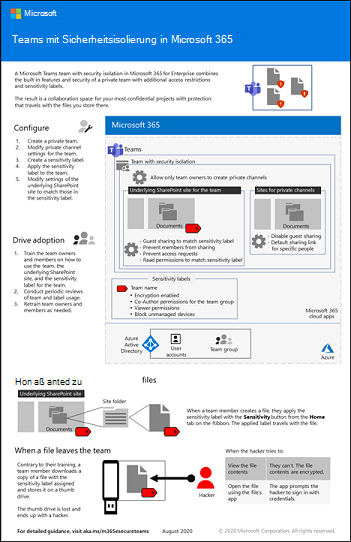

# Konfigurieren eines Teams mit SicherheitsisolierungConfigure a team with security isolation

In diesem Artikel finden Sie Empfehlungen und Schritte zum Konfigurieren eines privaten Teams in Microsoft Teams und zum Verwenden einer eindeutigen Vertraulichkeitsbezeichnung zum Verschlüsseln von Dateien, sodass nur Teammitglieder Sie entschlüsseln können.This article provides you with recommendations and steps to configure a private team in Microsoft Teams and use a unique sensitivity label to encrypt files so that only team members can decrypt them.

Neben dem privaten Zugriff wird in diesem Artikel beschrieben, wie die zugehörige SharePoint-Website, auf die Sie über den Abschnitt **Dateien** eines Teamkanals zugreifen können, für die zusätzliche Sicherheit konfiguriert wird, die für die Speicherung von streng regulierten Daten erforderlich ist.Beyond the private access, this article describes how to configure the associated SharePoint site, which you can access from the **Files** section of a team channel, for the additional security needed to store highly regulated data.

Die Elemente der Konfiguration für ein Team mit Sicherheitsisolierung sind:The elements of configuration for a team with security isolation are:

- Ein privates TeamA private team
- Zusätzliche Sicherheit auf der zugehörigen SharePoint-Website für das Team, die verhindert,Additional security on the associated SharePoint site for the team that:
  - Dass Mitglieder der Website die Website für andere Personen freigeben.Prevents members of the site from sharing the site with others.
  - Dass Nicht-Mitglieder der Website Zugriff auf die Website anfordern.Prevents non-members of the site from requesting access to the site.
- Eine Vertraulichkeitsbezeichnung speziell für dieses Team, die:A sensitivity label specifically for this team that:
    - den Zugriff auf SharePoint-Inhalte von nicht verwalteten Geräten verhindertPrevents access to SharePoint content from unmanaged devices
    - dem Gast den Zugang zum Team erlaubt oder verweigert, je nach Ihren AnforderungenAllows or denies guest access to the team, depending on your requirements
    - Dokumente verschlüsselt, auf die das Etikett angewendet wirdEncrypts documents to which the label is applied

> [!IMPORTANT]
> Stellen Sie sicher, dass Sie die [Vertraulichkeitsbezeichnungen zum Schutz von Inhalten in Microsoft Teams, Office 365-Gruppen und SharePoint-Websites](https://docs.microsoft.com/microsoft-365/compliance/sensitivity-labels-teams-groups-sites) aktiviert haben, bevor Sie mit den Schritten in diesem Artikel fortfahren.Be sure you have enabled [sensitivity labels to protect content in Microsoft Teams, Office 365 groups, and SharePoint sites](https://docs.microsoft.com/microsoft-365/compliance/sensitivity-labels-teams-groups-sites) before you proceed with the steps in this article.

Schauen Sie sich dieses Video an, um einen Überblick über den Bereitstellungsprozess zu erhalten.Watch this video for an overview of the deployment process.
 
 
> [!VIDEO https://www.microsoft.com/videoplayer/embed/RE4mGHf]

 Eine einseitige Zusammenfassung dieses Szenarios zeigt das [Poster „Microsoft Teams mit Sicherheitsisolierung“](../downloads/team-security-isolation-poster.pdf).For a 1-page summary of this scenario, see the [Microsoft Teams with security isolation poster](../downloads/team-security-isolation-poster.pdf).

Sie können dieses Poster auch im [PDF](https://github.com/MicrosoftDocs/microsoft-365-docs/raw/public/microsoft-365/downloads/team-security-isolation-poster.pdf)- oder [PowerPoint](https://download.microsoft.com/download/8/0/5/8057fc16-c044-40b6-a652-7ed555ba2895/team-security-isolation-poster.pptx)-Format herunterladen und in den Formaten "Brief", "Legal" oder "Tabloid" (27,94 x 43,18 cm) ausdrucken.You can also download this poster in [PDF](https://github.com/MicrosoftDocs/microsoft-365-docs/raw/public/microsoft-365/downloads/team-security-isolation-poster.pdf) or [PowerPoint](https://download.microsoft.com/download/8/0/5/8057fc16-c044-40b6-a652-7ed555ba2895/team-security-isolation-poster.pptx) formats and print it on letter, legal, or tabloid (11 x 17) size paper.

Probieren Sie diese Konfiguration in Ihrer eigenen Testlaborumgebung mit [diesen Anweisungen](team-security-isolation-dev-test.md) aus.Try this configuration in your own test lab environment with [these instructions](team-security-isolation-dev-test.md).

Sehen Sie in [dieser Fallstudie](contoso-team-for-top-secret-project.md), wie die Contoso Corporation ein isoliertes Team für ein streng geheimes Projekt verwendet hat.See how the Contoso Corporation used an isolated team for a top-secret project in [this case study](contoso-team-for-top-secret-project.md).

## Erste SchutzmaßnahmenInitial protections

Wenn Sie den Zugriff auf das Team und die zugrunde liegende SharePoint-Website schützen möchten, überprüfen Sie die folgenden bewährten Methoden:To help protect access to the team and its underlying SharePoint site, review the following best practices:
- [Identitäts- und GerätezugriffsrichtlinienIdentity and device access policies](../security/office-365-security/identity-access-policies.md)
- [SharePoint-Online-ZugriffsrichtlinienSharePoint Online access policies](../security/office-365-security/sharepoint-file-access-policies.md)
- [Bereitstellen von Teams mit grundlegendem SchutzDeploy teams with baseline protection](configure-teams-baseline-protection.md)

## GastfreigabeGuest sharing

Je nach Art des Unternehmens ist möglicherweise die Gastfreigabe für dieses Team erforderlich.Depending on the nature of your business, you may or may not want to enable guest sharing for this team. Wenn Sie die Zusammenarbeit mit Personen außerhalb Ihrer Organisation in einem solchen Team planen, aktivieren Sie die Gastfreigabe.If you do plan to collaborate with people outside your organization in the team, enable guest sharing. 

Details zur sicheren Freigabe für Gäste finden Sie in den folgenden Ressourcen:For details about sharing with guests securely, see the following resources:

- [Begrenzen der versehentlichen Gefährdung von Dateien bei der Freigabe für Personen außerhalb Ihrer OrganisationLimit accidental exposure to files when sharing with people outside your organization](https://docs.microsoft.com/microsoft-365/solutions/share-limit-accidental-exposure)
- [Erstellen einer sicheren GastfreigabeumgebungCreate a secure guest sharing environment](https://docs.microsoft.com/microsoft-365/solutions/create-secure-guest-sharing-environment)

Für das Zulassen oder Blockieren des Gastfreigabe verwenden wir eine Kombination aus einer Vertraulichkeitsbezeichnung für das Team und Steuerelementen für die Freigabe auf Team- und Websiteebene für die zugeordnete SharePoint-Website, die beide später behandelt werden.To allow or block guest sharing, we use a combination of a sensitivity label for the team and site-level sharing controls for the associated SharePoint site, both discussed later.

## Erstellen eines privaten TeamsCreate a private team

Da wir eine Vertraulichkeitsbezeichnung speziell für dieses Team erstellen, besteht der nächste Schritt darin, das Team zu erstellen.Since we are creating a sensitivity label specifically for this team, the next step is to create the team. Wenn Sie über ein vorhandenes Team verfügen, können Sie es verwenden.If you have an existing team, you can use that.

So erstellen Sie ein Team für vertrauliche InformationenTo create a team for sensitive information
1. Klicken Sie in Microsoft Teams auf der linken Seite auf **Teams** und dann unten in der Teamliste auf **Einem Team beitreten oder ein Team erstellen**.In Teams, click **Teams** on the left side of the app, then click **Join or create a team** at the bottom of the teams list.
2. Klicken Sie auf **Team erstellen** (erste Karte, obere linke Ecke).Click **Create team** (first card, top left corner).
3. Wählen Sie **Neuerstellen eines Teams**.Choose **Build a team from scratch**.
4. Behalten Sie in der Liste **Vertraulichkeit** die Standardeinstellung bei.In the **Sensitivity** list, keep the default.
5. Klicken Sie unter **Datenschutz** auf **Privat**.Under **Privacy**, click **Private**.
6. Geben Sie einen Namen für das Team ein, der sich auf Ihr sensibles Projekt bezieht.Type a name for the team that is related to your sensitive project. Z. B. **Projekt Saturn**.For example, **Project Saturn**.
7. Klicken Sie auf **Erstellen**.Click **Create**.
8. Fügen Sie Benutzer zu dem Team hinzu, und klicken Sie dann auf **Schließen**.Add users to the team, and then click **Close**.

## Einstellungen für private KanälePrivate channel settings

Es wird empfohlen, die Erstellung privater Kanäle für Teambesitzer zu beschränken.We recommend restricting creating private channels to team owners.

So schränken Sie die Erstellung privater Kanäle einTo restrict private channel creation
1. Klicken Sie im Team auf **Weitere Optionen** und dann auf **Team verwalten**.In the team, click **More options**, and then click **Manage team**.
2. Erweitern Sie auf der Registerkarte **Einstellungen** den Eintrag **Mitgliedsberechtigungen**.On the **Settings** tab, expand **Member permissions**.
3. Deaktivieren Sie das Kontrollkästchen **Mitglieder können private Kanäle erstellen**.Clear the **Allow members to create private channels** check box.

Sie können auch [Teams-Richtlinien](https://docs.microsoft.com/MicrosoftTeams/teams-policies) verwenden, um zu steuern, wer private Kanäle erstellen kann.You can also use [teams policies](https://docs.microsoft.com/MicrosoftTeams/teams-policies) to control who can create private channels.

## Erstellen einer VertraulichkeitsbezeichnungCreate a sensitivity label

Wenn Sie ein Team für die Sicherheitsisolierung konfigurieren möchten, verwenden wir eine speziell für dieses Team erstellte Vertraulichkeitsbezeichnung.To configure a team for security isolation, we'll be using a sensitivity label created specifically for this team. Diese Bezeichnung wird auf Teamebene verwendet, um die gemeinsame Nutzung von Gästen zu steuern und den Zugriff von nicht verwalteten Geräten zu blockieren.This label is used at the team level to control guest sharing and to block access from unmanaged devices. Sie kann auch dazu verwendet werden, einzelne Dateien im Team zu klassifizieren und zu verschlüsseln, sodass sie nur von Teambesitzern und Mitgliedern geöffnet werden können.It can also be used to classify and encrypt individual files in the team so that only team owners and members can open them.

Wenn Sie über einen internen Partner oder eine Gruppe von Interessengruppen verfügen, die in der Lage sein sollen, verschlüsselte Dokumente anzuzeigen, diese jedoch nicht zu bearbeiten, können Sie sie zur Bezeichnung mit der Berechtigung „Nur Anzeigen“ hinzufügen.If you have an internal partner or stakeholder group who should be able to view encrypted documents but not edit them, you can add them to the label with view-only permissions. Sie können diese Personen dann der SharePoint-Website des Teams mit Leseberechtigungen hinzufügen, und sie haben schreibgeschützten Zugriff auf die Website, auf der die Dokumente aufbewahrt werden, aber nicht auf das Team selbst.You can then add these people to the team's SharePoint site with Reader permissions, and they will have read-only access to the site where the documents are kept, but not the team itself.

Erstellen einer VertraulichkeitsbezeichnungTo create a sensitivity label
1. Öffnen Sie das [Microsoft 365 Compliance Center](https://compliance.microsoft.com).Open the [Microsoft 365 compliance center](https://compliance.microsoft.com).
2. Klicken Sie unter **Lösungen** auf **Informationsschutz**.Under **Solutions**, click **Information protection**.
3. Klicken Sie auf **Bezeichnung erstellen**.Click **Create a label**.
4. Weisen Sie der Bezeichnung einen Namen zu.Give the label a name. Wir schlagen vor, ihn nach dem Team zu benennen, mit dem Sie ihn verwenden möchten.We suggest naming it after the team that you'll be using it with.
5. Fügen Sie einen Namen und eine Beschreibung hinzu, und klicken Sie auf **Weiter**.Add a display name and description, and then click **Next**.
6. Wählen Sie auf der Seite **Definieren des Bereichs für diese Bezeichnung** die Option **Dateien & E-Mails** und **Gruppen & Websites** aus und klicken Sie **Weiter**.On the **Define the scope for this label page**, select **Files & emails** and **Groups & sites** and click **Next**.
7. Wählen Sie auf der Seite **Schutzeinstellungen für Dateien und E-Mails auswählen** die Option **Dateien und E-Mails verschlüsseln** aus und klicken Sie dann **Weiter**.On the **Choose protection settings for files and emails** page, select **Encrypt files and emails**, and then click **Next**.
8. Wählen Sie auf der Seite **Verschlüsselung** die Option **Verschlüsselungseinstellungen konfigurieren** aus.On the **Encryption** page, choose **Configure encryption settings**.
9. Klicken Sie auf **Benutzer oder Gruppen hinzufügen**, wählen Sie das von Ihnen erstellte Team aus und klicken Sie dann auf **Hinzufügen**.Click **Add users or groups**, select the team that you created, and then click **Add**
10. Klicken Sie auf **Berechtigungen auswählen**.Click **Choose permissions**.
11. Wählen Sie in der Dropdownliste **Mitautor**, und klicken Sie dann auf **Speichern**.Choose **Co-Author** from the dropdown list, and then click **Save**.
12. Wenn Sie Benutzer oder Gruppen mit schreibgeschütztem Zugriff auf Dateien mit dieser Bezeichnung einbeziehen möchten:If you want to include users or groups with read-only access to files with the label:
    1. Klicken Sie auf **Zuweisen von Berechtigungen**.Click **Assign permissions**.
    1. Klicken Sie auf **Benutzer oder Gruppen hinzufügen**, wählen Sie die Benutzer oder die Gruppen, die Sie hinzufügen möchten, aus und klicken Sie dann auf **Hinzufügen**.Click **Add users or groups**, select the users or groups that you want to add, and then click **Add**.
    1. Klicken Sie auf **Berechtigungen auswählen**.Click **Choose permissions**.
    1. Wählen Sie in der Dropdownliste **Viewer** aus, und klicken Sie dann auf **Speichern**.Choose **Viewer** from the dropdown list, and then click **Save**.
13.  Klicken Sie auf **Speichern** und dann auf **Weiter**.Click **Save**, and then click **Next**.
14. Klicken Sie auf der Seite *Automatische Bezeichnung für Dateien und E-Mails*\* auf **Weiter**.On the *Auto-labeling for files and emails*\* page, click **Next**.
15. Wählen Sie auf der Seite **Definieren der Schutzeinstellungen für Gruppen und Websites** die Option **Einstellungen für Datenschutz und den Zugriff externer Benutzer** und **Einstellungen für Gerätezugriff und externe Freigabe** aus und klicken Sie **Weiter**.On the **Define protection settings for groups and sites** page, select **Privacy and external user access settings** and **Device access and external sharing settings** and click **Next**.
16. Wählen Sie auf der Seite **Definieren von Einstellungen für Datenschutz und den Zugriff externer Benutzer** unter **Datenschutz** die Option **Privat** aus.On the **Define privacy and external user access settings** page, under **Privacy**, select the **Private** option.
17. Wenn Sie Gastzugriffe zulassen wollen, wählen Sie unter **Externer Benutzerzugriff** die Option **Zulassen, dass Microsoft 365-Gruppenbesitzer Personen außerhalb Ihrer Organisation als Gäste zur Gruppe hinzufügen**.If you want to allow guest access, under **External user access**, select **Let Microsoft 365 Group owners add people outside your organization to the group as guests**.
18. Klicken Sie auf **Weiter**.Click **Next**.
19. Wählen Sie auf der Seite **Definieren der Einstellungen für externe Freigabe und Gerätezugriff** die Option **Steuerung der externen Freigabe aus bezeichneten SharePoint-Websites**.On the **Define external sharing and device access settings** page, select **Control external sharing from labeled SharePoint sites**.
20. Wählen Sie unter **Inhalt kann geteilt werden mit** die Option **Neue und bestehende Gäste** aus, wenn Sie den Gastzugriff erlauben wollen, oder anderenfalls **Nur Personen in Ihrer Organisation**.Under **Content can be shared with**, choose **New and existing guests** if you're allowing guest access or **Only people in your organization** if not.
21. Wählen Sie unter **Zugriff von nicht verwalteten Geräten** die Option **Zugriff blockieren**.Under **Access from unmanaged devices**, choose **Block access**.
22. Klicken Sie auf **Weiter**.Click **Next**.
23. Klicken Sie auf der Seite **Automatisches Bezeichnen von Datenbank-Spalten** auf **Weiter**.On the **Auto-labeling for database columns** page, click **Next**.
24. Klicken Sie auf **Bezeichnung erstellen** und anschließend auf **Fertig**.Click **Create label**, and then click **Done**.

Nachdem Sie die Bezeichnung erstellt haben, müssen Sie sie für die Benutzer veröffentlichen, die sie verwenden sollen.Once you've created the label, you need to publish it to the users who will use it. In diesem Fall wird die Bezeichnung nur für Personen im Team verfügbar sein.In this case, we'll make the label available only to people in the team.

So veröffentlichen Sie eine VertraulichkeitsbezeichnungTo publish a sensitivity label
1. Wählen Sie im Microsoft 365 Compliance Center auf der Seite **Informationsschutz** die Registerkarte **Bezeichnungsrichtlinien**.In the Microsoft 365 compliance center, on the **Information protection** page, choose the **Label policies** tab.
2. Klicken Sie auf **Bezeichnungen veröffentlichen**.Click **Publish labels**.
3. Klicken Sie auf der Seite **Zu veröffentlichende Vertraulichkeitsbezeichnungen wählen** auf **Zu veröffentlichende Vertraulichkeitsbezeichnungen wählen**.On the **Choose sensitivity labels to publish** page, click **Choose sensitivity labels to publish**.
4. Wählen Sie die von Ihnen erstellten Bezeichnungen aus, und klicken Sie dann auf **Hinzufügen**.Select the label that you created, and then click **Add**.
5. Klicken Sie auf **Weiter**.Click **Next**.
6. Klicken Sie auf der Seite „Für Benutzer und Gruppen veröffentlichen“ auf **Benutzer und Gruppen auswählen**.On the Publish to users and groups page, click **Choose users and groups**.
7. Klicken Sie auf **Hinzufügen** und wählen Sie dann das von Ihnen erstellte Team aus.Click **Add**, and then select the team that you created.
8. Klicken Sie auf **Hinzufügen** und dann auf **Fertig**.Click **Add**, and then click **Done**.
9. Klicken Sie auf **Weiter**.Click **Next**.
10. Aktivieren Sie auf der Seite Richtlinieneinstellungen das Kontrollkästchen **Benutzer müssen eine Begründung für das Entfernen einer Bezeichnung oder einer Bezeichnung mit niedrigerer Klassifizierung angeben**, und klicken Sie dann auf **Weiter**.On the Policy settings page, select the **Users must provide justification to remove a label or lower classification label** check box, and then click **Next**.
11. Geben Sie einen Namen für die Richtlinie ein und klicken Sie dann auf **Weiter**.Type a name for the policy, and then click **Next**.
12. Klicken Sie auf **Absenden** und dann auf **Fertig**.Click **Submit** and then click **Done**.

## Anwenden der Bezeichnung auf das TeamApply the label to the team

Nachdem die Bezeichnung veröffentlicht wurde, müssen Sie sie auf das Team anwenden, damit die Einstellungen für Gastfreigabe und verwaltete Geräte wirksam werden.Once the label has been published, you must apply it to the team in order for the guest sharing and managed devices settings to take effect. Das kann im SharePoint Online Admin Center erledigt werden.This is done in the SharePoint admin center. Beachten Sie, dass es einige Zeit dauern kann, bis die Bezeichnung nach ihrer Veröffentlichung verfügbar ist.Note, it may take some time for the label to become available after it's been published.

So wenden Sie die Vertraulichkeitsbezeichnung anTo apply the sensitivity label
1. Öffnen Sie das [SharePoint Online Admin Center](https://admin.microsoft.com/sharepoint).Open the [SharePoint admin center](https://admin.microsoft.com/sharepoint).
2. Klicken Sie unter **Websites** auf **Aktive Websites**.Under **Sites**, click **Active sites**.
3. Klicken Sie auf die dem Team zugeordnete Website.Click the site that is associated with team.
4. Klicken Sie auf der Registerkarte **Richtlinien** unter **Vertraulichkeit** auf **Bearbeiten**.On the **Policies** tab, under **Sensitivity**, click **Edit**.
5. Wählen Sie die von Ihnen erstellten Bezeichnungen aus, und klicken Sie dann auf **Speichern**.Select the label that you created, and then click **Save**.

## SharePoint-EinstellungenSharePoint settings

In SharePoint müssen Sie drei Schritte ausführen:There are three steps to do in SharePoint:

- Aktualisieren Sie die Gastfreigabeeinstellungen für die Website im SharePoint Online Admin Center so, dass sie jenen entsprechen, die Sie beim Erstellen der Bezeichnung vorgenommen haben, und legen Sie für den standardmäßigen Freigabelink *Personen mit vorhandenem Zugriff* fest.Update the guest sharing settings for the site in the SharePoint admin center to match what you chose when you created the label, and update the default sharing link to *People with existing access*.
- Aktualisieren Sie die Website-Freigabeeinstellungen auf der Website selbst, um zu verhindern, dass Mitglieder Dateien, Ordner oder die Website freigeben, und Zugriffsanforderungen ausschalten.Update the site sharing settings in the site itself to prevent members from sharing files, folders, or the site, and turn off access requests.
- Wenn Sie Personen oder Gruppen zur Bezeichnung mit Nur-Leseberechtigungen hinzugefügt haben, können Sie sie mit Leseberechtigungen zur SharePoint-Website hinzufügen.If you added people or groups to the label with Viewer permissions, you can add them to the SharePoint site with Read permissions.

### SharePoint-GasteinstellungenSharePoint guest settings

Die Einstellung für die Gastfreigabe, die Sie beim Erstellen der Bezeichnung ausgewählt haben (die sich nur auf die Teammitgliedschaft auswirkt), sollten mit den Gast-Freigabeeinstellungen für die zugeordnete SharePoint-Website wie folgt übereinstimmen:The guest sharing setting that you chose when you created the label (which only affects team membership) should match the guest sharing settings for the associated SharePoint site as follows:

|BezeichnungseinstellungLabel setting|Einstellung für die SharePoint-WebsiteSharePoint site setting|
|:------------|:----------------------|
|**Office 365-Gruppenbesitzer dürfen Personen außerhalb der Organisation zur Gruppe hinzufügen** ausgewählt**Let Office 365 group owners add people outside the organization to the group** selected|**Neue und vorhandene Gäste** (Standard für neue Teams)**New and existing guests** (default for new teams)|
|**Office 365-Gruppenbesitzer dürfen Personen außerhalb der Organisation zur Gruppe hinzufügen** nicht ausgewählt**Let Office 365 group owners add people outside the organization to the group** not selected|**Nur Personen in Ihrer Organisation****Only people in your organization**|

Außerdem wird der standardmäßige Linktyp für die Freigabe aktualisiert, um das Risiko zu verringern, dass Dateien und Ordner versehentlich für ein breiteres Publikum freigegeben werden als beabsichtigt.We'll also update the default sharing link type to reduce the risk of accidentally sharing files and folders to a wider audience than intended.

So aktualisieren Sie WebsiteeinstellungenTo update site settings
1. Öffnen Sie das [SharePoint Admin Center](https://admin.microsoft.com/sharepoint).Open the [SharePoint admin center](https://admin.microsoft.com/sharepoint).
2. Klicken Sie unter **Websites** auf **Aktive Websites**.Under **Sites**, click **Active sites**.
3. Klicken Sie auf die dem Team zugeordnete Website.Click the site that is associated with team.
4. Klicken Sie auf der Registerkarte **Richtlinien** unter **Externe Freigabe** auf **Bearbeiten**.On the **Policies** tab, under **External sharing**, click **Edit**.
5. Wenn Sie beim Erstellen der Vertraulichkeitsbezeichnung die Gastfreigabe zugelassen haben, stellen Sie sicher, dass **Neue und vorhandene Gäste** ausgewählt ist.If you allowed guest sharing when you created the sensitive label, ensure that **New and existing guests** is selected. Wenn Sie beim Erstellen der Bezeichnung keine Freigabe zugelassen haben, wählen Sie **Nur Personen in Ihrer Organisation** aus.If you didn't allow sharing when you created the label, choose **Only people in your organization**.
6. Deaktivieren Sie unter "Standardmäßiger Freigabe-Linktyp" das Kontrollkästchen **Identisch mit der Einstellung auf Organisationsebene**, und wählen Sie **Personen mit vorhandenem Zugriff** aus.Under Default sharing link type, clear the **Same as organization-level setting** check box, and select **People with existing access**.
7. Klicken Sie auf **Speichern**.Click **Save**.

#### Private KanälePrivate channels

Wenn Sie dem Team private Kanäle hinzufügen, erstellt jeder private Kanal eine neue SharePoint-Website mit den Standardeinstellungen für die Freigabe.If you add private channels to the team, each private channel creates a new SharePoint site with the default sharing settings. Diese Websites werden im SharePoint Online Admin Center nicht angezeigt, daher müssen Sie das Cmdlet [Set-SPOSite](https://docs.microsoft.com/powershell/module/sharepoint-online/set-sposite) PowerShell mit den folgenden Parametern verwenden, um die Gast-Freigabeeinstellungen zu aktualisieren:These sites are not visible in the SharePoint admin center, so you must use the [Set-SPOSite](https://docs.microsoft.com/powershell/module/sharepoint-online/set-sposite) PowerShell cmdlet with the following parameters to update the guest sharing settings:

- `-SharingCapability Disabled` um die Gastfreigabe zu deaktivieren (standardmäßig aktiviert)`-SharingCapability Disabled` to turn off guest sharing (it's on by default)
- `-DefaultSharingLinkType Internal` um den standardmäßigen Freigabelink zu *Bestimmte Personen* zu ändern`-DefaultSharingLinkType Internal` to change the default sharing link to *Specific people*

Wenn Sie nicht beabsichtigen, private Kanäle für Ihr Team zu verwenden, können Sie die Möglichkeit für Teammitglieder deaktivieren, solche Kanäle unter **Mitgliedsberechtigungen** in [Team-Einstellungen](https://support.microsoft.com/office/ce053b04-1b8e-4796-baa8-90dc427b3acc) zu erstellen.If you don't plan to use private channels with your team, consider turning off the ability for team members to create them under **Member permissions** in [team settings](https://support.microsoft.com/office/ce053b04-1b8e-4796-baa8-90dc427b3acc).

### Freigabeeinstellungen für WebsitesSite sharing settings

Um sicherzustellen, dass die SharePoint-Website nicht mit Personen geteilt wird, die nicht Mitglieder des Teams sind, schränken Sie die Freigabe auf die Besitzer ein.To help ensure that the SharePoint site does not get shared with people who are not members of the team, we limit such sharing to owners. Außerdem beschränken wir das Freigeben von Dateien und Ordnern auf die Teambesitzer.We also limit sharing of files and folders to team owners. Auf diese Weise wird sichergestellt, dass die Besitzer informiert sind, wenn eine Datei an jemanden außerhalb des Teams freigegeben wird.This helps ensure that owners are aware whenever a file is shared with someone outside the team.

So beschränken Sie die Websitefreigabe auf die BesitzerTo configure owners-only site sharing
1. Gehen Sie in Teams zur Registerkarte **Allgemein** des Teams, das Sie aktualisieren möchten.In Teams, navigate to the **General** tab of the team you want to update.
2. Klicken Sie auf der Symbolleiste des Teams auf **Dateien**.In the tool bar for the team, click **Files**.
3. Klicken Sie auf die drei Punkte "(…)" und dann auf **In SharePoint öffnen**.Click the ellipsis, and then click **Open in SharePoint**.
4. Klicken Sie in der Symbolleiste der zugrunde liegenden SharePoint-Website auf das Symbol "Einstellungen" und anschließend auf **Websiteberechtigungen**.In the tool bar of the underlying SharePoint site, click the settings icon, and then click **Site permissions**.
5. Klicken Sie im Bereich "Websiteberechtigungen" unter **Freigabeeinstellungen** auf **Freigabeeinstellungen ändern**.In the Site permissions pane, under **Sharing Settings**, click **Change sharing settings**.
6. Wählen Sie unter **Freigabeberechtigungen** die Option **Nur Websitebesitzer können Dateien, Ordner und die Website teilen** aus, und klicken Sie dann auf **Speichern**.Under **Sharing permissions**, choose **Only site owners can share files, folders, and the site**, and then click **Save**.

### Benutzerdefinierte Website-BerechtigungenCustom site permissions

Wenn Sie Personen mit Leseberechtigungen zur Vertraulichkeitsbezeichnung hinzugefügt haben, können Sie diese der SharePoint-Website mit Lesezugriff hinzufügen, damit Sie einfach auf die Dateien zugreifen können.If you added people with Viewer permissions to the sensitivity label, you can add them to the SharePoint site with Read access so they have easy access to the files.

So fügen Sie Benutzern zur Website hinzuTo add users to the site
1. Klicken Sie in der Website auf das Zeichen für die Einstellungen und anschließend auf **Websiteberechtigungen**.In the site, click the settings icon, and then click **Site permissions**.
2. Klicken Sie auf **Personen einladen** und klicken Sie dann auf **Nur Website freigeben**.Click **Invite people**, and then click **Share site only**.
3. Geben Sie die Namen der Benutzer und Gruppen ein, die Sie einladen möchten.Type the names of the users and groups that you want to invite.
4. Ändern Sie für jede hinzugefügte Person oder Gruppe deren Berechtigungen von **Bearbeiten** auf **Lesen**.For each person or group that you add, change their permissions from **Edit** to **Read**.
5. Wählen Sie aus, ob Sie eine E-Mail mit einem Link zur Website senden möchten.Choose if you want to send them an email with a link to the site.
6. Klicken Sie auf **Hinzufügen**.Click **Add**.

## Zusätzliche SchutzfunktionenAdditional protections

Microsoft 365 bietet zusätzliche Methoden zum Schützen Ihrer Inhalte.Microsoft 365 offers additional methods for securing your content. Prüfen Sie, ob die folgenden Optionen zur Verbesserung der Sicherheit in Ihrer Organisation beitragen würden.Consider if the following options would help improve security for your organization.

- Lassen Sie Ihre Gastbenutzer den [Nutzungsbedingungen](https://docs.microsoft.com/azure/active-directory/conditional-access/terms-of-use) zustimmen.Have your guests agree to a [terms of use](https://docs.microsoft.com/azure/active-directory/conditional-access/terms-of-use).
- Konfigurieren Sie eine [Richtlinie für Sitzungstimeout](https://docs.microsoft.com/azure/active-directory/conditional-access/howto-conditional-access-session-lifetime) für Gastbenutzer.Configure a [session timeout policy](https://docs.microsoft.com/azure/active-directory/conditional-access/howto-conditional-access-session-lifetime) for guests.
- Erstellen Sie [Typen vertraulicher Informationen](https://docs.microsoft.com/microsoft-365/compliance/custom-sensitive-info-types) und verwenden Sie [Schutz vor Datenverlust](https://docs.microsoft.com/microsoft-365/compliance/data-loss-prevention-policies) zum Festlegen von Richtlinien für den Zugriff auf vertrauliche Informationen.Create [sensitive information types](https://docs.microsoft.com/microsoft-365/compliance/custom-sensitive-info-types) and use [data loss protection](https://docs.microsoft.com/microsoft-365/compliance/data-loss-prevention-policies) to set policies around accessing sensitive information.
- Verwenden Sie [Azure Active Directory Zugriffsüberprüfungen](https://docs.microsoft.com/azure/active-directory/governance/access-reviews-overview), um den Zugriff und die Mitgliedschaft des Teams regelmäßig zu überprüfen.Use [Azure Active Directory access](https://docs.microsoft.com/azure/active-directory/governance/access-reviews-overview) reviews to periodically review team access and membership.

## Fördern der Benutzerakzeptanz für TeammitgliederDrive user adoption for team members

Wenn das Team aktiv ist, ist es an der Zeit, die Benutzerakzeptanz dieses Teams und dessen zusätzlicher Sicherheit für Teammitglieder zu fördern.With the team in place, it's time to drive the adoption of this team and its additional security to team members.

### Schulen Ihrer BenutzerTrain your users

Mitglieder des Teams können auf das Team und alle zugehörigen Ressourcen zugreifen, b. B. Chats, Besprechungen und andere Apps.Members of the team can access the team and all of its resources, including chats, meetings, and other apps. Wenn Sie mit Dateien aus dem Abschnitt **Dateien** eines Kanals arbeiten, müssen die Mitglieder des Teams den von ihnen erstellten Dateien eine Vertraulichkeitsbezeichnung zuweisen.When working with files from the **Files** section of a channel, members of the team should assign the sensitivity label to the files they create.

Wird die Bezeichnung auf eine Datei angewendet, ist diese verschlüsselt.When the label gets applied to the file, it is encrypted. Mitglieder des Teams können sie öffnen und in Echtzeit zusammenarbeiten.Members of the team can open it and collaborate in real time. Wenn die Datei die Website verlässt und an einen böswilligen Benutzer weitergeleitet wird, lässt sich die Datei nur öffnen, und ihr Inhalt kann nur angezeigt werden, wenn die Anmeldeinformationen eines Benutzerkontos angegeben werden, das Mitglied des Teams ist.If the file leaves the site and gets forwarded to a malicious user, they will have to supply credentials of a user account that is member of the team to open the file and view its contents. 

Schulen Sie Ihre Teammitglieder:Train your team members:

- Vermitteln Sie ihnen, wie wichtig es ist, das neue Team für Chats, Besprechungen, Dateien und andere Ressourcen der SharePoint-Website zu nutzen und welche Auswirkungen ein Verlust streng regulierter Daten hat, z. B. rechtliche Konsequenzen, Bußgelder, Ransomware oder Verlust des Wettbewerbsvorteils.On the importance of using the new team for chats, meetings, files, and the other resources of the SharePoint site and the consequences of a highly regulated data leak, such as legal ramifications, regulatory fines, ransomware, or loss of competitive advantage.
- So greifen Sie auf das Team zu.How to access the team.
- Erklären Sie, wie neue Dateien auf der Website erstellt und neue, lokal gespeicherte Dateien hochgeladen werden.How to create new files on the site and upload new files stored locally.
- Bezeichnen von Dateien mit der richtigen Vertraulichkeitsbezeichnung für das Team.How to label files with the correct sensitivity label for the team.
- Veranschaulichen, wie die Bezeichnung Dateien schützt, auch wenn sie die Website verlassen.How the label protects files even when they are leaked off the site.

Diese Schulung sollte praktische Übungen umfassen, damit die Teammitglieder diese Funktionen und deren Ergebnisse ausprobieren können.This training should include hands-on exercises so that your team members can experience these capabilities and their results.

### Durchführen regelmäßiger Verwendungsprüfungen und Behandeln des Feedbacks der Teammitglieder.Conduct periodic reviews of usage and address team member feedback

In den Wochen nach der Schulung:In the weeks after training:

- Reagieren Sie umgehend auf Feedback von Teammitgliedern und optimieren Sie die Richtlinien und Konfigurationen.Quickly address team member feedback and fine tune polices and configurations.
- Analysieren Sie die Verwendung der Website und vergleichen Sie sie mit den Erwartungen.Analyze usage for the team and compare it with usage expectations.
- Sicherstellen, dass streng regulierte Dateien korrekt mit der Vertraulichkeitsbezeichnung gekennzeichnet wurden.Verify that highly regulated files have been properly labeled with the sensitivity label. (Sie können sehen, welchen Dateien eine Bezeichnung zugeordnet ist, indem Sie einen Ordner in SharePoint anzeigen und über die Option **Spalten ein-/ausblenden** > **Spalte hinzufügen** die Spalte **Vertraulichkeit** hinzufügen.(You can see which files have a label assigned by viewing a folder in SharePoint and adding the **Sensitivity** column through the **Show/hide columns** option of **Add column**.

Ihre Benutzer bei Bedarf erneut schulen.Retrain your users as needed.

## Siehe auchSee also

[Azure AD Privileged Identity ManagementAzure AD Privileged Identity Management](https://docs.microsoft.com/azure/active-directory/privileged-identity-management/pim-configure)
