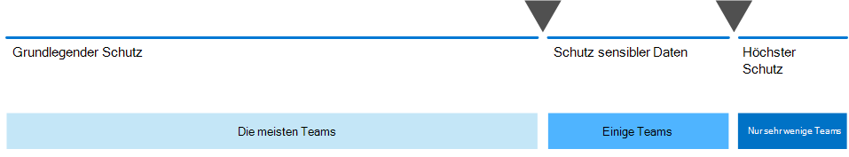

# Sichere Zusammenarbeit mit Microsoft 365 einrichten

Die Möglichkeit, Informationen einfach mit den richtigen Personen auszutauschen und gleichzeitig eine Übernutzung zu verhindern, ist für den Erfolg einer Organisation entscheidend. Dies umfasst die Möglichkeit, vertrauliche Daten sicher nur für diejenigen freizugeben, die Zugriff darauf haben sollten. Je nach Projekt kann dies die Freigabe vertraulicher Daten für Personen außerhalb Ihrer Organisation umfassen.

Diese Lösungsanleitung umfasst zwei Komponenten, die Ihnen helfen:
- Bereitstellen von Microsoft Teams mit der richtigen Schutzebene für jedes Projekt
- Konfigurieren der externen Freigabe mit geeigneten Sicherheitseinstellungen für jedes Projekt

Wenn vielseitige und einfach zu verwendende Tools für die Zusammenarbeit nicht verfügbar sind, werden Benutzer häufig zusammenarbeiten, indem Sie Dokumente per e-Mail senden. Dies ist eine langwierige und fehlerträchtige Methode der Zusammenarbeit und kann das Risiko einer ungeeigneten gemeinsamen Nutzung von Informationen verbessern. Wenn Personen Freigabe Informationen zu schwierig finden, können Sie auf die Verwendung von Consumer-Produkten zurückgreifen, die nicht von ihr gesteuert werden. Dies kann ein noch größeres Risiko darstellen.

Mit Microsoft 365 können Sie Teams mit einer Vielzahl von Konfigurationen bereitstellen, die Folgendes unterstützen:

- Schützen Ihres geistigen Eigentums
- Einfache Zusammenarbeit aktivieren
- Erstellen Sie ein Gleichgewichtzwischen Sicherheit und Benutzerfreundlichkeit, das die Benutzerzufriedenheit erhöht und das Risiko von Shadow IT reduziert.

Die meisten Organisationen verfügen über eine Vielzahl von Informationen mit unterschiedlichem Grad an Sensibilität und unterschiedlichen geschäftlichen Auswirkungen, wenn die Informationen ungeeignet freigegeben werden. Je nach Empfindlichkeit einer bestimmten Information möchten Sie möglicherweise die Freigabe für Folgendes zulassen:

- Jeder (nicht authentifiziert)
- Personen innerhalb der Organisation
- Bestimmte Personen innerhalb der Organisation
- Bestimmte Personen innerhalb und außerhalb der Organisation

Informationen wie Marketingbroschüren sind für eine breite Freigabe außerhalb der Organisation gedacht. Informationen wie Cafeteria-Menüs sind nicht für die externe Freigabe gedacht, aber es hätte keine Auswirkungen auf das Geschäft, wenn Sie extern freigegeben würden. Diese Arten von Informationen benötigen wenig oder keinen Schutz.

Dieselben Marketingbroschüren, während Sie sich in der Entwicklung befinden, können nur innerhalb der Organisation freigegeben werden. In diesem Fall sind die Standardfreigabe Einstellungen in Microsoft Teams möglicherweise ausreichend.

Informationen zu einem neuen Produkt, das in der Entwicklung ist, können auch innerhalb der Organisation als vertraulich betrachtet werden. In diesem Fall ist möglicherweise ein größerer Schutz angemessen. Sie können beispielsweise den Zugriff auf diese Informationen auf Mitglieder eines bestimmten Teams einschränken. Je nach Projekt müssen Sie möglicherweise mit Personen außerhalb Ihrer Organisation zusammenarbeiten, beispielsweise einem Anbieter oder einer Partnerorganisation.

Informationen, die für den Erfolg Ihrer Organisation entscheidend sind oder strenge Sicherheits-oder Compliance-Anforderungen haben, erfordern möglicherweise noch höhere Schutzgrade.

Für alle oben genannten Szenarien können Sie Microsoft Teams-Teams verwenden, um die Informationen zu speichern, freizugeben und zusammenzuarbeiten. 

Um Secure collabration zu konfigurieren, verwenden Sie diese Microsoft 365-Funktionen und-Funktionen.

| Produkt oder Komponente | Funktion oder Feature | Lizenzierung |
|:-------|:-----|:-------|
| Office 365 Advanced Threat Protection | Sichere ATP-Anhänge für SpO, OneDrive und Teams; Sichere ATP-Dokumente; ATP-sichere Links für Teams    | Microsoft 365 E1, E3 und E5 |
| SharePoint    | Website-und Dateifreigabe Richtlinien, Website Freigabeberechtigungen, Freigabelinks, Zugriffsanforderungen, Einstellungen für die Website-Gast Freigabe | Microsoft 365 E1, E3 und E5 |
| Microsoft Teams   | Gastzugriff, private Teams, private Kanäle | Microsoft 365 E1, E3 und E5 |
| Microsoft 365 Compliance  | Vertraulichkeitsbezeichnungen    | Microsoft 365 E3 und E5 |

### Verwenden von Microsoft Teams für alle Arten von Daten

Um den Zugriff auf Informationen mit unterschiedlichen Sensitivitäten zu verwalten, haben wir [drei verschiedene Schutzebenen für Teams](configure-teams-three-tiers-protection.md)entwickelt. Sie können jede dieser Ebenen anpassen, um den Anforderungen oder Ihrem Unternehmen besser gerecht zu werden. 

Diese Ebenen – *Baseline*, *sensibel*und *hoch sensibel* – verbessern schrittweise den Schutz, der zur Vermeidung von über-und potenziellem Informationsverlust beiträgt, wie in der folgenden Tabelle dargestellt.

||**Baseline-Ebene**|**Vertrauliche Ebene**|**Hochgradig sensible Ebene**|
|:--|:-----------|:------------|:-------------------|
|Öffentliches oder privates Team|Entweder|Private|Private|
|Nicht authentifizierte Freigabe|Gesperrt|Gesperrt|Gesperrt|
|Dateifreigabe|Zulässig|Zulässig|Nur Teambesitzer können freigeben.|
|Team Mitgliedschaft|Jeder kann an öffentlichen Teams teilnehmen. Team Besitzer-Genehmigung für die Teilnahme an privaten Teams erforderlich.|Für den Beitritt erforderliche Team Besitzergenehmigung.|Für den Beitritt erforderliche Team Besitzergenehmigung.|
|Dokumentverschlüsselung|||Verfügbar mit Sensitivitäts Bezeichnung|
|Gastfreigabe|Allowed|Kann zugelassen oder blockiert werden|Kann zugelassen oder blockiert werden|
|Nicht verwaltete Geräte|Keine Einschränkung|Webbasierter Zugriff|Gesperrt|

Das Konfigurieren dieser Ebenen umfasst Folgendes:

- Konfigurieren von Einstellungen in Microsoft Teams für Gastzugriff und private Kanäle
- Konfigurieren von Einstellungen in der zugeordneten SharePoint-Website eines Teams für interne und Gast Freigaben, Zugriffsanforderungen und Freigabelinks
- Für die *vertraulichen* und *hochsensiblen* Ebenen, Konfigurieren von Sensitivitäts Bezeichnungen zum Klassifizieren der Teams und Steuern der Gast Freigabe und des Zugriffs von nicht verwalteten Geräten
- Für die *hochsensible* Ebene, Konfigurieren einer Vertraulichkeits Bezeichnung zum Verschlüsseln der Dokumente, auf die Sie angewendet wird

Beginnen Sie mit der baselineebene, und fügen Sie dann Teams hinzu, die die *vertraulichen* und *hochsensiblen* Ebenen nach Bedarf verwenden, um die Informationen in Ihrer Organisation zu schützen. Die ersten Schritte finden Sie in den folgenden Ressourcen:

- [Konfigurieren von Teams mit grundlegendem Schutz](configure-teams-baseline-protection.md)
- [Teams für den Schutz vertraulicher Daten konfigurieren](configure-teams-sensitive-protection.md)
- [Teams für den Schutz hochgradig vertraulicher Daten konfigurieren](configure-teams-highly-sensitive-protection.md)

Wenn Sie über ein hoch vertrauliches Projekt verfügen, das zusätzlichen Schutz vor der Freigabe auch innerhalb Ihrer Organisation erfordert, können Sie ein Team konfigurieren, das eine eigene Vertraulichkeits Bezeichnung verwendet, um Dateien zu verschlüsseln, sodass nur Teammitglieder Sie lesen können. Weitere Informationen finden Sie unter [Configure a Team with Security Isolation](secure-teams-security-isolation.md) .

### Freigabe für Personen außerhalb Ihrer Organisation

Möglicherweise müssen Sie [Informationen über Vertraulichkeit für Personen außerhalb Ihrer Organisation freigeben](collaborate-with-people-outside-your-organization.md). Dies kann von der gemeinsamen Nutzung eines einzelnen Dokuments mit einer einzigen Person bis zur Zusammenarbeit bei einem großen Projekt mit einer großen Partnerorganisation oder Freiberuflern aus der ganzen Welt reichen. In Microsoft 365 können diese Bereiche der externen Freigabe einfach und mit den entsprechenden Schutzvorkehrungen zum Schutz Ihrer vertraulichen Informationen ausgeführt werden.

Diese Ressourcen unterstützen Sie bei der Einrichtung Ihrer Umgebung für die Zusammenarbeit mit Personen außerhalb Ihrer Organisation:

- [Zusammenarbeit an Dokumenten](collaborate-on-documents.md) für die gemeinsame Verwendung einzelner Ordner Dateien.
- [Zusammenarbeiten an einer Website](collaborate-in-site.md) für die Zusammenarbeit mit Gästen in einer SharePoint-Website.
- [Arbeiten Sie als Team](collaborate-as-team.md) für die Zusammenarbeit mit Gästen in einem Team zusammen.

Je nach Empfindlichkeit der freigegebenen Informationen können Sie Sicherheitsvorkehrungen hinzufügen, um eine übermäßige Freigabe zu verhindern. Diese Ressourcen helfen Ihnen beim Einrichten der Schutzmaßnahmen, die Sie für Ihre Organisation benötigen:

- [Bewährte Methoden zum Freigeben von Dateien und Ordnern für nicht authentifizierte Benutzer](best-practices-anonymous-sharing.md)
- [Begrenzen der versehentlichen Gefährdung von Dateien bei der Freigabe für Personen außerhalb Ihrer Organisation](share-limit-accidental-exposure.md)
- [Erstellen einer sicheren Gastfreigabeumgebung](create-secure-guest-sharing-environment.md)

Wenn Sie ein Hauptprojekt mit einer Partnerorganisation haben, können Sie die Azure-Berechtigungsverwaltung verwenden, um die Gäste aus dieser Organisation in einem Team zu verwalten, das Sie für das Projekt eingerichtet haben. Weitere Informationen finden Sie unter [Erstellen eines B2B-Extranets mit verwalteten Gästen](b2b-extranet.md) .

## Bereitstellen der Lösung für sichere Zusammenarbeit

Wenn Sie bereit sind, diese Lösung bereitzustellen, fahren Sie mit den folgenden Schritten fort:
1. Konfigurieren Sie die [drei verschiedenen Schutzebenen für Microsoft Teams](configure-teams-three-tiers-protection.md).
2. Konfigurieren Sie Einstellungen für [die Freigabe von Informationen mit Vertraulichkeit für Personen außerhalb Ihrer Organisation](collaborate-with-people-outside-your-organization.md).

## Siehe auch

[Microsoft 365 Sicherheitsdokumentation](https://docs.microsoft.com/microsoft-365/security)

[Microsoft 365-Compliance-Dokumentation](https://docs.microsoft.com/microsoft-365/compliance)

[Willkommen bei Microsoft Teams](https://docs.microsoft.com/MicrosoftTeams/Teams-overview)
