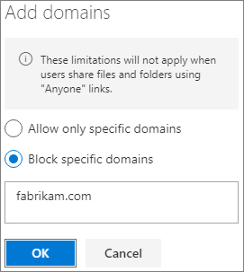

# Begrenzen der versehentlichen Exposition von Dateien bei deren Freigabe für Personen außerhalb der OrganisationLimit accidental exposure to files when sharing with people outside your organization

Bei der Freigabe von Dateien und Ordnern für Personen außerhalb der Organisation gibt es eine Vielzahl an Optionen, um das Risiko zu minimieren, dass vertrauliche Informationen versehentlich freigegeben werden.When sharing files and folders with people outside your organization, there are a variety of options to reduce the chances of accidentally sharing sensitive information. Sie können aus den Optionen in diesem Artikel wählen, um die Anforderungen Ihrer Organisation optimal zu erfüllen.You can choose from the options in this article to best meet the needs of your organization.

## Bewährte Methoden für „Jeder“-Links verwendenUse best practices for Anyone links

Wenn Personen in Ihrer Organisation eine Freigabe ohne Authentifizierung vornehmen müssen, Sie jedoch befürchten, dass nicht authentifizierte Personen Inhalte ändern, lesen Sie [Bewährte Methoden für die Freigabe ohne Authentifizierung](best-practices-anonymous-sharing.md), um Anleitungen zum Arbeiten mit der Freigabe ohne Authentifizierung in Ihrer Organisation zu erhalten.If people in your organization need to do unauthenticated sharing, but you're concerned about unauthenticated people modifying content, read [Best practices for unauthenticated sharing](best-practices-anonymous-sharing.md) for guidance on how to work with unauthenticated sharing in your organization.

## Deaktivieren von "Jeder"-LinksTurn off Anyone links

Wir empfehlen, die *Jeder*-Links für den entsprechenden Inhalt aktiviert zu lassen, da dies die einfachste Freigabemöglichkeit ist und das Risiko reduziert, dass Benutzer andere Lösungen außerhalb der Kontrolle Ihrer IT-Abteilung suchen.We recommend leaving *Anyone* links enabled for appropriate content because it's the easiest way to share and can help reduce the risk of users seeking other solutions that are outside the control of your IT department. *Jeder*-Links können an andere weitergeleitet werden, aber Dateizugriff ist nur für diejenigen möglich, die den Link haben.*Anyone* links can be forwarded to others, but file access is only available to those who have the link.

Wenn Personen von außerhalb der Organisation sich beim Zugreifen auf Inhalte in SharePoint, Gruppen oder Teams authentifizieren sollen, können Sie die *Jeder*-Freigabe deaktivieren.If you always want people outside your organization to authenticate when accessing content in SharePoint, Groups, or Teams, you can turn off *Anyone* sharing. Das verhindert, dass Benutzer Inhalte ohne Authentifizierung freigeben.This will prevent users from unauthenticated sharing of content.

Wenn Sie die *Jeder*-Links deaktivieren, können Benutzer Elemente weiterhin mit *Bestimmte Personen*-Links für Gäste freigeben.If you disable *Anyone* links, users can still easily share with guests using *Specific people* links. In diesem Fall müssen sich alle Personen außerhalb der Organisation authentifizieren, bevor sie auf die freigegebenen Inhalte zugreifen können.In this case, all people outside your organization will be required to authenticate before they can access the shared content.

Je nach Ihren Anforderungen können Sie *Jeder*-Links für bestimmte Sites oder für Ihre gesamte Organisation deaktivieren.Depending on your needs, you can disable *Anyone* links for specific sites, or for your whole organization.

So deaktivieren Sie *Jeder*-Links für Ihre OrganisationTo turn off *Anyone* links for your organization
1. Klicken Sie im SharePoint Admin Center links in der Navigation auf **Freigabe**.In the SharePoint admin center, in the left navigation, click **Sharing**.
2. Legen Sie für die SharePoint-Einstellungen für die externe Freigabe **Neue und vorhandene Gäste** fest.Set the SharePoint external sharing settings to **New and existing guests**.

   

3. Klicken Sie auf **Speichern**.Click **Save**.

So deaktivieren Sie *Jeder*-Links für eine SiteTo turn off *Anyone* links for a site
1. Erweitern Sie im SharePoint Admin Center links in der Navigation **Sites** und klicken Sie auf **Aktive Sites**.In the SharePoint admin center, in the left navigation, expand **Sites** and click **Active sites**.
2. Wählen Sie die Website aus, die Sie konfigurieren möchten.Select the site that you want to configure.
3. Klicken Sie im Menüband auf **Freigabe**. In the ribbon, click **Sharing**.
4. Vergewissern Sie sich, dass die Freigabe auf **Neue und vorhandene Gäste** festgelegt ist.Ensure that sharing is set to **New and existing guests**.

   

5. Wenn Sie Änderungen vorgenommen haben, klicken Sie auf **Speichern**.If you made changes, click **Save**.

## DomänenfilterDomain filtering

Sie können Zulassungs- oder Verweigerungsliste für Domänen verwenden, um festzulegen, welche Domänen Ihre Benutzer bei der Freigabe für Personen außerhalb der Organisation verwenden können.You can use domain allow or deny lists to specify which domains your users can use when sharing with people outside your organization.

Mit einer Zulassungsliste können Sie eine Liste der Domänen festlegen, aus denen Benutzer in Ihrer Organisation Inhalte für Personen außerhalb der Organisation freigeben können.With an allow list, you can specify a list of domains where users in your organization can share with people outside your organization. Die Freigabe für andere Domänen wird blockiert.Sharing with to other domains is blocked. Wenn Ihre Organisation nur mit Personen aus einer Liste bestimmter Domänen zusammenarbeitet, können Sie diese Funktion verwenden, um die Freigabe für andere Domänen zu verhindern.If your organization only collaborates with people from a list of specific domains, you can use this feature to prevent sharing with other domains.

Mit einer Verweigerungsliste können Sie eine Liste der Domänen festlegen, aus denen Benutzer in Ihrer Organisation keine Inhalte für Personen außerhalb der Organisation freigeben können.With a deny list, you can specify a list of domains from which users in your organization cannot share with people outside your organization. Die Freigabe der aufgeführten Domänen wird blockiert.Sharing with the listed domains is blocked. Dies kann hilfreich sein, wenn Sie beispielsweise Konkurrenten haben, die Sie daran hindern möchten, auf Inhalte in Ihrer Organisation zuzugreifen.This can be useful if you have competitors, for example, who you want to prevent from accessing content in your organization.

Die Zulassungs- und Verweigerungslisten wirken sich nur auf die Freigabe für Gäste aus.The allow and deny lists only affect sharing with guests. Benutzer können weiterhin für Personen aus verbotenen Domänen freigeben, indem sie *Jeder*-Links verwenden, wenn Sie diese nicht deaktiviert haben.Users can still share with people from prohibited domains by using *Anyone* links if you haven't disabled them. Für optimale Ergebnisse in Bezug auf die Zulassungs- und Ablehnungslisten für Domänen, ziehen Sie die Deaktivierung von *Jeder*-Links wie oben beschrieben in Betracht.For best results with domain allow and deny lists, consider disabling *Anyone* links as described above.

So richten Sie eine Zulassungs- oder Ablehnungsliste einTo set up a domain allow or deny list
1. Klicken Sie im SharePoint Admin Center links in der Navigation auf **Freigabe**.In the SharePoint admin center, in the left navigation, click **Sharing**.
2. Aktivieren Sie unter **Erweiterte Einstellungen für externe Freigabe** das Kontrollkästchen **Externe Freigabe nach Domäne einschränken**.Under **Advanced settings for external sharing**, select the **Limit external sharing by domain** check box.
3. Klicken Sie auf **Domänen hinzufügen**.Click **Add domains**.
4. Wählen Sie aus, ob Domänen blockiert werden sollen, geben Sie die Domänen ein, und klicken Sie auf **OK**.Select whether you want to block domains, type the domains, and click **OK**.

   

5. Klicken Sie auf **Speichern**.Click **Save**.

Wenn Sie die Freigabe mithilfe von Domänen auf einer höheren Ebene als SharePoint und OneDrive einschränken möchten, [lassen Sie Einladungen in Azure Active Directory für B2B-Benutzer aus bestimmten Organisationen zu oder blockieren Sie sie](/azure/active-directory/b2b/allow-deny-list).If you want to limit sharing by domain at a higher level than SharePoint and OneDrive, you can [allow or block invitations to B2B users from specific organizations](/azure/active-directory/b2b/allow-deny-list) in Azure Active Directory. (Sie müssen die [SharePoint- und OneDrive-Integration mit Azure AD B2B Preview](/sharepoint/sharepoint-azureb2b-integration-preview) konfigurieren, damit diese Einstellungen für SharePoint und OneDrive wirksam sind.)(You must configure the [SharePoint and OneDrive integration with Azure AD B2B Preview](/sharepoint/sharepoint-azureb2b-integration-preview) for these settings to affect SharePoint and OneDrive.)

## Einschränken der Freigabe von Dateien, Ordnern und Websites für Personen außerhalb Ihrer Organisation auf bestimmte SicherheitsgruppenLimit sharing of files, folders, and sites with people outside your organization to specified security groups

Sie können die Freigabe von Dateien, Ordnern und Websites für Personen außerhalb Ihrer Organisation auf Mitglieder einer bestimmten Sicherheitsgruppe einschränken.You can restrict sharing of files, folders, and sites with people outside your organization to members of a specific security group. Dies ist nützlich, wenn Sie die externe Freigabe aktivieren, dafür aber einen Genehmigungsworkflow oder einem Anforderungsprozess festlegen möchten.This is useful if you want to enable external sharing, but with an approval workflow or request process. Alternativ dazu können Sie von Ihren Benutzern verlangen, dass sie einen Schulungskurs absolvieren, bevor sie der Sicherheitsgruppe hinzugefügt werden und ihnen die externe Freigage erlaubt wird.Alternatively, you might require your users to complete a training course before they're added to the security group and are allowed to share externally.

So schränken Sie die externe Freigabe auf Mitglieder einer Sicherheitsgruppe einTo limit external sharing to members of a security group
1. Klicken Sie im [SharePoint Admin Center](https://admin.microsoft.com/sharepoint) links in der Navigation unter **Richtlinien** auf **Freigabe**.In the [SharePoint admin center](https://admin.microsoft.com/sharepoint), in the left navigation, under **Policies**, click **Sharing**.
2. Erweitern Sie **Weitere Einstellungen für die externe Freigabe** unter **Externe Freigabe**.Under **External sharing**, expand **More external sharing settings**.

3. Wählen Sie **Ausschließlich Benutzern in bestimmten Sicherheitsgruppen die externe Freigabe erlauben** und dann **Sicherheitsgruppen verwalten** aus.Select **Allow only users in specific security groups to share externally**, and then select **Manage security groups**.

    

4. Geben Sie im Feld **Sicherheitsgruppe hinzufügen** einen Namen für eine Sicherheitsgruppe ein.In the **Add a security group** box, enter a name for a security group. Das Feld "Sicherheitsgruppe" wird angezeigt.The security group box appears.

5. Wählen Sie neben dem Namen der Sicherheitsgruppe aus der Dropdownliste **kann freigeben für** eine der folgenden Optionen aus:Next to the security group name, from the **Can share with** dropdown, select either:

    - **Nur authentifizierte Gäste** (Standard)**Authenticated guests only** (default)
    - **Jeder****Anyone**

6. Klicken Sie auf **Speichern**.Select **Save**.

Dies wirkt sich auf Dateien, Ordner und Sites, aber nicht auf Microsoft 365-Gruppen oder -Teams aus.Note that this affects files, folders, and sites, but not Microsoft 365 groups or Teams. Wenn Mitglieder Gäste zu einer privaten Microsoft 365-Gruppe oder einem privaten Team in Microsoft Teams einladen, wird die Einladung zur Genehmigung an den Gruppen- oder Teambesitzer gesendet.When members invite guests to a private Microsoft 365 group or a private team in Microsoft Teams, the invitation is sent to the group or team owner for approval.

## Siehe auchSee Also

[Erstellen einer sicheren Umgebung für die GastfreigabeCreate a secure guest sharing environment](create-secure-guest-sharing-environment.md)

[Bewährte Methoden zum Freigeben von Dateien und Ordnern für anonyme BenutzerBest practices for sharing files and folders with anonymous users](best-practices-anonymous-sharing.md)