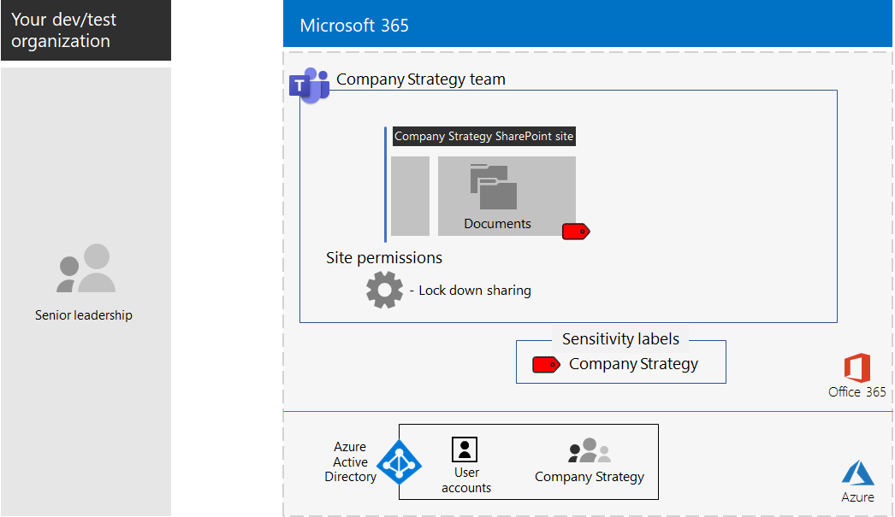

# <a name="configure-a-team-with-security-isolation-in-a-devtest-environment"></a>Konfigurieren eines Teams mit Sicherheitsisolierung in einer Entwicklungs-/Testumgebung

Dieser Artikel enthält eine Schritt-für-Schritt-Anleitung zum Erstellen eines [Teams mit Sicherheitsisolierung](secure-teams-security-isolation.md) in einer Entwicklungs-/Testumgebung.



Verwenden Sie diese Entwicklungs-/Testumgebung zum Experimentieren und zur Feinabstimmung der Einstellungen für Ihre spezifischen Bedürfnisse, bevor Sie diese Art von Team in der Produktion einsetzen.
  
## <a name="phase-1-build-out-your-microsoft-365-enterprise-test-environment"></a>Phase 1: Erstellen Ihrer Microsoft 365 Enterprise-Testumgebung

Wenn Sie vertrauliche und streng vertrauliche Teams auf einfache Weise mit Minimalanforderungen testen möchten, befolgen Sie die Anweisungen unter [Einfache Basiskonfiguration](https://docs.microsoft.com/microsoft-365/enterprise/lightweight-base-configuration-microsoft-365-enterprise).

Wenn Sie vertrauliche und hochgradig vertrauliche Teams in einem simulierten Unternehmen testen möchten, befolgen Sie die Anweisungen unter [Kennworthashsynchronisierung](https://docs.microsoft.com/microsoft-365/enterprise/password-hash-sync-m365-ent-test-environment).

>[!Note]
>Für das Testen eines Teams mit Sicherheitsisolation ist keine simulierte Unternehmenstestumgebung erforderlich, die ein simuliertes Intranet, das mit dem Internet verbunden ist, und die Verzeichnissynchronisierung für eine Active Directory Domain Services-Gesamtstruktur umfasst. Dies wird hier als Option bereitgestellt, damit Sie ein Team mit Sicherheitsisolation testen und damit in einer Umgebung, die eine typische Organisation darstellt, experimentieren können.
>
    
## <a name="phase-2-create-and-configure-your-azure-active-directory-ad-group-and-users"></a>Phase 2: Erstellen und Konfigurieren der Azure Active Directory(AD)-Gruppe und -Benutzer

In dieser Phase erstellen und konfigurieren Sie eine Azure AD-Gruppe und -Benutzer für eine fiktive Organisation.
  
Erstellen Sie zunächst eine Sicherheitsgruppe mit dem Azure-Portal.
  
1. Erstellen Sie eine separate Registerkarte in Ihrem Browser, und wechseln Sie dann zum Azure-Portal unter [https://portal.azure.com](https://portal.azure.com). Falls erforderlich, melden Sie sich mit den Anmeldeinformationen des globalen Administratorkontos für Ihr Microsoft 365 E5-Testabonnement oder Ihr kostenpflichtiges Abonnement an.
    
2. Klicken Sie im Azure-Portal auf **Azure Active Directory > Gruppen**.
    
3. Klicken Sie auf dem Blatt **Gruppen - Alle Gruppen** auf **+ Neue Gruppe**.
    
4. Auf dem Blatt **Gruppe**:
    
  - Wählen Sie unter **Gruppentyp** die Option **Sicherheit** aus.
    
  - Geben **C-Suite** unter **Name** ein.
    
  - Wählen Sie **Zugewiesen** unter **Mitgliedschaftstyp** aus.
      
5. Klicken Sie auf **Erstellen**, und schließen Sie dann das Blatt **Gruppe**.
    
Als Nächstes, konfigurieren Sie die automatische Lizenzierung so, dass den Mitgliedern der neuen **C-Suite**-Gruppe automatisch eine Microsoft 365 E5-Lizenz zugewiesen wird.
  
1. Klicken Sie im Azure-Portal auf **Azure Active Directory > Lizenzen > Alle Produkte**.
    
2. Wählen Sie in der Liste **Microsoft 365 Enterprise E5** aus, und klicken Sie dann auf **Zuweisen**.
    
3. Klicken Sie auf dem Blatt **Lizenz zuweisen** auf **Benutzer und Gruppen**.
    
4. Wählen Sie in der Liste der Gruppen die Gruppe **C-Suite** aus.
    
5. Klicken Sie auf **Auswählen** und dann auf **Zuweisen**.
    
6. Schließen Sie die Registerkarte für das Azure Portal in Ihrem Browser.
    
Als Nächstes, [stellen Sie eine Verbindung mit dem Azure Active Directory PowerShell für Graph-Modul her](https://docs.microsoft.com/office365/enterprise/powershell/connect-to-office-365-powershell#connect-with-the-azure-active-directory-powershell-for-graph-module).
  
Geben Sie den Namen Ihrer Organisation, Ihren Standort und ein gemeinsames Kennwort ein, und führen Sie dann die folgenden Befehle über die PowerShell-Eingabeaufforderung oder in der ISE-Umgebung (Integrated Script Environment) aus, um neue Benutzerkonten zu erstellen und sie zu der C-Suite-Gruppe hinzuzufügen:
  
```powershell
$orgName="<organization name, such as contoso-test for the contoso-test.onmicrosoft.com trial subscription domain name>"
$location="<the ISO ALPHA2 country code, such as US for the United States>"
$commonPassword="<common password for all the new accounts>"

$PasswordProfile=New-Object -TypeName Microsoft.Open.AzureAD.Model.PasswordProfile
$PasswordProfile.Password=$commonPassword

$groupName="C-Suite"
$userNames=@("CEO","CFO","CIO") 
$groupID=(Get-AzureADGroup | Where { $_.DisplayName -eq $groupName }).ObjectID
ForEach ($element in $userNames){ 
New-AzureADUser -DisplayName $element -PasswordProfile $PasswordProfile -UserPrincipalName ($element + "@" + $orgName + ".onmicrosoft.com") -AccountEnabled $true -MailNickName $element -UsageLocation $location 
Add-AzureADGroupMember -RefObjectId (Get-AzureADUser | Where { $_.DisplayName -eq $element }).ObjectID -ObjectId $groupID
}
```

> [!NOTE]
> Für die Automatisierung und Vereinfachung der Konfiguration einer Dev/Test-Umgebung wird hier ein gemeinsames Kennwort verwendet. Natürlich ist davon bei Produktionsabonnements dringend abzuraten. 
  
Gehen Sie folgendermaßen vor, um sicherzustellen, dass die gruppenbasierte Lizenzierung ordnungsgemäß funktioniert.
  
1. Melden Sie sich beim [Microsoft 365 Admin Center](https://admin.microsoft.com) an.
    
2. Klicken Sie auf der neuen Registerkarte **Microsoft 365 Admin Center** des Browsers auf **Benutzer**.
    
3. Klicken Sie in der Liste der Benutzer auf **CEO**.
    
4. Stellen Sie im Bereich, der die Eigenschaften des Benutzerkontos **CEO** anzeigt, sicher, dass ihm die Lizenz **Microsoft 365 Enterprise E5** in **Produktlizenzen** zugewiesen wurde.
    
## <a name="phase-3-create-your-team"></a>Phase 3: Erstellen Ihres Teams

In dieser Phase erstellen und konfigurieren Sie ein Team mit Sicherheitsisolierung, in dem die Mitglieder des leitenden Führungsteams an der Unternehmensstrategie mitarbeiten.

Aktivieren Sie zunächst Vertraulichkeitsbezeichnungen zum Schutz von Inhalten in Microsoft Teams, Office 365-Gruppen und SharePoint-Websites, bevor Sie mit den Schritten in [diesem Artikel](https://docs.microsoft.com/microsoft-365/compliance/sensitivity-labels-teams-groups-sites) fortfahren.

Als Nächstes, erstellen Sie das Team:

1. Klicken Sie in Microsoft Teams auf der linken Seite auf **Teams** und dann unten in der Teamliste auf **Einem Team beitreten oder ein Team erstellen**.
2. Klicken Sie auf **Team erstellen** (erste Karte, obere linke Ecke).
3. Wählen Sie **Neuerstellen eines Teams**.
4. Behalten Sie in der Liste **Vertraulichkeit** die Standardeinstellung bei.
5. Klicken Sie unter **Datenschutz** auf **Privat**.
6. Geben Sie **Unternehmensstrategie** ein, und klicken Sie dann auf **Erstellen** > **Schließen**.

Als Nächstes, müssen Sie eine Vertraulichkeitsbezeichnung mit den folgenden Einstellungen konfigurieren:

- Der Name der Bezeichnung lautet „Unternehmensstrategie“.
- Die Verschlüsselung ist aktiviert.
- Die Gruppe „Unternehmensstrategie“ verfügt über Berechtigungen für die gemeinsame Dokumenterstellung.

Führen Sie die folgenden Schritte aus:

1. Öffnen Sie das [Microsoft 365 Compliance Center](https://compliance.microsoft.com).
2. Klicken Sie unter **Lösungen**auf **Informationsschutz**.
3. Klicken Sie auf **Bezeichnung erstellen**.
4. Geben Sie **Unternehmensstrategie** für den Bezeichnungsnamen ein.
5. Geben Sie als QuickInfo **Dokumente zur Unternehmensstrategie für leitende Angestellte** ein, und klicken Sie dann auf **Weiter**.
6. Wählen Sie auf der Seite **Verschlüsselung** im Dropdownmenü **Verschlüsselung** **Anwenden**aus.
7. Hinzufügen der Team-Berechtigungen:<br>
  a. Klicken Sie auf **Zuweisen von Berechtigungen**.<br>
  b. Klicken Sie auf **Benutzer oder Gruppen hinzufügen**, wählen Sie **Unternehmensstrategie** aus, und klicken Sie dann auf **Hinzufügen**.<br>
  c. Klicken Sie auf **Berechtigungen auswählen**.<br>
  d. Wählen Sie in der Dropdownliste **Mitautor**, und klicken Sie dann auf **Speichern**.<br>
8. Klicken Sie auf **Weiter**.
9. Klicken Sie auf der Seite **Inhaltskennzeichnung** auf **Weiter**.
10. Legen Sie auf der Seite **Website- und Gruppeneinstellungen** die Option **Website- und Gruppeneinstellungen** auf **Ein** fest.
11. Wählen Sie in der Dropdownliste **Datenschutz für mit Office 365-Gruppen verbundene Teamwebsites** die Option **Privat – nur Mitglieder können auf die Website zugreifen** aus.
12. Wählen Sie unter **Nicht verwaltete Geräte** die Option **Zugriff blockieren**.
13. Klicken Sie auf **Weiter**.
14. Klicken Sie auf der Seite **Automatisches Bezeichnen für Office-Apps** auf **Weiter**.
15. Klicken Sie auf **Absenden** und anschließend auf **Fertig**.

Als Nächstes, veröffentlichen Sie die neue Bezeichnung mit diesen Schritten: 

1. Wählen Sie im Microsoft 365 Compliance Center auf der Seite **Informationsschutz** die Registerkarte **Bezeichnungsrichtlinien**.
2. Klicken Sie auf **Bezeichnungen veröffentlichen**.
3. Klicken Sie auf der Seite **Zu veröffentlichende Vertraulichkeitsbezeichnungen wählen** auf **Zu veröffentlichende Vertraulichkeitsbezeichnungen wählen**.
4. Wählen Sie **Unternehmensstrategie** aus, und klicken Sie dann auf **Hinzufügen**.
5. Klicken Sie auf **Weiter**.
6. Klicken Sie auf der Seite **Für Benutzer und Gruppen veröffentlichen** auf **Benutzer und Gruppen auswählen**.
7. Klicken Sie auf **Hinzufügen**, und wählen Sie dann **Unternehmensstrategie** aus.
8. Klicken Sie auf **Hinzufügen** und dann auf **Fertig**.
9. Klicken Sie auf **Weiter**.
10. Aktivieren Sie auf der Seite Richtlinieneinstellungen das Kontrollkästchen **Benutzer müssen eine Begründung für das Entfernen einer Bezeichnung oder einer Bezeichnung mit niedrigerer Klassifizierung angeben**, und klicken Sie dann auf **Weiter**.
11. Geben Sie **Unternehmensstrategie** für den Richtliniennamen ein, und klicken Sie dann auf **Weiter**.
12. Klicken Sie auf **Absenden** und klicken Sie dann auf **Fertig**.

Es kann einige Zeit dauern, bis die Bezeichnung **Unternehmensstrategie** nach ihrer Veröffentlichung verfügbar ist.

Als Nächstes wenden Sie Ihre neue Bezeichnung auf das Team für **Unternehmensstrategie** an und aktualisieren den standardmäßigen Linktyp für die Freigabe, um das Risiko zu verringern, dass Dateien und Ordner versehentlich für ein breiteres Publikum freigegeben werden als beabsichtigt. 

1. Öffnen Sie das [SharePoint Admin Center](https://admin.microsoft.com/sharepoint).
2. Klicken Sie unter **Websites** auf **Aktive Websites**.
3. Klicken Sie auf die Website **Unternehmensstrategie**.
4. Klicken Sie auf der Registerkarte **Richtlinien** unter **Vertraulichkeit** auf **Bearbeiten**.
5. Wählen Sie die Bezeichnung **Unternehmensstrategie** aus, und klicken Sie dann auf **Speichern**.
6. Klicken Sie auf der Registerkarte **Richtlinien** unter **Externe Freigabe** auf **Bearbeiten**.
5. Wählen Sie **Nur Personen in Ihrer Organisation**.
6. Deaktivieren Sie unter **Standardmäßiger Freigabe**-Linktyp das Kontrollkästchen **Identisch mit der Einstellung auf Organisationsebene**, und wählen Sie **Personen mit vorhandenem Zugriff** aus.
7. Klicken Sie auf **Speichern**.

Als Nächstes, konfigurieren Sie die Websitefreigabe nur für Besitzer für das Team **Unternehmensstrategie**.

1. Gehen Sie in Teams zur Registerkarte **Allgemein** des Teams **Unternehmensstrategie**.
2. Klicken Sie auf der Symbolleiste des Teams auf **Dateien**.
3. Klicken Sie auf die drei Punkte "(…)" und dann auf **In SharePoint öffnen**.
4. Klicken Sie in der Symbolleiste der zugrunde liegenden SharePoint-Website auf das Symbol "Einstellungen" und anschließend auf **Websiteberechtigungen**.
5. Klicken Sie im Bereich „Websiteberechtigungen“ unter **Websitefreigabe** auf **Freigabemethode für Mitglieder ändern**.
6. Wählen Sie unter **Freigabeberechtigungen** die Option **Nur Websitebesitzer können Dateien, Ordner und die Website teilen** aus, und klicken Sie dann auf **Speichern**.
7. Schließen Sie die Bereiche **Berechtigungen** und **Einstellungen**.

Wenn Sie sich als Mitglied der Gruppe „Unternehmensstrategie“ anmelden, wird **Unternehmensstrategie** auf der Symbolleiste „Start“ in Word, Excel und PowerPoint unter der Option **Vertraulichkeit** angezeigt. Wählen Sie unter der Option **Vertraulichkeit** die Bezeichnung **Unternehmensstrategie** aus, um einer Datei eine Bezeichnung zuzuweisen.

Hier ist die resultierende Konfiguration für das Unternehmensstrategieteam.


Dateien im Team können von den Mitgliedern der Gruppe „Unternehmensstrategie“ mit der Vertraulichkeitsbezeichnung „Unternehmensstrategie“ versehen werden. Hier ein Beispiel.


 
## <a name="next-step"></a>Nächster Schritt

Wenn Sie für den Produktionseinsatz bereit sind, finden Sie unter [Konfigurieren eines Teams mit Sicherheitsisolierung](secure-teams-security-isolation.md) detaillierte Informationen zur Konfiguration.
