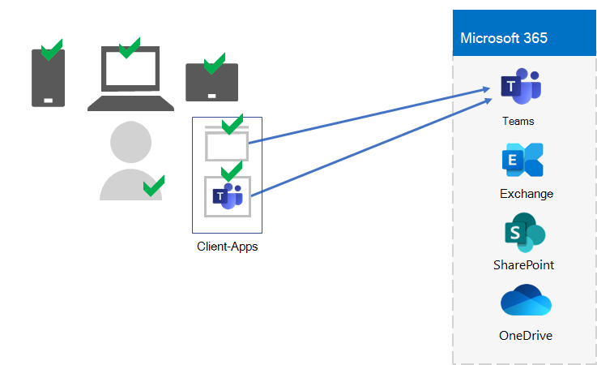
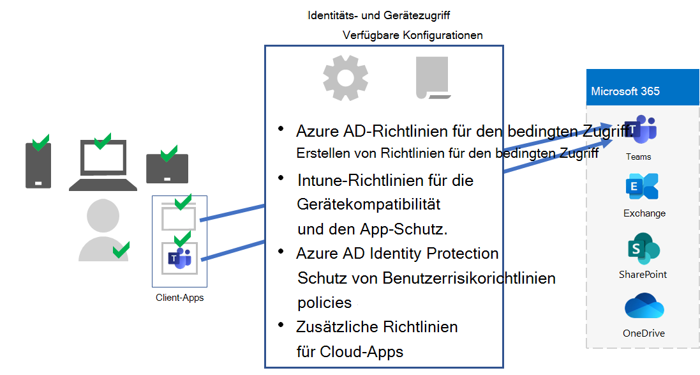
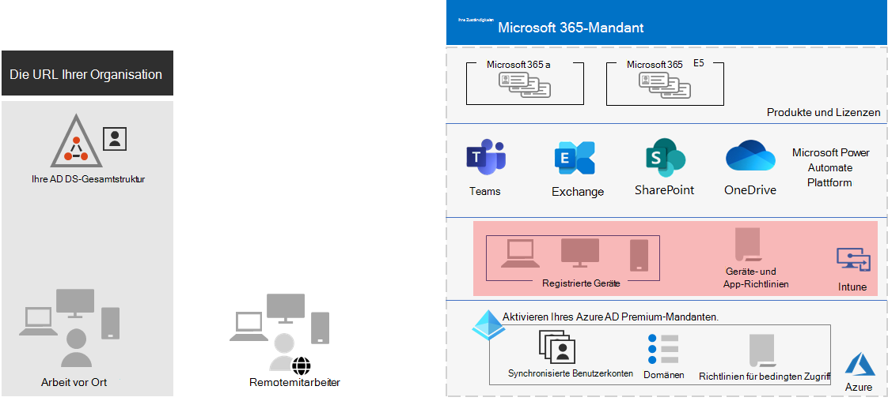

# Schritt 5:Step 5. Geräte- und App-Verwaltung für Ihre Microsoft 365 for Enterprise-MandantenDevice and app management for your Microsoft 365 for enterprise tenants

Microsoft 365 for Enterprise enthält Features, mit denen Sie Geräte und die Verwendung von Apps auf diesen Geräten in Ihrer Organisation mit mobiler Geräteverwaltung (Mobile Device Management, MDM) und mobiler Anwendungsverwaltung (MOBILE Application Management, MAM) verwalten können.Microsoft 365 for enterprise includes features to help manage devices and the use of apps on those devices within your organization with mobile device management (MDM) and mobile application management (MAM). Sie können iOS-, Android-, macOS- und Windows-Geräte verwalten, um den Zugriff auf die Ressourcen Ihrer Organisation, einschließlich Ihrer Daten, zu schützen.You can manage iOS, Android, macOS, and Windows devices to protect access to your organization's resources, including your data. Sie können beispielsweise verhindern, dass E-Mails an Personen außerhalb Ihrer Organisation gesendet werden, oder Sie können Organisationsdaten von personenbezogenen Daten auf den persönlichen Geräten Ihrer Mitarbeiter isolieren.For example, you can prevent emails from being sent to people outside your organization or isolate organization data from personal data on your worker's personal devices.

Hier ist ein Beispiel für die Überprüfung und Verwaltung von Benutzern, deren Geräten und deren Verwendung lokaler und Cloudproduktivitäts-Apps wie Microsoft Teams.Here is an example of the validation and management of users, their devices, and their use of local and cloud productivity apps like Microsoft Teams.

Um Die Ressourcen Ihrer Organisation zu schützen und zu schützen, enthält Microsoft 365 For Enterprise Features, mit deren Hilfe Geräte und deren Zugriff auf Apps verwaltet werden können.To help you secure and protect your organization's resources, Microsoft 365 for enterprise includes features to help manage devices and their access to apps. Es gibt zwei Optionen für die Geräteverwaltung:There are two options for device management:

- Microsoft Intune, eine umfassende Geräte- und App-Verwaltungslösung für Unternehmen.Microsoft Intune, which is a comprehensive device and app management solution for enterprises.
- Grundlegende Mobilität und Sicherheit, eine Teilmenge der Intune-Dienste, die in allen Microsoft 365-Produkten zum Verwalten von Geräten in Ihrer Organisation enthalten sind.Basic Mobility and Security, which is a subset of Intune services included with all Microsoft 365 products for managing devices in your organization. Weitere Informationen finden Sie unter [Capabilities of Basic Mobility and Security](../admin/basic-mobility-security/capabilities.md).For more information, see [Capabilities of Basic Mobility and Security](../admin/basic-mobility-security/capabilities.md).

Wenn Sie über Microsoft 365 E3 oder E5 verfügen, sollten Sie Intune verwenden.If you have Microsoft 365 E3 or E5, you should use Intune.

## Microsoft IntuneMicrosoft Intune

Sie verwenden [Microsoft Intune,](/mem/intune/fundamentals/planning-guide) um den Zugriff auf Ihre Organisation mithilfe von MDM oder MAM zu verwalten.You use [Microsoft Intune](/mem/intune/fundamentals/planning-guide) to manage access to your organization using MDM or MAM. MDM ist, wenn Benutzer ihre Geräte in Intune "registrieren".MDM is when users "enroll" their devices in Intune. Nach der Registrierung eines Geräts handelt es sich um ein verwaltetes Gerät, das die Richtlinien, Regeln und Einstellungen Ihrer Organisation empfangen kann.After a device is enrolled, it is a managed device and can receive your organization's  policies, rules, and settings. Sie können beispielsweise bestimmte Apps installieren, eine Kennwortrichtlinie erstellen, eine VPN-Verbindung installieren und vieles mehr.For example, you can install specific apps, create a password policy, install a VPN connection, and more.

Benutzer mit ihren eigenen persönlichen Geräten möchten ihre Geräte möglicherweise nicht registrieren oder von Intune und den Richtlinien Ihrer Organisation verwaltet werden.Users with their own personal devices may not want to enroll their devices or be managed by Intune and your organization's policies. Sie müssen jedoch weiterhin die Ressourcen und Daten Ihrer Organisation schützen.But you still need to protect your organization's resources and data. In diesem Szenario können Sie Ihre Apps mithilfe von MAM schützen.In this scenario, you can protect your apps using MAM. Sie können beispielsweise eine MAM-Richtlinie verwenden, für die ein Benutzer beim Zugriff auf SharePoint auf dem Gerät eine PIN eingeben muss.For example, you can use an MAM policy that requires a user to enter a PIN when accessing SharePoint on the device.

Außerdem bestimmen Sie, wie Sie persönliche Geräte und geräte im Besitz der Organisation verwalten.You'll also determine how you're going to manage personal devices and organization-owned devices. Sie können Geräte je nach Verwendung unterschiedlich behandeln.You might want to treat devices differently, depending on their uses.

## Konfigurationen für den Identitäts- und GerätezugriffIdentity and device access configurations

Microsoft bietet eine Reihe von Konfigurationen für den Identitäts- und [Gerätezugriff,](../security/office-365-security/microsoft-365-policies-configurations.md) um eine sichere und produktive Belegschaft sicherzustellen.Microsoft provides a set of configurations for [identity and device access](../security/office-365-security/microsoft-365-policies-configurations.md) to ensure a secure and productive workforce. Diese Konfigurationen umfassen die Verwendung von:These configurations include the use of:

- Azure AD-Richtlinien für den bedingten ZugriffAzure AD Conditional Access policies
- Microsoft Intune-Richtlinien für Gerätekonformität und App-SchutzMicrosoft Intune device compliance and app protection policies
- Azure AD Identity Protection-BenutzerrisikorichtlinienAzure AD Identity Protection user risk policies
- Zusätzliche Richtlinien von Cloud-AppsAdditional policies of cloud apps

Hier ist ein Beispiel für die Anwendung dieser Einstellungen und Richtlinien zum Überprüfen und Einschränken von Benutzern, deren Geräten und deren Verwendung lokaler und Cloudproduktivitäts-Apps wie Microsoft Teams.Here is an example of the application of these settings and policies to validate and restrict users, their devices, and their use of local and cloud productivity apps like Microsoft Teams.

Verwenden Sie für den Gerätezugriff und die App-Verwaltung die Konfigurationen in den folgenden Artikeln:For device access and app management, use the configurations in these articles:

- [VoraussetzungenPrerequisites](../security/office-365-security/identity-access-prerequisites.md)
- [Allgemeine Identitäts- und GerätezugriffsrichtlinienCommon identity and device access policies](../security/office-365-security/identity-access-policies.md)

## Ergebnisse von Schritt 5Results of Step 5

Für die Geräte- und App-Verwaltung für Ihren Microsoft 365-Mandanten haben Sie die Intune-Einstellungen und -Richtlinien festgelegt, um Benutzer, ihre Geräte und deren Verwendung lokaler und Cloudproduktivitäts-Apps zu überprüfen und einzuschränken.For device and app management for your Microsoft 365 tenant, you have determined the Intune settings and policies to validate and restrict users, their devices, and their use of local and cloud productivity apps.

Im Folgenden finden Sie ein Beispiel für einen Mandanten mit Intune-Geräte- und App-Verwaltung mit hervorgehobenen neuen Elementen.Here is an example of a tenant with Intune device and app management with the new elements highlighted.

In dieser Abbildung verfügt der Mandant über:In this illustration, the tenant has:

- Geräte im Besitz der Organisation, die in Intune registriert sind.Organization-owned devices enrolled in Intune.
- Intune-Geräte- und App-Richtlinien für registrierte und persönliche Geräte.Intune device and app policies for enrolled and personal devices.

## Fortlaufende Wartung der Geräte- und App-VerwaltungOngoing maintenance for device and app management

Auf fortlaufender Basis müssen Sie möglicherweise:On an ongoing basis, you might need to: 

- Verwalten der Geräteregistrierung.Manage device enrollment.
- Überarbeiten Sie Ihre Einstellungen und Richtlinien für zusätzliche Apps, Geräte und Sicherheitsanforderungen.Revise your settings and policies for additional apps, devices, and security requirements.