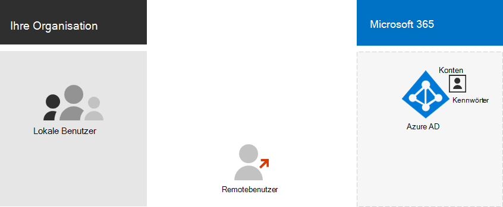
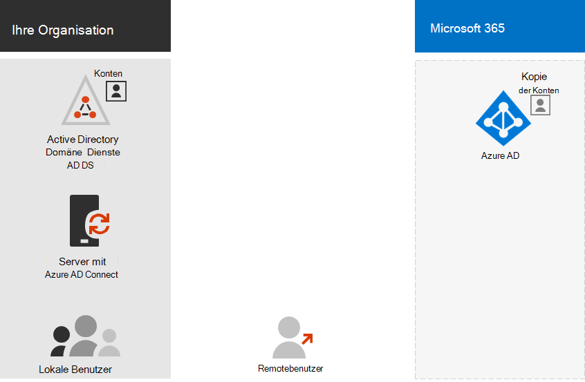
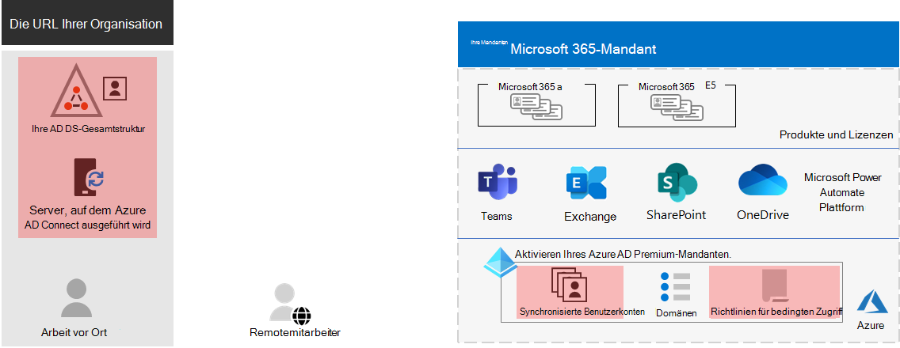
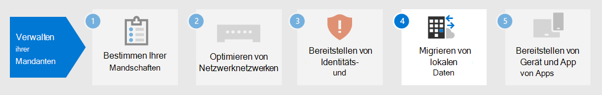

# Schritt 3. Identität für Ihre Microsoft 365 enterprise-Mandanten

Ihr Microsoft 365-Mandant enthält einen Azure Active Directory (Azure AD)-Mandanten zum Verwalten von Identitäten und der Authentifizierung für Anmeldungen. Die korrekte Konfiguration Ihrer Identitätsinfrastruktur ist für die Verwaltung des Microsoft 365-Benutzerzugriffs und der Berechtigungen für Ihre Organisation unerlässlich.

## Nur in der Cloud im Vergleich zu Hybrid

Hier sind die beiden Typen von Identitätsmodellen und deren optimale Passform und Vorteile.

| Modell | Beschreibung | Authentifizierung von Benutzeranmeldeinformationen durch Microsoft 365 | Ideal für | Größter Vorteil |
|:-------|:-----|:-----|:-----|:-----|
| Rein cloudbasiert | Das Benutzerkonto ist nur im Azure AD-Mandanten für Ihren Microsoft 365-Mandanten vorhanden. | Der Azure AD-Mandant für Ihren Microsoft 365-Mandanten führt die Authentifizierung mit dem Cloudidentitätskonto aus. | Organisationen, die keinen lokalen AD DS besitzen oder benötigen. | Einfach zu verwenden. Es sind keine zusätzlichen Verzeichnistools oder Server erforderlich. |
| Hybrid |  Das Benutzerkonto ist in Ihrem lokalen Active Directory Domain Services (AD DS) vorhanden, und eine Kopie befindet sich auch im Azure AD-Mandanten für Ihren Microsoft 365-Mandanten. Azure AD Connect wird auf einem lokalen Server ausgeführt, um AD DS-Änderungen mit Ihrem Azure AD-Mandanten zu synchronisieren. Das Benutzerkonto in Azure AD kann auch eine Hashversion des bereits mit einem Hash bezeichneten AD DS-Benutzerkontokennworts enthalten. | Der Azure AD-Mandant für Ihren Microsoft 365-Mandanten übernimmt entweder den Authentifizierungsprozess oder leitet den Benutzer an einen anderen Identitätsanbieter weiter. | Organisationen, die AD DS oder einen anderen Identitätsanbieter verwenden. | Benutzer können dieselben Anmeldeinformationen verwenden, wenn sie auf lokale oder cloudbasierte Ressourcen zugreifen. |
||||||

Hier sind die grundlegenden Komponenten der reinen Cloudidentität.
 

In dieser Abbildung melden sich lokale und Remotebenutzer mit Konten im Azure AD-Mandanten ihres Microsoft 365-Mandanten an.

Hier sind die grundlegenden Komponenten der Hybrididentität.

In dieser Abbildung melden sich lokale und Remotebenutzer bei ihrem Microsoft 365-Mandanten mit Konten im Azure AD-Mandanten an, die aus ihrem lokalen AD DS kopiert wurden.

## Synchronisieren Ihres lokalen AD DS

Je nach Ihren Geschäftsanforderungen und technischen Anforderungen ist das Hybrididentitätsmodell und die Verzeichnissynchronisierung die häufigste Wahl für Unternehmenskunden, die Microsoft 365 übernehmen. Mit der Verzeichnissynchronisierung können Sie Identitäten in Ihrem AD DS verwalten, und alle Updates für Benutzerkonten, Gruppen und Kontakte werden mit dem Azure AD-Mandanten Ihres Microsoft 365-Mandanten synchronisiert.

>[!Note]
>Wenn AD DS-Benutzerkonten zum ersten Mal synchronisiert werden, erhalten sie nicht automatisch eine Microsoft 365-Lizenz und können nicht auf Microsoft 365-Dienste zugreifen, z. B. E-Mails. Sie müssen ihnen zuerst einen Verwendungsspeicherort zuweisen. Weisen Sie anschließend diesen Benutzerkonten eine Lizenz zu, entweder einzeln oder dynamisch über die Gruppenmitgliedschaft.
>

Hier sind die beiden Authentifizierungstypen bei Verwendung des Hybrididentitätsmodells.

| Authentifizierungstyp | Beschreibung |
|:-------|:-----|
| Verwaltete Authentifizierung | Azure AD verarbeitet den Authentifizierungsprozess mithilfe einer lokal gespeicherten Hashversion des Kennworts oder sendet die Anmeldeinformationen an einen lokalen Software-Agent, der vom lokalen AD DS authentifiziert werden soll.      Es gibt zwei Arten von verwalteter Authentifizierung: Kennworthashsynchronisierung (Password Hash Synchronization, PHS) und Pass-Through-Authentifizierung (Pass-Through Authentication, PTA). Mit PHS führt Azure AD die Authentifizierung selbst aus. Mit PTA hat Azure AD AD DS die Authentifizierung ausgeführt. |
| Verbundauthentifizierung | Azure AD leitet den Clientcomputer, der die Authentifizierung anfordert, an einen anderen Identitätsanbieter um. |
|  |  |

Weitere Informationen finden Sie unter Auswählen [der richtigen Authentifizierungsmethode.](https://docs.microsoft.com/azure/active-directory/hybrid/choose-ad-authn)

## Erzwingen starker Anmeldungen

Um die Sicherheit von Benutzer-Anmeldungen zu erhöhen, verwenden Sie die Features und Funktionen in der folgenden Tabelle.

| Funktion | Beschreibung | Weitere Informationen | Lizenzierungsanforderungen |
|:-------|:-----|:-----|:-----|:-----|
| Windows Hello for Business | Ersetzt Kennwörter durch eine starke zweistufige Authentifizierung beim Signieren auf einem Windows-Gerät. Beide Faktoren zählen zu neuen Arten von Benutzeranmeldeinformationen, die mit einem Gerät verknüpft sind und biometrische Daten oder eine PIN erfordern. | [Windows Hello for Business – Übersicht](https://docs.microsoft.com/windows/security/identity-protection/hello-for-business/hello-overview) | Microsoft 365 E3 oder E5 |
| Azure AD-Kennwortschutz | Erkennt und blockiert bekannte schwache Kennwörter und deren Varianten und kann auch zusätzliche schwache Begriffe blockieren, die spezifisch für Ihre Organisation sind. | [Konfigurieren des Azure AD-Kennwortschutzes](https://docs.microsoft.com/azure/active-directory/authentication/concept-password-ban-bad) | Microsoft 365 E3 oder E5 |
| Verwenden der mehrstufigen Authentifizierung (Multi-Factor Authentication, MFA) | MFA erfordert, dass Für Benutzer-Anmeldungen eine zusätzliche Überprüfung über das Benutzerkontokennwort hinaus erforderlich ist, z. B. die Überprüfung mit einer Smartphone-App oder eine an ein Smartphone gesendete Textnachricht. In [diesem Video finden](https://support.microsoft.com/office/set-up-multi-factor-authentication-in-microsoft-365-business-a32541df-079c-420d-9395-9d59354f7225) Sie Anweisungen dazu, wie Benutzer MFA einrichten. | [MFA für Microsoft 365 Enterprise](../enterprise/microsoft-365-secure-sign-in.md#mfa) | Microsoft 365 E3 oder E5 |
| Konfigurationen für den Identitäts- und Gerätezugriff | Einstellungen und Richtlinien, die aus empfohlenen erforderlichen Features und deren Einstellungen in Kombination mit Richtlinien für bedingten Zugriff, Intune und Azure AD Identity Protection bestehen, die bestimmen, ob eine bestimmte Zugriffsanforderung gewährt werden soll und unter welchen Bedingungen.  | [Konfigurationen für den Identitäts- und Gerätezugriff](../security/office-365-security/microsoft-365-policies-configurations.md) | Microsoft 365 E3 oder E5 |
| Azure AD Identity Protection | Schützen Sie sich vor einem Angriff auf Anmeldeinformationen, bei dem ein Angreifer den Kontonamen und das Kennwort eines Benutzers bestimmt, um Zugriff auf die Clouddienste und Daten einer Organisation zu erhalten. | [Azure AD Identity Protection](https://docs.microsoft.com/azure/active-directory/active-directory-identityprotection) | Microsoft 365 E5 oder Microsoft 365 E3 mit dem Identity & Threat Protection-Add-On |
|  |  |  |

## Ergebnisse von Schritt 3

Für die Identität Ihres Microsoft 365-Mandanten haben Sie ermittelt:

- Welches Identitätsmodell verwendet werden soll.
- Erzwingen eines starken Benutzer- und Gerätezugriffs.

Hier ist ein Beispiel für einen Mandanten mit hervorgehobenen neuen Hybrididentitätselementen.

In dieser Abbildung verfügt der Mandant über:

- Eine AD DS-Gesamtstruktur, die mit dem Azure AD-Mandanten mithilfe eines DirSync-Servers und Azure AD Connect synchronisiert wird.
- Eine Kopie der AD DS-Benutzerkonten und anderer Objekte aus der AD DS-Gesamtstruktur.
- Eine Reihe von Richtlinien für bedingten Zugriff, um sichere Benutzer-Anmeldungen und zugriff basierend auf dem Benutzerkonto zu erzwingen. 

## Fortlaufende Wartung der Identität

Auf fortlaufender Basis müssen Sie möglicherweise:

- Hinzufügen oder Ändern von Benutzerkonten und Gruppen. Für die ausschließliche Cloudidentität verwalten Sie Ihre cloudbasierten Benutzer und Gruppen mit Azure AD-Tools wie dem Microsoft 365 Admin Center oder PowerShell. Für hybride Identitäten verwalten Sie Ihre lokalen Benutzer und Gruppen mit AD DS-Tools.
- Fügen Sie Ihre Identitäts- und Gerätezugriffskonfiguration hinzu, oder ändern Sie sie, um Anmeldesicherheitsanforderungen zu erzwingen.

## Nächster Schritt

Fahren Sie mit [der Migration](tenant-management-migration.md) fort, um Ihre lokalen Office-Server und ihre Daten zu Microsoft 365 zu migrieren.
