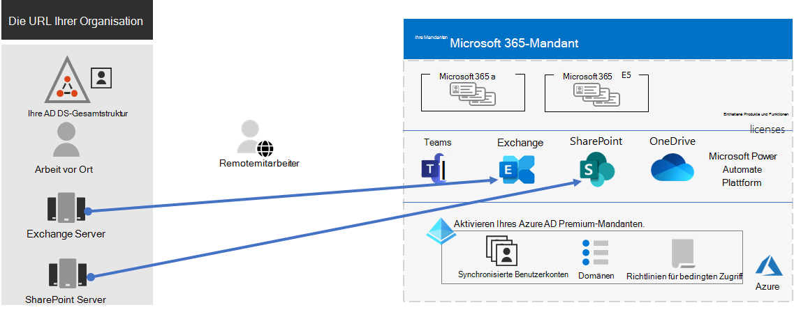
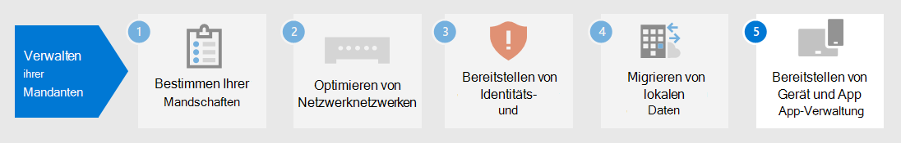

# Schritt 4:Step 4. Migration für Ihre Microsoft 365 Enterprise-MandantenMigration for your Microsoft 365 for enterprise tenants

Die meisten Unternehmensorganisationen verfügen über eine heterogene Umgebung, die mehrere Versionen von Betriebssystemen, Clientsoftware und Serversoftware umfasst.Most enterprise organizations have a heterogeneous environment that includes multiple releases of operating systems, client software, and server software. Microsoft 365 enterprise enthält die sichersten Versionen der wichtigsten Komponenten Ihrer IT-Infrastruktur.Microsoft 365 for enterprise includes the most secure versions of the key components of your IT infrastructure. Es enthält auch Produktivitätsfeatures, die für die Nutzung von Cloudtechnologien entwickelt wurden.It also includes productivity features that are designed to take advantage of cloud technologies.

Um den Geschäftswert der integrierten Microsoft 365 For Enterprise-Produktsuite zu maximieren, beginnen Sie mit der Planung und Implementierung einer Strategie zum Migrieren dieser Versionen:To maximize the business value of the Microsoft 365 for enterprise integrated suite of products, begin planning and implementing a strategy to migrate these releases:

| FromFrom | AnTo |
|:-------|:-----|
| Windows 7 und Windows 8.1Windows 7 and Windows 8.1 | Windows 10 EnterpriseWindows 10 Enterprise |
| Auf den Geräten Ihrer Mitarbeiter installierte Office-ClientprodukteOffice client products installed on your worker's devices | Microsoft 365 Apps for EnterpriseMicrosoft 365 Apps for enterprise |
| Auf lokalen Servern installierte Office-ServerprodukteOffice server products installed on on-premises servers | Ihre entsprechenden cloudbasierten Dienste in Microsoft 365Their equivalent cloud-based services in Microsoft 365 |
|  |  |

## Migrieren zu Windows 10Migrating to Windows 10

Jede Microsoft 365 for Enterprise-Lizenz enthält eine Lizenz für Windows 10 Enterprise.Each Microsoft 365 for enterprise license includes a license for Windows 10 Enterprise. Um Ihre Geräte mit Windows 7 oder Windows 8.1 zu migrieren, können Sie ein in-Place-Upgrade durchführen.To migrate your devices that run Windows 7 or Windows 8.1, you can do an in-place upgrade. Der Support für Windows 7 wurde am *14. Januar 2020 beendet.*Support ended for Windows 7 on *January 14, 2020*. 

Weitere Methoden zum Installieren von Windows 10 Enterprise über ein in-Place-Upgrade hinaus finden Sie unter [Windows 10-Bereitstellungsszenarien](/windows/deployment/windows-10-deployment-scenarios).For additional methods of installing Windows 10 Enterprise beyond an in-place upgrade, see [Windows 10 deployment scenarios](/windows/deployment/windows-10-deployment-scenarios). Sie können [die Bereitstellung von Windows 10 auch selbst planen](/windows/deployment/planning/).You can also [plan for Windows 10 deployment](/windows/deployment/planning/) on your own.

## Migrieren zu Microsoft 365 Apps for EnterpriseMigrating to Microsoft 365 Apps for enterprise

Microsoft 365 enterprise umfasst Microsoft 365 Apps for Enterprise, eine Version der Office-Clientprodukte (Word, PowerPoint, Excel und Outlook), die in der Microsoft Cloud installiert und aktualisiert wird.Microsoft 365 for enterprise includes Microsoft 365 Apps for enterprise, a version of the Office client products (Word, PowerPoint, Excel, and Outlook) that is installed and updated from the Microsoft cloud. Weitere Informationen finden Sie unter [Informationen zu Microsoft 365 Apps for Enterprise](/deployoffice/about-microsoft-365-apps).For more information, see [About Microsoft 365 Apps for enterprise](/deployoffice/about-microsoft-365-apps).

Anstatt Ihre Computer für Office 2019 oder ältere Versionen auf dem neuesten Stand zu halten, gehen Sie wie folgt vor:Rather than keeping your computers current for Office 2019 or older versions, take the following steps:

1. Sie können eine Microsoft 365-Lizenz für Ihre Benutzer erhalten und zuweisen.Get and assign a Microsoft 365 license for your users.
2. Deinstallieren Sie Office 2013 oder Office 2016 auf ihren Computern.Uninstall Office 2013 or Office 2016 on their computers.
3. Installieren Sie Microsoft 365 Apps for Enterprise entweder einzeln oder während eines IT-Rollouts.Install Microsoft 365 Apps for enterprise, either individually or during an IT rollout. Weitere Informationen finden Sie unter [Bereitstellungshandbuch für Microsoft 365 Apps](/deployoffice/deployment-guide-microsoft-365-apps).For more information, see [Deployment guide for Microsoft 365 Apps](/deployoffice/deployment-guide-microsoft-365-apps).

Microsoft 365 Apps for Enterprise installiert sowohl Sicherheitsupdates als auch neue Featureupdates automatisch und kann cloudbasierte Dienste in Microsoft 365 für mehr Sicherheit und Produktivität nutzen.Microsoft 365 Apps for enterprise installs both security updates and new feature updates automatically and can take advantage of cloud-based services in Microsoft 365 for enhanced security and productivity.

## Migrieren von lokalen Servern und Daten zu Microsoft 365Migrating on-premises servers and data to Microsoft 365

Microsoft 365 enterprise umfasst cloudbasierte Versionen von Office-Serverdiensten, die einige der gleichen Tools wie lokale Versionen von Office Server-Software verwenden, z. B. Webbrowser und der Outlook-Client.Microsoft 365 for enterprise includes cloud-based versions of Office server services that use some of the same tools as on-premises versions of Office server software, such as web browsers and the Outlook client. Diese cloudbasierten Dienste werden aus Sicherheitsgründen und neuen Features automatisch aktualisiert.These cloud-based services are automatically updated for security and new features. Nach der Migration kann Ihre IT-Abteilung die Zeit sparen, die zum Warten und Aktualisieren von lokalen Servern benötigt wird.After migration, your IT department can save the time it takes to maintain and update on-premises servers.

Verwenden Sie die folgenden Ressourcen, um Informationen zum Migrieren von Benutzern und Daten für bestimmte Microsoft 365-Workloads zu erhalten:Use the following resources for information about migrating users and data for specific Microsoft 365 workloads:

- [Verschieben von Postfächern von lokalen Exchange Server zu Exchange OnlineMove mailboxes from on-premises Exchange Server to Exchange Online](/exchange/hybrid-deployment/move-mailboxes)
- [Migrieren von SharePoint-Daten von SharePoint Server zu SharePoint OnlineMigrate SharePoint data from SharePoint Server to SharePoint Online](/sharepointmigration/migrate-to-sharepoint-online)
- [Migrieren von Skype for Business Online zu Microsoft TeamsMigrate Skype for Business Online to Microsoft Teams](/microsoftteams/migration-interop-guidance-for-teams-with-skype)

## Umstellung Ihrer gesamten OrganisationTransition your entire organization

Laden Sie dieses Übergangsposter herunter, um ein besseres Bild davon zu erhalten, wie Sie Ihre gesamte Organisation zu den Produkten und Diensten in Microsoft 365 Enterprise verschieben:To get a better picture of how to move your entire organization to the products and services in Microsoft 365 for enterprise, download this transition poster:

Dieses zweiseitige Poster bietet eine schnelle Methode, um Ihre vorhandene Infrastruktur aufzulisten.This two-page poster is a quick way to inventory your existing infrastructure. Verwenden Sie sie, um Anleitungen für den Wechsel zu einem Produkt oder Dienst in Microsoft 365 Enterprise zu erhalten.Use it to get guidance for moving to a product or service in Microsoft 365 for enterprise. Es zeigt Windows- und Office-Produkte sowie andere Infrastruktur- und Sicherheitselemente wie Geräteverwaltung, Identitäts- und Bedrohungsschutz sowie Informationsschutz und Compliance.It shows Windows and Office products and other infrastructure and security elements such as device management, identity and threat protection, and information protection and compliance.

## Ergebnisse von Schritt 4Results of Step 4

Für die Migration für Ihren Microsoft 365-Mandanten haben Sie ermittelt:For migration for your Microsoft 365 tenant, you have determined:

- Auf welchen Geräten Windows 7 oder Windows 8.1 ausgeführt wird, und der Plan, sie auf Windows 10 Enterprise zu aktualisieren.Which devices are running Windows 7 or Windows 8.1 and the plan to update them to Windows 10 Enterprise.
- Auf welchen Geräten werden die Office-Client-Apps ausgeführt, und der Plan, sie auf Microsoft 365-Apps für Unternehmen zu aktualisieren.Which devices are running the Office client apps and the plan to update them to Microsoft 365 apps for enterprise.
- Welche lokalen Office-Serverdienste zu ihrem Microsoft 365-Äquivalent migriert werden sollen, sowie der Plan, sie und ihre Daten zu migrieren.Which on-premises Office server services should be migrated to their Microsoft 365 equivalent and the plan to migrate them and their data.

Im Folgenden finden Sie ein Beispiel für einen Mandanten mit einer abgeschlossenen Migration von lokalen Servern.Here is an example of a tenant with a completed migration of on-premises servers.

In dieser Abbildung verfügt die Organisation über:In this illustration, the organization has:

- Die lokalen Postfächer wurden Exchange Server Exchange Online migriert.Migrated its on-premises Exchange Server mailboxes to Exchange Online.
- Die lokalen SharePoint Server-Websites und -Daten wurden zu SharePoint in Microsoft 365 migriert.Migrated its on-premises SharePoint Server sites and data to SharePoint in Microsoft 365.

## Fortlaufende Wartung der MigrationOngoing maintenance for migration

Auf fortlaufender Basis müssen Sie möglicherweise:On an ongoing basis, you might need to:

- Je nach Status der Exchange-Postfachmigration setzen Sie den Übergang zu Exchange Online in Ihre Organisation fort.Depending on the state of your Exchange mailbox migration, continue rolling the transition to Exchange Online out to your organization.
- Je nach Dem Status Ihrer lokalen SharePoint-Websitemigration rollen Sie den Übergang zu SharePoint in Microsoft 365 weiter auf Ihre Organisation um.Depending on the state of your on-premises SharePoint site migration, continue rolling the transition to SharePoint in Microsoft 365 out to your organization.

## Nächster SchrittNext step

Fahren Sie mit [der Geräte- und App-Verwaltung fort,](tenant-management-device-management.md) um die Geräte- und App-Verwaltung zu bereitstellen.Continue with [device and app management](tenant-management-device-management.md) to deploy device and app management.