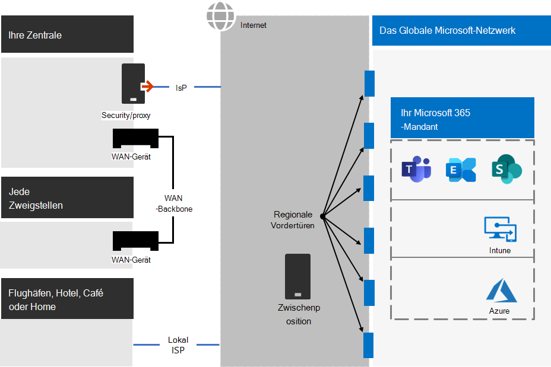
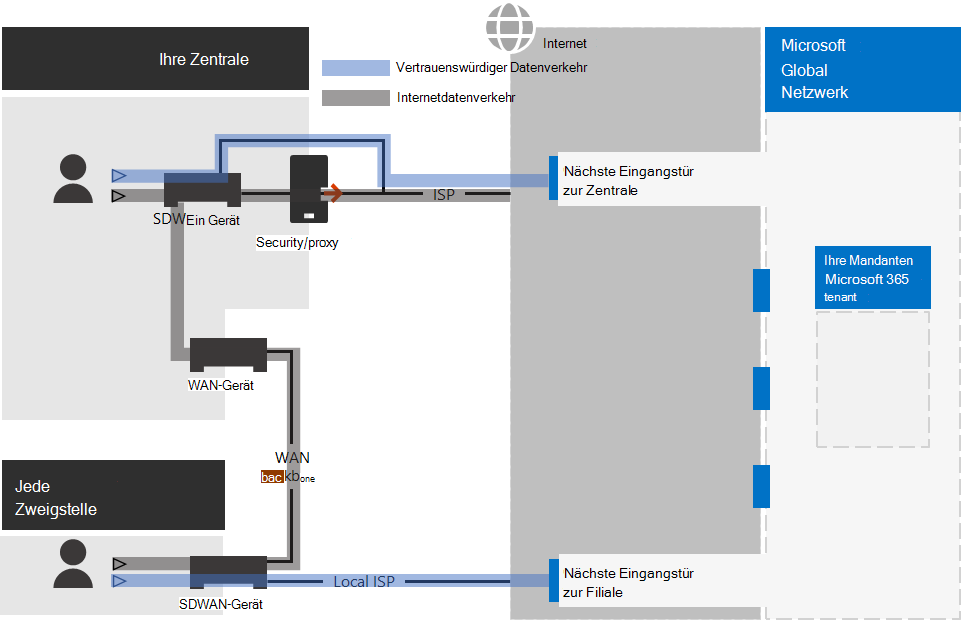
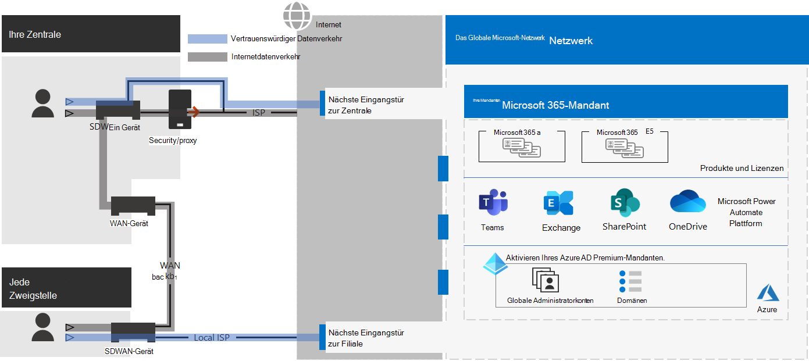
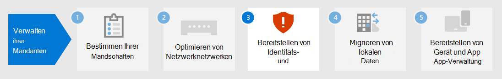

# Schritt 2. Optimales Netzwerk für Ihre Microsoft 365 Enterprise-Mandanten

Microsoft 365 enterprise umfasst Cloudproduktivitäts-Apps wie Teams und Exchange Online sowie Microsoft Intune sowie viele Identitäts- und Sicherheitsdienste von Microsoft Azure. Alle diese cloudbasierten Dienste basieren auf der Sicherheit, Leistung und Zuverlässigkeit von Verbindungen von Clientgeräten in Ihrem lokalen Netzwerk oder einem beliebigen Standort im Internet. 

Um den Netzwerkzugriff für Ihren Mandanten zu optimieren, müssen Sie:

- Optimieren Sie den Pfad zwischen Ihren lokalen Benutzern und dem nächstgelegenen Standort für das globale Microsoft-Netzwerk.
- Optimieren Sie den Zugriff auf das globale Microsoft-Netzwerk für Remotebenutzer, die eine Remotezugriffs-VPN-Lösung verwenden.
- Verwenden Sie Network Insights, um den Netzwerkperimeter für Ihre Bürostandorte zu entwerfen.
- Optimieren Sie den Zugriff auf bestimmte Objekte, die auf SharePoint-Websites gehostet werden, mit dem Office 365 CDN.
- Konfigurieren Sie Proxy- und Netzwerk-Edgegeräte, um die Verarbeitung für vertrauenswürdigen Microsoft 365-Datenverkehr mit der Liste der Endpunkte zu umgehen, und automatisieren Sie die Aktualisierung der Liste, sobald Änderungen vorgenommen werden.

## Lokale Mitarbeiter des Unternehmens

Für Unternehmensnetzwerke sollten Sie die Endbenutzererfahrung optimieren, indem Sie den leistungsstarken Netzwerkzugriff zwischen Clients und den nächstgelegenen Microsoft 365-Endpunkten aktivieren. Die Qualität der Endbenutzererfahrung steht in direktem Zusammenhang mit der Leistung und Reaktionsfähigkeit der Anwendung, die der Benutzer verwendet. Microsoft Teams basiert z. B. auf einer geringen Latenz, sodass Benutzertelefonanrufe, Konferenzen und Zusammenarbeiten auf gemeinsamem Bildschirm kostenlos sind.

Das Hauptziel im Netzwerkentwurf sollte es sein, die Latenz zu minimieren, indem die Roundtripzeit (Roundtrip time, RTT) von Clientgeräten zum Microsoft Global Network reduziert wird, dem öffentlichen Netzwerk-Backbone von Microsoft, das alle Rechenzentren von Microsoft mit niedriger Latenz miteinander verbindet, und Die Einstiegspunkte für Cloudanwendung mit hoher Verfügbarkeit, die als Fronttüren bezeichnet werden, verteilen sich auf die ganze Welt.

Hier ist ein Beispiel für ein herkömmliches Unternehmensnetzwerk.

In dieser Abbildung stellen Zweigstellen eine Verbindung mit einer Zentralstelle über WAN-Geräte (Wide Area Network) und ein WAN-Backbone zur Verfügung. Der Internetzugriff wird über ein Sicherheits- oder Proxygerät am Netzwerkrand der Zentralstelle und über einen Internetdienstanbieter (Internet Service Provider, ISP) ausgeführt. Im Internet verfügt das Globale Netzwerk von Microsoft über eine Reihe von Fronttüren in Regionen auf der ganzen Welt. Organisationen können auch Zwischenstandorte für zusätzliche Paketverarbeitung und Sicherheit für Datenverkehr verwenden. Der Microsoft 365-Mandant einer Organisation befindet sich im globalen Netzwerk von Microsoft.

Die Probleme mit dieser Konfiguration für Microsoft 365-Clouddienste sind:

- Für Benutzer in Zweigstellen wird Datenverkehr an nicht lokale Eingangstüren gesendet, was die Wartezeit erhöht.
- Das Senden von Datenverkehr an Zwischenstandorte erstellt Netzwerk-Hairpins, die doppelte Paketverarbeitung für vertrauenswürdigen Datenverkehr durchführen, was die Latenz erhöht.
- Netzwerk-Edgegeräte führen eine nicht mehr zu verwendende und doppelte Paketverarbeitung für vertrauenswürdigen Datenverkehr durch, was die Wartezeit erhöht.

Die Optimierung der Microsoft 365-Netzwerkleistung muss nicht kompliziert sein. Sie können die bestmögliche Leistung erzielen, indem Sie einige wichtige Prinzipien folgen:

- Identifizieren Sie Microsoft 365-Netzwerkdatenverkehr, bei dem es sich um vertrauenswürdigen Datenverkehr handelt, der an Microsoft Cloud Services bestimmt ist.
- Zulassen, dass lokale Zweigstellen den Microsoft 365-Netzwerkdatenverkehr von jedem Ort in das Internet umstellen, an dem Benutzer eine Verbindung mit Microsoft 365 herstellen.
- Vermeiden Sie Netzwerk-Hairpins.
- Zulassen, dass Microsoft 365-Datenverkehr Proxys und Paketprüfungsgeräte umgehen kann.

Wenn Sie diese Prinzipien implementieren, erhalten Sie ein unternehmensweites Netzwerk, das für Microsoft 365 optimiert ist.

In dieser Abbildung verfügen Zweigstellen über eine eigene Internetverbindung über ein softwaredefiniertes WAN-Gerät (SDWAN), das vertrauenswürdigen Microsoft 365-Datenverkehr an die regional nächstgelegene Eingangstür sendet. In der Zentralstelle umgeht der vertrauenswürdige Microsoft 365-Datenverkehr das Sicherheits- oder Proxygerät, und Zwischengeräte werden nicht mehr verwendet.

Hier sehen Sie, wie die optimierte Konfiguration die Latenzprobleme eines herkömmlichen Unternehmensnetzwerks löst:

- Der vertrauenswürdige Microsoft 365-Datenverkehr überspringt das WAN-Backbone und wird an lokale Fronttüren für alle Büros gesendet, was die Latenz verringert.
- Netzwerk-Hairpins, die doppelte Paketverarbeitung durchführen, werden für vertrauenswürdigen Microsoft 365-Datenverkehr übersprungen, was die Wartezeit verringert.
- Netzwerk-Edgegeräte, die nicht unnötigen und doppelten Paketverarbeitung durchführen, werden für vertrauenswürdigen Microsoft 365-Datenverkehr übersprungen, was die Wartezeit verringert.

Weitere Informationen finden Sie unter [Microsoft 365 Network Connectivity Overview](../enterprise/microsoft-365-networking-overview.md).

## Remotemitarbeiter

Wenn Ihre Remotemitarbeiter einen herkömmlichen VPN-Client für den Remotezugriff auf Ihr Organisationsnetzwerk verwenden, überprüfen Sie, ob der VPN-Client geteilte Tunnel unterstützt. Ohne geteilte Tunnel wird der gesamte Datenverkehr im Rahmend er Remotearbeit über die VPN-Verbindung gesendet, wo er an die Geräte am Rande Ihrer Organisation weitergeleitet, verarbeitet und dann im Internet gesendet werden muss. Hier ein Beispiel.

In dieser Abbildung muss der Microsoft 365-Datenverkehr eine indirekte Route durch Ihre Organisation nehmen, die an eine Microsoft Global Network-Fronttür weit weg vom physischen Standort des VPN-Clients weitergeleitet werden kann. Dieser indirekte Pfad erhöht die Latenz des Netzwerkverkehrs und verringert die Gesamtleistung. 

Mit geteilten Tunneln können Sie Ihren VPN-Client so konfigurieren, dass bestimmte Typen von Datenverkehr von der Übertragung über die VPN-Verbindung zum Unternehmensnetzwerk ausgeschlossen werden.

Um den Zugriff auf Microsoft 365-Cloudressourcen zu optimieren, konfigurieren Sie die VPN-Clients für geteilte Tunneln so, dass der Datenverkehr an die Endpunkte der **Optimieren**-Kategorie von Microsoft 365 über die VPN-Verbindung ausgeschlossen ist. Weitere Informationen finden Sie unter [Office 365-Endpunktkategorien](../enterprise/microsoft-365-network-connectivity-principles.md#new-office-365-endpoint-categories) und [in](../enterprise/microsoft-365-vpn-implement-split-tunnel.md#implement-vpn-split-tunneling) den Listen der Optimize-Kategorieendpunkte für geteiltes Tunneling.

Hier ist der resultierende Datenverkehrsfluss für geteiltes Tunneln, bei dem der großteil des Datenverkehrs an Microsoft 365-Cloud-Apps die VPN-Verbindung umgehen.

In dieser Abbildung sendet und empfängt der VPN-Client wichtigen Microsoft 365-Clouddienstdatenverkehr direkt über das Internet und an die nächste Eingangstür in das globale Microsoft Netzwerk.

Weitere Informationen und eine Anleitung finden Sie unter[Optimieren der Office 365-Konnektivität für Remotebenutzer mithilfe von geteilten VPN-Tunneln](../enterprise/microsoft-365-vpn-split-tunnel.md).

## Verwenden von Network Insights (Vorschau)

Netzwerkeinblicke sind Leistungsmetriken, die von Ihrem Microsoft 365-Mandanten gesammelt werden und Ihnen beim Entwerfen von Netzwerkperimetern für Ihre Bürostandorte helfen. Jeder Einblick enthält Livedetails zu den Leistungsmerkmalen eines bestimmten Problems für jeden geografischen Standort, an dem lokale Benutzer auf Ihren Mandanten zugreifen.

Es gibt zwei Netzwerkeinblicke auf Mandantenebene, die für den Mandanten angezeigt werden können:

- [Exchange-Beispielverbindungen, die von Konnektivitätsproblemen betroffen sind](../enterprise/office-365-network-mac-perf-insights.md#exchange-sampled-connections-impacted-by-connectivity-issues)
- [SharePoint-Beispielverbindungen, die von Konnektivitätsproblemen betroffen sind](../enterprise/office-365-network-mac-perf-insights.md#sharepoint-sampled-connections-impacted-by-connectivity-issues)

Dies sind die spezifischen Netzwerkeinblicke für jeden Bürostandort:

- [Backhauled network egress](../enterprise/office-365-network-mac-perf-insights.md#backhauled-network-egress)
- [Bessere Leistung für Kunden in Ihrer Nähe erkannt](../enterprise/office-365-network-mac-perf-insights.md#better-performance-detected-for-customers-near-you)
- [Verwenden einer nicht optimalen Exchange Online-Dienst-Eingangstür](../enterprise/office-365-network-mac-perf-insights.md#use-of-a-non-optimal-exchange-online-service-front-door)
- [Verwenden einer nicht optimalen SharePoint Online-Dienst-Eingangstür](../enterprise/office-365-network-mac-perf-insights.md#use-of-a-non-optimal-sharepoint-online-service-front-door)
- [Niedrige Downloadgeschwindigkeit von der SharePoint-Eingangstür](../enterprise/office-365-network-mac-perf-insights.md#low-download-speed-from-sharepoint-front-door)
- [Optimaler Netzwerk-Abgress für China-Benutzer](../enterprise/office-365-network-mac-perf-insights.md#china-user-optimal-network-egress)

>[!IMPORTANT]
>Netzwerkeinblicke, Leistungsempfehlungen und Bewertungen im Microsoft 365 Admin Center befinden sich derzeit im Vorschaustatus. Sie ist nur für Microsoft 365-Mandanten verfügbar, die im Featurevorschauprogramm registriert wurden.

Weitere Informationen finden Sie unter [Microsoft 365 Network Insights](../enterprise/office-365-network-mac-perf-insights.md).

## SharePoint-Leistung mit dem Office 365 CDN

Ein cloudbasiertes Content Delivery Network (CDN) ermöglicht es Ihnen, Ladezeiten zu reduzieren, Bandbreite zu sparen und die Reaktionsfähigkeit zu beschleunigen. Ein CDN verbessert die Leistung, indem statische Ressourcen wie Grafik- oder Videodateien näher an den Browsern zwischenspeichern, die sie anfordern, wodurch Downloads beschleunigt und wartezeiten reduziert werden. Sie können das integrierte Office 365 Content Delivery Network (CDN) verwenden, das in SharePoint in Microsoft 365 E3 und E5 enthalten ist, um statische Objekte zu hosten, um eine bessere Leistung für Ihre SharePoint-Seiten zu bieten.

Das Office 365-Netzwerk für die Inhaltsübermittlung besteht aus mehreren CDNs, über die Sie statische Objekte an mehreren Speicherorten hosten können, oder aus _Ursprüngen_, die aus globalen Hochgeschwindigkeitsnetzwerken bedient werden. Je nachdem, welche Art von Inhalt Sie im Office 365  CDN hosten möchten, können Sie öffentliche Ursprünge, **private** Ursprünge oder beides hinzufügen.

Bei der Bereitstellung und Konfiguration lädt das Office 365 CDN Objekte von öffentlichen und privaten Ursprüngen hoch und stellt sie für den schnellen Zugriff auf Benutzer im Internet zur Verfügung.

Weitere Informationen finden Sie unter [Verwenden des Office 365 CDN mit SharePoint Online](../enterprise/use-microsoft-365-cdn-with-spo.md).

## Automatisierte Endpunktauflistung

Damit Ihre lokalen Clients, Edgegeräte und cloudbasierten Paketanalysedienste die Verarbeitung des vertrauenswürdigen Microsoft 365-Datenverkehrs überspringen, müssen Sie sie mit dem Satz von Endpunkten (IP-Adressbereiche und DNS-Namen) konfigurieren, der Microsoft 365-Diensten entspricht. Diese Endpunkte können manuell in Firewalls und anderen Edgesicherheitsgeräten, PAC-Dateien für Clientcomputer zum Umgehen von Proxys oder SD-WAN-Geräten in Zweigstellen konfiguriert werden. Die Endpunkte ändern sich jedoch im Laufe der Zeit, was eine fortlaufende manuelle Wartung der Endpunktlisten an diesen Speicherorten erfordert.

Verwenden Sie den [OFFICE 365-IP-Adress- und URL-REST-basierten](../enterprise/microsoft-365-ip-web-service.md)Webdienst, um die Listen- und Änderungsverwaltung für Microsoft 365-Endpunkte in Ihren Client-PAC-Dateien und Netzwerkgeräten zu automatisieren. Dieser Dienst hilft Ihnen, den Microsoft 365-Netzwerkdatenverkehr besser zu identifizieren und zu unterscheiden, was ihnen die Auswertung, Konfiguration und den Aktuellen der neuesten Änderungen erleichtert.

Sie können PowerShell, Python oder andere Sprachen verwenden, um die Änderungen an Endpunkten im Laufe der Zeit zu bestimmen und Ihre PAC-Dateien und Edgenetzwerkgeräte zu konfigurieren.

Der grundlegende Prozess ist:

1. Verwenden Sie den Office 365-IP-Adress- und -URL-Webdienst und den Konfigurationsmechanismus Ihrer Wahl, um Ihre PAC-Dateien und Netzwerkgeräte mit dem aktuellen Satz von Microsoft 365-Endpunkten zu konfigurieren.
2. Führen Sie eine tägliche Wiederholung aus, um nach Änderungen an den Endpunkten zu suchen oder eine Benachrichtigungsmethode zu verwenden.
3. Wenn Änderungen erkannt werden, regenerieren und verteilen Sie die PAC-Datei für Clientcomputer, und nehmen Sie die Änderungen an Ihren Netzwerkgeräten vor.

Weitere Informationen finden Sie unter [Office 365-IP-Adresse und URL-Webdienst](../enterprise/microsoft-365-ip-web-service.md).

## Ergebnisse von Schritt 2

Für Ihren Microsoft 365-Mandanten mit optimalem Netzwerk haben Sie ermittelt:

- Optimieren der Netzwerkleistung für lokale Benutzer durch Hinzufügen von Internetverbindungen zu allen Zweigstellen und Eliminieren von Netzwerk-Hairpins.
- Implementieren der automatisierten Liste vertrauenswürdiger Endpunkte für Ihre clientbasierten PAC-Dateien und Ihre Netzwerkgeräte und -dienste, einschließlich laufender Updates (am besten geeignet für Unternehmensnetzwerke).
- So unterstützen Sie den Zugriff von Remotemitarbeitern auf lokale Ressourcen.
- Verwenden von Network Insights
- Bereitstellen des Office 365 CDN.

Hier ist ein Beispiel für eine Unternehmensorganisation und deren Mandant mit optimaler Netzwerkumgebung.

[Eine größere Version dieses Bilds sehen](https://github.com/MicrosoftDocs/microsoft-365-docs/raw/public/microsoft-365/media/tenant-management-overview/tenant-management-tenant-build-step2.png)

In dieser Abbildung verfügt der Mandant für diese Unternehmensorganisation über:

- Lokaler Internetzugang für jede Zweigstelle mit einem SDWAN-Gerät, das vertrauenswürdigen Microsoft 365-Datenverkehr an eine lokale Eingangstür weiter gibt.
- Keine Netzwerk-Hairpins.
- Sicherheits- und Proxy-Edgegeräte der Zentralstelle, die vertrauenswürdigen Microsoft 365-Datenverkehr an eine lokale Eingangstür weiterleiten.

## Fortlaufende Wartung für optimale Netzwerke

Auf fortlaufender Basis müssen Sie möglicherweise:

- Aktualisieren Sie Ihre Edgegeräte und bereitgestellten PAC-Dateien für Änderungen an Endpunkten, oder überprüfen Sie, ob Ihr automatisierter Prozess ordnungsgemäß funktioniert.
- Verwalten Sie Ihre Ressourcen im Office 365 CDN.
- Aktualisieren Sie die Konfiguration des geteilten Tunnels in Ihren VPN-Clients für Änderungen an Endpunkten.

## Nächster Schritt

Fahren Sie mit [der Identität](tenant-management-identity.md) fort, um Ihre lokalen Konten und Gruppen zu synchronisieren und sichere Benutzer-Anmeldungen zu erzwingen.
