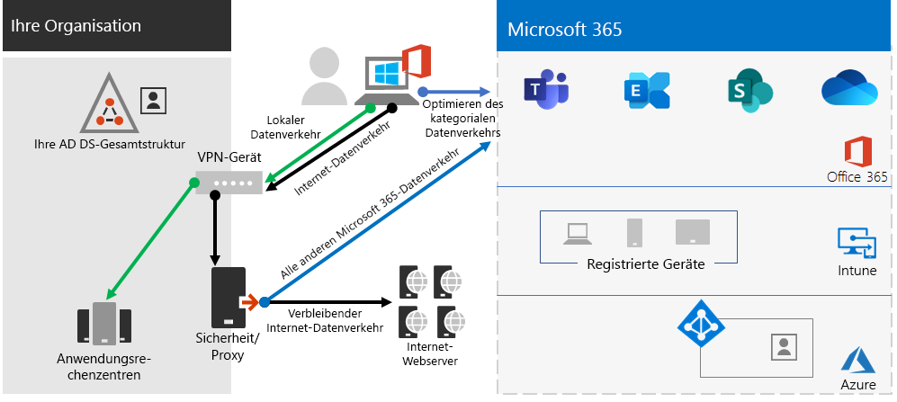

# Schritt 2.Step 2. Optimales Netzwerk für Ihre Microsoft 365 Enterprise-MandantenOptimal networking for your Microsoft 365 for enterprise tenants

Microsoft 365 Enterprise umfasst Cloudproduktivitäts-Apps wie Teams und Exchange Online sowie Microsoft Intune sowie viele Identitäts- und Sicherheitsdienste von Microsoft Azure.Microsoft 365 for enterprise includes cloud productivity apps such as Teams and Exchange Online, and Microsoft Intune, along with many identity and security services of Microsoft Azure. Alle diese cloudbasierten Dienste basieren auf der Sicherheit, Leistung und Zuverlässigkeit von Verbindungen von Clientgeräten in Ihrem lokalen Netzwerk oder einem beliebigen Standort im Internet.All of these cloud-based services rely on the security, performance, and reliability of connections from client devices on your on-premises network or any location on the Internet. 

Um den Netzwerkzugriff für Ihren Mandanten zu optimieren, müssen Sie:To optimize network access for your tenant, you need to:

- Optimieren Sie den Pfad zwischen Ihren lokalen Benutzern und dem nächstgelegenen Standort zum globalen Microsoft-Netzwerk.Optimize the path between your on-premises users and the closest location to the Microsoft Global Network.
- Optimieren Sie den Zugriff auf das globale Microsoft-Netzwerk für Remotebenutzer, die eine Remotezugriffs-VPN-Lösung verwenden.Optimize access to the Microsoft Global Network for your remote users that are using a remote access VPN solution.
- Verwenden Sie Network Insights, um den Netzwerkperimeter für Ihre Bürostandorte zu entwerfen.Use Network Insights to design the network perimeter for your office locations.
- Optimieren sie den Zugriff auf bestimmte Objekte, die auf SharePoint-Websites gehostet werden, mit dem Office 365 CDN.Optimize access to specific assets hosted on SharePoint sites with the Office 365 CDN.
- Konfigurieren Sie Proxy- und Netzwerk-Edgegeräte, um die Verarbeitung für vertrauenswürdigen Microsoft 365-Datenverkehr mit der Liste der Endpunkte zu umgehen, und automatisieren Sie die Aktualisierung der Liste, sobald Änderungen vorgenommen werden.Configure proxy and network edge devices to bypass processing for Microsoft 365 trusted traffic with the list of endpoints and automate the updating of the list as changes are made.

## Lokale Mitarbeiter des UnternehmensEnterprise on-premises workers

Für Unternehmensnetzwerke sollten Sie die Endbenutzererfahrung optimieren, indem Sie den Netzwerkzugriff mit der höchsten Leistung zwischen Clients und den nächstgelegenen Microsoft 365-Endpunkten aktivieren.For enterprise networks, you should optimize the end user experience by enabling the highest-performing network access between clients and the closest Microsoft 365 endpoints. Die Qualität der Endbenutzererfahrung steht in direktem Zusammenhang mit der Leistung und Reaktionsfähigkeit der Anwendung, die der Benutzer verwendet.The quality of end user experience is directly related to the performance and responsiveness of the application that the user is using. Microsoft Teams nutzt z. B. eine geringe Latenz, sodass Telefonanrufe, Konferenzen und Zusammenarbeiten auf gemeinsam genutzten Bildschirmen ohne Fehler auftreten.For example, Microsoft Teams relies on low latency so that user phone calls, conferences and shared screen collaborations are glitch-free.

Das Hauptziel im Netzwerkentwurf sollte die Minimierung der Latenz sein, indem die Roundtripzeit (Roundtrip Time, RTT) von Clientgeräten zum globalen Microsoft Network reduziert wird, dem Backbone des öffentlichen Netzwerks von Microsoft, das alle Rechenzentren von Microsoft mit geringer Latenz miteinander verbindet, und Einstiegspunkte für Hochverfügbarkeits-Cloud-Anwendungen, die als "Front-Doors" bezeichnet werden, auf der ganzen Welt verteilt sind.The primary goal in the network design should be to minimize latency by reducing the round-trip time (RTT) from client devices to the Microsoft Global Network, Microsoft's public network backbone that interconnects all of Microsoft's datacenters with low latency, high availability cloud application entry points, known as front doors, spread around the world.

Hier ist ein Beispiel für ein herkömmliches Unternehmensnetzwerk.Here is an example of a traditional enterprise network.

In dieser Abbildung stellen Zweigstellen eine Verbindung mit einer Zentrale über WAN (Wide Area Network)-Geräte und einen WAN-Backbone.In this illustration, branch offices connect to a central office through wide area network (WAN) devices and a WAN backbone. Der Internetzugriff wird über ein Sicherheits- oder Proxygerät am Netzwerkrand der Zentrale und über einen Internetdienstanbieter (Internet Service Provider, ISP) hergestellt.Internet access is through a security or proxy device at the network edge of the central office and an Internet service provider (ISP). Im Internet verfügt das globale Netzwerk von Microsoft über eine Reihe von Eingangstüren in Regionen auf der ganzen Welt.On the Internet, the Microsoft Global Network has a series of front doors in regions around the world. Organisationen können auch Zwischenstandorte für zusätzliche Paketverarbeitung und Sicherheit für Datenverkehr verwenden.Organizations can also use intermediate locations for additional packet processing and security for traffic. Der Microsoft 365-Mandant einer Organisation befindet sich im globalen Microsoft-Netzwerk.An organization's Microsoft 365 tenant is located within the Microsoft Global Network.

Die Probleme mit dieser Konfiguration für Microsoft 365-Clouddienste sind:The problems with this configuration for Microsoft 365 cloud services are:

- Bei Benutzern in Filialen wird Datenverkehr an nicht-lokale Eingangstüren gesendet, was die Latenz erhöht.For users in branch offices, traffic gets sent to non-local front doors, increasing latency.
- Das Senden von Datenverkehr an Zwischenstandorte erstellt Netzwerk-Hairpins, die doppelte Paketverarbeitung für vertrauenswürdigen Datenverkehr ausführen, was die Latenz erhöht.Sending traffic to intermediate locations create network hairpins that perform duplicate packet processing on trusted traffic, increasing latency.
- Netzwerked edge devices perform unneeded and duplicate packet processing on trusted traffic, increasing latency.Network edge devices perform unneeded and duplicate packet processing on trusted traffic, increasing latency.

Die Optimierung der Microsoft 365-Netzwerkleistung muss nicht kompliziert sein.Optimizing Microsoft 365 network performance doesn't need to be complicated. Sie können die bestmögliche Leistung erzielen, indem Sie ein paar wichtige Prinzipien folgen:You can get the best possible performance by following a few key principles:

- Identifizieren Sie Microsoft 365-Netzwerkdatenverkehr, bei dem es sich um vertrauenswürdigen Datenverkehr handelt, der an Microsoft Cloud Services bestimmt ist.Identify Microsoft 365 network traffic, which is trusted traffic destined to Microsoft cloud services.
- Zulassen des Lokalen Zweigstellen-Ausgangs des Microsoft 365-Netzwerkdatenverkehrs in das Internet von jedem Ort, an dem Benutzer eine Verbindung mit Microsoft 365 herstellen.Allow local branch egress of Microsoft 365 network traffic to the internet from each location where users connect to Microsoft 365.
- Vermeiden Sie Klammerungen im Netzwerk.Avoid network hairpins.
- Microsoft 365-Datenverkehr darf Proxys und Paketprüfungsgeräte umgehen.Allow Microsoft 365 traffic to bypass proxies and packet inspection devices.

Wenn Sie diese Prinzipien implementieren, erhalten Sie ein unternehmensweites Netzwerk, das für Microsoft 365 optimiert ist.If you implement these principles, you get an enterprise network optimized for Microsoft 365.

In dieser Abbildung verfügen Zweigstellen über eine eigene Internetverbindung über ein softwaredefiniertes WAN-Gerät (SDWAN), das vertrauenswürdigen Microsoft 365-Datenverkehr an die regional nächstgelegene Eingangstür sendet.In this illustration, branch offices have their own Internet connection through a software-defined WAN device (SDWAN) device, which sends trusted Microsoft 365 traffic to the regionally closest front door. In der Zentrale umgeht vertrauenswürdiger Microsoft 365-Datenverkehr das Sicherheits- oder Proxygerät, und Zwischengeräte werden nicht mehr verwendet.At the central office, trusted Microsoft 365 traffic bypasses the security or proxy device and intermediate devices are no longer used.

Hier erfahren Sie, wie die optimierte Konfiguration die Latenzprobleme eines herkömmlichen Unternehmensnetzwerks löst:Here's are how the optimized configuration solves the latency issues of a traditional enterprise network:

- Vertrauenswürdiger Microsoft 365-Datenverkehr überspringt das WAN-Backbone und wird an die lokalen Eingangstüren für alle Büros gesendet, was die Latenz verringert.Trusted Microsoft 365 traffic skips the WAN backbone and is sent to local front doors for all offices, decreasing latency.
- Netzwerk hairpins that perform duplicate packet processing are skipped for Microsoft 365 trusted traffic, decreasing latency.Network hairpins that perform duplicate packet processing are skipped for Microsoft 365 trusted traffic, decreasing latency.
- Netzwerk-Edgegeräte, die eine nicht mehr zu verwendende und doppelte Paketverarbeitung durchführen, werden für vertrauenswürdigen Microsoft 365-Datenverkehr übersprungen, was die Latenz verringert.Network edge devices that perform unneeded and duplicate packet processing are skipped for Microsoft 365 trusted traffic, decreasing latency.

Weitere Informationen finden Sie in der Übersicht über [die Microsoft 365-Netzwerkkonnektivität.](../enterprise/microsoft-365-networking-overview.md)For more information, see [Microsoft 365 network connectivity overview](../enterprise/microsoft-365-networking-overview.md).

## RemotemitarbeiterRemote workers

Wenn Ihre Remotemitarbeiter einen herkömmlichen VPN-Client für den Remotezugriff auf Ihr Organisationsnetzwerk verwenden, überprüfen Sie, ob der VPN-Client geteilte Tunnel unterstützt.If your remote workers are using a traditional VPN client to obtain remote access to your organization network, verify that the VPN client has split tunneling support. Ohne geteilte Tunnel wird der gesamte Datenverkehr im Rahmend er Remotearbeit über die VPN-Verbindung gesendet, wo er an die Geräte am Rande Ihrer Organisation weitergeleitet, verarbeitet und dann im Internet gesendet werden muss.Without split tunneling, all of your remote work traffic gets sent across the VPN connection, where it must be forwarded to your organization’s edge devices, get processed, and then sent on the Internet. Hier ein Beispiel.Here is an example.

In dieser Abbildung muss Der Microsoft 365-Datenverkehr eine indirekte Route durch Ihre Organisation verwenden, die an eine Microsoft Global Network-Front-Door weit vom physischen Standort des VPN-Clients weitergeleitet werden kann.In this illustration, Microsoft 365 traffic must take an indirect route through your organization, which could be forwarded to a Microsoft Global Network front door far away from the VPN client’s physical location. Dieser indirekte Pfad erhöht die Latenz des Netzwerkverkehrs und verringert die Gesamtleistung.This indirect path adds latency to the network traffic and decreases overall performance. 

Mit geteilten Tunneln können Sie Ihren VPN-Client so konfigurieren, dass bestimmte Typen von Datenverkehr von der Übertragung über die VPN-Verbindung zum Unternehmensnetzwerk ausgeschlossen werden.With split tunneling, you can configure your VPN client to exclude specific types of traffic from being sent over the VPN connection to the organization network.

Um den Zugriff auf Microsoft 365-Cloudressourcen zu optimieren, konfigurieren Sie die VPN-Clients für geteilte Tunneln so, dass der Datenverkehr an die Endpunkte der **Optimieren**-Kategorie von Microsoft 365 über die VPN-Verbindung ausgeschlossen ist.To optimize access to Microsoft 365 cloud resources, configure your split tunneling VPN clients to exclude traffic to the **Optimize** category Microsoft 365 endpoints over the VPN connection. Weitere Informationen finden Sie unter [Office 365-Endpunktkategorien](../enterprise/microsoft-365-network-connectivity-principles.md#new-office-365-endpoint-categories) [und](../enterprise/microsoft-365-vpn-implement-split-tunnel.md#implement-vpn-split-tunneling) in den Listen der Endpunkte der Kategorie "Optimieren" für geteiltes Tunneling.For more information, see [Office 365 endpoint categories](../enterprise/microsoft-365-network-connectivity-principles.md#new-office-365-endpoint-categories) and [the lists](../enterprise/microsoft-365-vpn-implement-split-tunnel.md#implement-vpn-split-tunneling) of Optimize category endpoints for split tunneling.

Hier sehen Sie den resultierenden Datenverkehrsfluss für geteiltes Tunneling, bei dem der Großteil des Datenverkehrs zu Microsoft 365-Cloud-Apps die VPN-Verbindung umgeht.Here is the resulting traffic flow for split tunneling, in which most of the traffic to Microsoft 365 cloud apps bypass the VPN connection.

In dieser Abbildung sendet und empfängt der VPN-Client wichtigen Microsoft 365-Clouddienstdatenverkehr direkt über das Internet und an die nächste Eingangstür in das globale Microsoft-Netzwerk.In this illustration, the VPN client sends and receives crucial Microsoft 365 cloud service traffic directly over the Internet and to the nearest front door into the Microsoft Global Network.

Weitere Informationen und eine Anleitung finden Sie unter[Optimieren der Office 365-Konnektivität für Remotebenutzer mithilfe von geteilten VPN-Tunneln](../enterprise/microsoft-365-vpn-split-tunnel.md).For more information and guidance, see [Optimize Office 365 connectivity for remote users using VPN split tunneling](../enterprise/microsoft-365-vpn-split-tunnel.md).

## Verwenden von Network Insights (Vorschau)Using Network Insights (preview)

Netzwerkeinblicke sind Leistungsmetriken, die von Ihrem Microsoft 365-Mandanten gesammelt werden und Ihnen beim Entwerfen von Netzwerkperimetern für Ihre Bürostandorte helfen.Network insights are performance metrics collected from your Microsoft 365 tenant that help you design network perimeters for your office locations. Jeder Einblick bietet Livedetails zu den Leistungsmerkmalen für ein bestimmtes Problem für jeden geografischen Standort, an dem lokale Benutzer auf Ihren Mandanten zugreifen.Each insight provides live details about the performance characteristics for a specified issue for each geographic location where on-premises users are accessing your tenant.

Es gibt zwei Netzwerkeinblicke auf Mandantenebene, die für den Mandanten angezeigt werden können:There are two tenant level network insights that may be shown for the tenant:

- [Exchange-Beispielverbindungen, die von Konnektivitätsproblemen betroffen sindExchange sampled connections impacted by connectivity issues](../enterprise/office-365-network-mac-perf-insights.md#exchange-sampled-connections-impacted-by-connectivity-issues)
- [Von Konnektivitätsproblemen betroffene In-SharePoint-BeispielverbindungenSharePoint sampled connections impacted by connectivity issues](../enterprise/office-365-network-mac-perf-insights.md#sharepoint-sampled-connections-impacted-by-connectivity-issues)

Dies sind die spezifischen Netzwerkeinblicke für jeden Bürostandort:These are the specific network insights for each office location:

- [Backhauled network egressBackhauled network egress](../enterprise/office-365-network-mac-perf-insights.md#backhauled-network-egress)
- [Bessere Leistung für Kunden in Ihrer Nähe erkanntBetter performance detected for customers near you](../enterprise/office-365-network-mac-perf-insights.md#better-performance-detected-for-customers-near-you)
- [Verwenden einer nicht optimalen Front-Door des Exchange Online-DienstsUse of a non-optimal Exchange Online service front door](../enterprise/office-365-network-mac-perf-insights.md#use-of-a-non-optimal-exchange-online-service-front-door)
- [Verwenden einer nicht optimalen SharePoint Online-Dienst-EingangstürUse of a non-optimal SharePoint Online service front door](../enterprise/office-365-network-mac-perf-insights.md#use-of-a-non-optimal-sharepoint-online-service-front-door)
- [Niedrige Downloadgeschwindigkeit von der SharePoint-Front-DoorLow download speed from SharePoint front door](../enterprise/office-365-network-mac-perf-insights.md#low-download-speed-from-sharepoint-front-door)
- [Optimaler Netzwerk-Ausgangs in ChinaChina user optimal network egress](../enterprise/office-365-network-mac-perf-insights.md#china-user-optimal-network-egress)

>[!IMPORTANT]
>Netzwerkeinblicke, Leistungsempfehlungen und Bewertungen im Microsoft 365 Admin Center befinden sich derzeit im Vorschaustatus.Network insights, performance recommendations and assessments in the Microsoft 365 Admin Center is currently in preview status. Es ist nur für Microsoft 365-Mandanten verfügbar, die für das Featurevorschauprogramm registriert wurden.It is only available for Microsoft 365 tenants that have been enrolled in the feature preview program.

Weitere Informationen finden Sie unter [Microsoft 365 Network Insights](../enterprise/office-365-network-mac-perf-insights.md).For more information, see [Microsoft 365 Network Insights](../enterprise/office-365-network-mac-perf-insights.md).

## Leistung von SharePoint mit dem Office 365 CDNSharePoint performance with the Office 365 CDN

Mit einem cloudbasierten Content Delivery Network (CDN) können Sie Ladezeiten reduzieren, Bandbreite sparen und reaktionsschnelle Reaktionen beschleunigen.A cloud-based Content Delivery Network (CDN) allows you to reduce load times, save bandwidth, and speed responsiveness. Ein CDN verbessert die Leistung, indem statische Objekte wie Grafik- oder Videodateien zwischenspeichert werden, die näher an den Browsern sind, die sie anfordern, wodurch Downloads beschleunigt und die Latenz reduziert wird.A CDN improves performance by caching static assets such as graphic or video files closer to the browsers requesting them, which helps to speed up downloads and reduce latency. Sie können das integrierte Office 365 Content Delivery Network (CDN) verwenden, das in SharePoint in Microsoft 365 E3 und E5 enthalten ist, um statische Objekte zu hosten, um eine bessere Leistung für Ihre SharePoint-Seiten zu bieten.You can use the built-in Office 365 Content Delivery Network (CDN), included with SharePoint in Microsoft 365 E3 and E5, to host static assets to provide better performance for your SharePoint pages.

Das Office 365-Netzwerk für die Inhaltsübermittlung besteht aus mehreren CDNs, über die Sie statische Objekte an mehreren Speicherorten hosten können, oder aus _Ursprüngen_, die aus globalen Hochgeschwindigkeitsnetzwerken bedient werden.The Office 365 CDN is composed of multiple CDNs that allow you to host static assets in multiple locations, or _origins_, and serve them from global high-speed networks. Je nachdem, welche Art von Inhalt Sie im Office 365  CDN hosten möchten, können Sie öffentliche Ursprünge, **private** Ursprünge oder beides hinzufügen.Depending on the kind of content you want to host in the Office 365 CDN, you can add **public** origins, **private** origins, or both.

Bei der Bereitstellung und Konfiguration lädt das Office 365 CDN Objekte von öffentlichen und privaten Ursprüngen hoch und macht sie für schnellen Zugriff für Benutzer verfügbar, die sich über das Internet befinden.When deployed and configured, the Office 365 CDN uploads assets from public and private origins and makes them available for fast access to users located across the Internet.

Weitere Informationen finden Sie unter [Verwenden des Office 365 CDN mit SharePoint Online.](../enterprise/use-microsoft-365-cdn-with-spo.md)For more information, see [Use the Office 365 CDN with SharePoint Online](../enterprise/use-microsoft-365-cdn-with-spo.md).

## Automatisierte EndpunktauflistungAutomated endpoint listing

Damit Ihre lokalen Clients, Edgegeräte und cloudbasierten Paketanalysedienste die Verarbeitung des vertrauenswürdigen Microsoft 365-Datenverkehrs überspringen, müssen Sie sie mit dem Satz von Endpunkten (IP-Adressbereiche und DNS-Namen) konfigurieren, der den Microsoft 365-Diensten entspricht.To have your on-premises clients, edge devices, and cloud-based packet analysis services skip processing of trusted Microsoft 365 traffic, you must configure them with the set of endpoints (IP address ranges and DNS names) corresponding to Microsoft 365 services. Diese Endpunkte können manuell in Firewalls und anderen Edgesicherheitsgeräten, in PAC-Dateien für Clientcomputer zum Umgehen von Proxys oder SD-WAN-Geräten in Zweigstellen konfiguriert werden.These endpoints can be manually configured in firewalls and other edge security devices, PAC files for client computers to bypass proxies, or SD-WAN devices at branch offices. Die Endpunkte ändern sich jedoch im Laufe der Zeit, was eine fortlaufende manuelle Wartung der Endpunktlisten an diesen Speicherorten erfordert.However, the endpoints change over time, requiring ongoing manual maintenance of the endpoint lists in these locations.

Verwenden Sie zum Automatisieren der Eintrags- und Änderungsverwaltung für Microsoft 365-Endpunkte in Ihren Client-PAC-Dateien und Netzwerkgeräten den [Office 365-IP-Adress- und URL-REST-basierten Webdienst.](../enterprise/microsoft-365-ip-web-service.md)To automate the listing and change management for Microsoft 365 endpoints in your client PAC files and network devices, use the [Office 365 IP Address and URL REST-based web service](../enterprise/microsoft-365-ip-web-service.md). Dieser Dienst hilft Ihnen, Den Microsoft 365-Netzwerkdatenverkehr besser zu identifizieren und zu unterscheiden, wodurch Sie die neuesten Änderungen einfacher bewerten, konfigurieren und auf dem Laufenden bleiben können.This service helps you better identify and differentiate Microsoft 365 network traffic, making it easier for you to evaluate, configure, and stay current with the latest changes.

Sie können PowerShell, Python oder andere Sprachen verwenden, um die Änderungen an Endpunkten im Laufe der Zeit zu ermitteln und Ihre PAC-Dateien und Edgenetzwerkgeräte zu konfigurieren.You can use PowerShell, Python, or other languages to determine the changes to endpoints over time and configure your PAC files and edge network devices.

Der grundlegende Prozess ist:The basic process is:

1. Verwenden Sie den Office 365-IP-Adress- und -URL-Webdienst und den Konfigurationsmechanismus Ihrer Wahl, um Ihre PAC-Dateien und Netzwerkgeräte mit dem aktuellen Satz von Microsoft 365-Endpunkten zu konfigurieren.Use the Office 365 IP Address and URL web service and the configuration mechanism of your choice to configure your PAC files and network devices with the current set of Microsoft 365 endpoints.
2. Führen Sie eine tägliche Wiederholung aus, um nach Änderungen an den Endpunkten zu suchen, oder verwenden Sie eine Benachrichtigungsmethode.Run a daily recurring to check for changes in the endpoints or use a notification method.
3. Wenn Änderungen erkannt werden, müssen Sie die PAC-Datei für Clientcomputer neu erstellen und verteilen und die Änderungen an Ihren Netzwerkgeräten vornehmen.When changes are detected, regenerate and redistribute the PAC file for client computers and make the changes to your network devices.

Weitere Informationen finden Sie unter [Office 365-IP-Adresse und URL-Webdienst.](../enterprise/microsoft-365-ip-web-service.md)For more information, see [Office 365 IP Address and URL web service](../enterprise/microsoft-365-ip-web-service.md).

## Ergebnisse von Schritt 2Results of Step 2

Für Ihren Microsoft 365-Mandanten mit optimalem Netzwerk haben Sie festgelegt:For your Microsoft 365 tenant with optimal networking, you have determined:

- Optimieren der Netzwerkleistung für lokale Benutzer durch Hinzufügen von Internetverbindungen zu allen Zweigstellen und Eliminieren von Netzwerk-Hairpins.How to optimize network performance for on-premises users by adding Internet connections to all branch offices and eliminating network hairpins.
- Implementieren der automatisierten Auflistung vertrauenswürdiger Endpunkte für Ihre clientbasierten PAC-Dateien und Ihre Netzwerkgeräte und -dienste, einschließlich laufender Updates (am besten geeignet für Unternehmensnetzwerke).How to implement automated trusted endpoint listing for your client-based PAC files and your network devices and services, including ongoing updates (most suitable for enterprise networks).
- Informationen zum Unterstützen des Zugriffs von Remotemitarbeitern auf lokale Ressourcen.How to support the access of remote workers to on-premises resources.
- Verwenden von Network InsightsHow to use Network Insights
- Bereitstellen des Office 365 CDN.How to deploy the Office 365 CDN.

Hier ist ein Beispiel für eine Unternehmensorganisation und deren Mandant mit optimalem Netzwerk.Here is an example of an enterprise organization and its tenant with optimal networking.

[Sehen Sie sich eine größere Version dieses Bilds an.See a larger version of this image](https://github.com/MicrosoftDocs/microsoft-365-docs/raw/public/microsoft-365/media/tenant-management-overview/tenant-management-tenant-build-step2.png)

In dieser Abbildung verfügt der Mandant für diese Unternehmensorganisation über:In this illustration, the tenant for this enterprise organization has:

- Lokaler Internetzugriff für jede Zweigstelle mit einem SDWAN-Gerät, das vertrauenswürdigen Microsoft 365-Datenverkehr an eine lokale Eingangstür weiterstürt.Local internet access for each branch office with an SDWAN device that forwards trusted Microsoft 365 traffic to a local front door.
- Keine Klammer im Netzwerk.No network hairpins.
- Sicherheits- und Proxy-Edgegeräte der Zentralstelle, die vertrauenswürdigen Microsoft 365-Datenverkehr an eine lokale Eingangstür weiterleiten.Central office security and proxy edge devices that forward Microsoft 365 trusted traffic to a local front door.

## Fortlaufende Wartung für optimale NetzwerkeOngoing maintenance for optimal networking

Es kann sein, dass Sie regelmäßig:On an ongoing basis, you might need to:

- Aktualisieren Sie Ihre Edgegeräte und bereitgestellten PAC-Dateien für Änderungen an Endpunkten, oder stellen Sie sicher, dass Ihr automatisierter Prozess ordnungsgemäß funktioniert.Update your edge devices and deployed PAC files for changes in endpoints or verify that your automated process works properly.
- Verwalten Sie Ihre Ressourcen im Office 365 CDN.Manage your assets in the Office 365 CDN.
- Aktualisieren Sie die Konfiguration des geteilten Tunnelings in Ihren VPN-Clients, um Änderungen an Endpunkten zu erhalten.Update the split tunneling configuration in your VPN clients for changes in endpoints.

## Nächster SchrittNext step

Fahren Sie mit [der Identität](tenant-management-identity.md) fort, um Ihre lokalen Konten und Gruppen zu synchronisieren und sichere Benutzer-Anmeldungen zu erzwingen.Continue with [identity](tenant-management-identity.md) to synchronize your on-premises accounts and groups and enforce secure user sign-ins.
