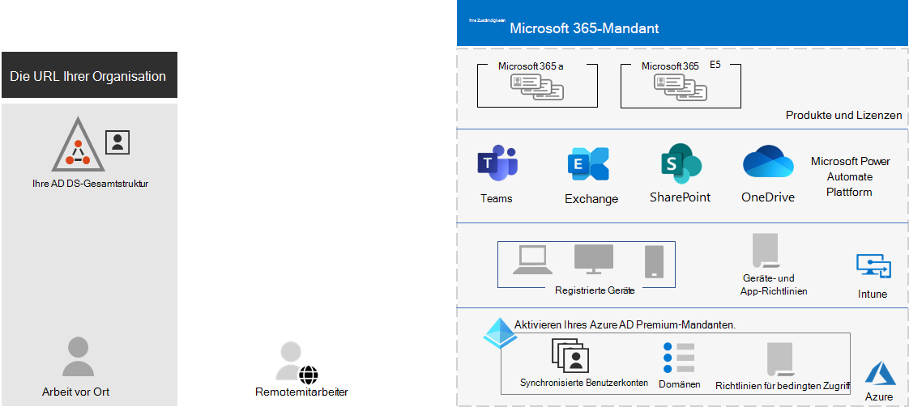
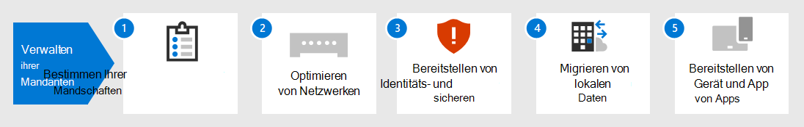

# Mandantenverwaltung für Microsoft 365 Enterprise

Das Erstellen eines Wegs zur digitalen Transformation Ihrer Organisation mit Cloud Computing erfordert eine feste Grundlage, auf der sich Ihre Mitarbeiter auf Produktivität, Zusammenarbeit, Leistung, Datenschutz, Compliance und Sicherheit verlassen können.

Die richtige Konfiguration Ihrer Microsoft 365-Mandanten bietet diese Grundlage, damit sich Ihre Mitarbeiter auf ihre Arbeit konzentrieren können, und Ihre IT-Abteilung kann sich auf End-to-End-Lösungen konzentrieren, die einen zusätzlichen geschäftlichen Nutzen bieten. 

Diese Lösung führt Sie durch die Konfiguration dieser Grundlage in den folgenden Schritten:

1. Ermitteln Ihrer Mandanten
2. Optimieren Ihres Netzwerks
3. Synchronisieren Ihrer Identitäten und Erzwingen sicherer Anmeldungen
4. Migrieren Von Windows-Geräten, -Clients und lokalen Office-Servern und -Daten
5. Bereitstellen der Geräte- und App-Verwaltung

Doch zunächst wollen wir uns einen Moment Zeit nehmen, um zu verstehen, was ein Mandant ist und wie ein Mandant aussieht, der eine feste Grundlage bietet.

## Ein Microsoft 365-Mandant definiert

Ein Microsoft 365-Mandant ist eine dedizierte Instanz der Dienste von Microsoft 365 und Ihrer Organisationsdaten, die an einem bestimmten Standardspeicherort wie Europa oder Nordamerika gespeichert sind. Dieser Speicherort wird angegeben, wenn Sie den Mandanten für Ihre Organisation erstellen. Jeder Microsoft 365-Mandant ist unterschiedlich, eindeutig und von allen anderen Microsoft 365-Mandanten getrennt. Sie erstellen einen Microsoft 365-Mandanten, wenn Sie ein oder mehrere Produkte von Microsoft erwerben, z. B. Microsoft 365 E3 oder E5, und jeweils eine Reihe von Lizenzen.

Ihr Microsoft 365-Mandant enthält auch einen Azure Active Directory (Azure AD)-Mandanten, bei dem es sich um eine dedizierte Instanz von Azure AD für Benutzerkonten, Gruppen und andere Objekte handelt. Jeder Azure AD-Mandant ist anders, eindeutig und von allen anderen Azure AD-Mandanten getrennt. Während Ihre Organisation mehrere Azure AD-Mandanten haben kann, die Sie mit Azure-Abonnements einrichten können, können Microsoft 365-Mandanten nur einen einzelnen Azure AD-Mandanten verwenden, den Mandanten, der beim Erstellen des Mandanten erstellt wurde. 

Hier ein Beispiel:

*Mandantenverwaltung* ist die Planung, Bereitstellung und der fortlaufende Betrieb Ihrer Microsoft 365-Mandanten. 

## Attribute eines gut entworfenen und betriebs n nen Mandanten

Neben dem richtigen Namen und Standort für Ihren Mandanten gibt es weitere Elemente zum Planen, Bereitstellen und Verwalten, um sicherzustellen, dass Ihre Benutzererfahrungen mit Cloudproduktivitäts-Apps wie Microsoft Teams und Exchange Online effektiv, sicher und effizient &mdash; &mdash; sind.

Hier sind die Elemente:

- Sie verfügen über den richtigen Satz von Produkten (Abonnements) und Lizenzen.
  - Der Satz von Produkten entspricht Ihren Geschäfts-, IT- und Sicherheitsanforderungen.
  - Es gibt eine angemessene Anzahl von Lizenzen für Ihre Mitarbeiter und erwartete Änderungen bei der Personalbearbeitung.
- Für den Netzwerkbetrieb:
  - Sie haben die richtigen DNS-Domänennamen konfiguriert.
  - Für Unternehmensnetzwerke haben Sie den Netzwerkdatenverkehr zum Netzwerk von Microsoft für Mitarbeiter vor Ort optimiert.
  - Sie haben den Netzwerkdatenverkehr für Remotemitarbeiter optimiert, die einen VPN-Client verwenden.
- Sie haben Ihre Active Directory Domain Services (AD DS)-Konten, -Gruppen und andere Objekte synchronisiert.
  - Ihre Azure AD-Mandantenkonten werden Exchange Online-Postfächern mit den richtigen DNS-Domänen für E-Mail-Adressen zugeordnet.
  - Ihren Benutzerkonten wurden die richtigen Lizenzen aus den richtigen gekauften Produkten (z. B. Microsoft 365 E3 oder E5) zugewiesen.
- Sie haben eine starke Identitäts- und Zugriffsverwaltung konfiguriert.
  - Sie benötigen eine sichere Benutzerauthentifizierung mit kennwortloser oder mehrstufiger Authentifizierung (MFA).
  - Sie verfügen über Richtlinien für bedingten Zugriff, die Anmeldeanforderungen und Einschränkungen für höhere Sicherheitsstufen erzwingen.
- Lokale Office Server und ihre Daten wurden zu Cloud-Apps migriert oder werden in einer Hybridkonfiguration verwendet.
- Sie verwenden Die Geräteverwaltung mit Intune oder Basic Mobility and Security, die in Microsoft 365 integrierte Sind.
  - Ihre Geräte im Besitz ihrer Organisation werden registriert und verwaltet.
  - Die Apps für persönliche Geräte werden verwaltet.

Hier ist ein Beispiel für einen Microsoft 365-Mandanten mit all diesen Elementen.

In dieser Abbildung enthält der Microsoft 365-Mandant:

- Produkte und Lizenzen für Microsoft 365 E3 und E5.
- Microsoft 365-Produktivitäts-Apps.
- Intune mit registrierten Geräten und Geräte- und Anwendungsrichtlinien.
- Ein Azure AD-Mandant, der ein Benutzerkonto synchronisiert hat (Gruppen und andere Verzeichnisobjekte werden nicht angezeigt), Domänen und Richtlinien für bedingten Zugriff.

## Mandantenfunktionen für Microsoft 365 Enterprise

In den folgenden Abschnitten und der folgenden Tabelle sind die wichtigsten Funktionen und Lizenzierungen für die Schritte in dieser Lösung aufgeführt.

### Mandant

| Funktion oder Feature | Beschreibung | Lizenzierung |
|:-------|:-----|:-------|
| Mehrere Mandanten | Jeder Microsoft 365-Mandant ist unterschiedlich, eindeutig und von allen anderen Microsoft 365-Mandanten getrennt. Bei mehreren Mandanten gibt es Einschränkungen und zusätzliche Überlegungen beim Verwalten und Bereitstellen von Diensten für Ihre Benutzer. | Microsoft 365 E3 oder E5 | 
| Mandantenübergreifende Postfachmigration | Mandantenadministratoren können Postfächer zwischen Mandanten mit minimalen Infrastrukturabhängigkeiten in ihren lokalen Systemen verschieben. Dadurch ist es nicht mehr nötig, Postfächer aus dem Offboard heraus zu nehmen und zu integrieren. | Microsoft 365 E3 oder E5 | 
| Multi-Geo | Ihr Mandant kann Ruhedaten an den anderen geografischen Standorten des Rechenzentrums speichern, die Sie ausgewählt haben, um die Anforderungen an den Datenspeicherort zu erfüllen. | Microsoft 365 E3 oder E5 | 
| Verschieben von Kerndaten in eine neue Rechenzentrums-Geo | Wenn Microsoft neue Rechenzentrums-Geos für zusätzliche Kapazität und Rechenressourcen hinzufügt, können Sie für Ihre Kundenkerndaten eine geografische Rechenzentrumsvermittelung für die In-Geo-Datenspeicherung anfordern. | Microsoft 365 E3 oder E5 | 
||||

### Netzwerk

| Funktion oder Feature | Beschreibung | Lizenzierung |
|:-------|:-----|:-------|
| Network Insights | Metriken zur Netzwerkleistung, die von Ihrem Microsoft 365-Mandanten erfasst wurden, um Ihnen beim Entwerfen von Netzwerkperimetern für Ihre Bürostandorte zu helfen. | Microsoft 365 E3 oder E5 | 
| Automatisieren von Endpunktupdates | Automatisieren Sie die Konfiguration und laufende Updates für Microsoft 365-Endpunkte in Ihren Client-PAC-Dateien und Netzwerkgeräten und -diensten. | Microsoft 365 E3 oder E5 | 
||||

### Identität

| Funktion oder Feature | Beschreibung | Lizenzierung |
|:-------|:-----|:-------|
| Synchronisieren der lokalen Active Directory Domain Services (AD DS) mit Ihrem Azure AD-Mandanten    | Nutzen Sie Ihren lokalen Identitätsanbieter für Benutzerkonten, Gruppen und andere Objekte. | Microsoft 365 E3 oder E5 |
| Mehrstufige Authentifizierung (MFA, Multi-Factor Authentication) mit Sicherheitsstandards erzwingen   | Schützen Sie sich vor kompromittierten Identitäten und Geräten, indem Sie eine zweite Authentifizierungsmethode für die Anmeldung vorsehen. Sicherheitsstandards schreiben MFA für alle Benutzerkonten vor.   | Microsoft 365 E3 oder E5 |
| Mehrstufige Authentifizierung (MFA, Multi-Factor Authentication) mit bedingtem Zugriff erzwingen| MFA basierend auf den Attributen der Anmeldung mit Richtlinien für bedingten Zugriff erforderlich.    | Microsoft 365 E3 oder E5 | 
| Mehrstufige Authentifizierung (MFA, Multi-Factor Authentication) mit risikoabhängig bedingtem Zugriff erzwingen   | Erfordert MFA basierend auf dem Risiko der Benutzeranmeldung mit Microsoft Defender for Identity. | Microsoft 365 E5 oder E3 mit Azure AD Premium P2-Lizenzen | 
| Zurücksetzen von Kennwörtern durch den Benutzer (Self-Service Password Reset, SSPR)    | Ermöglichen Sie Ihren Benutzern das Zurücksetzen oder Entsperren ihrer Kennwörter oder Konten.  | Microsoft 365 E3 oder E5 |
||||

### Migration

| Funktion oder Feature | Beschreibung | Lizenzierung |
|:-------|:-----|:-------|
| Migration zu Windows 10 | Migrieren Sie Ihre Geräte mit Windows 7 oder Windows 8.1 zu Windows 10 Enterprise. | In Microsoft 365 E3 oder E5 enthaltene Windows 10 Enterprise-Lizenzen | 
| Migrieren zu Microsoft 365 Apps for Enterprise | Migrieren Sie Ihre Office-Client-Apps wie Word und PowerPoint zu den versionen, die aus der Cloud installiert sind, die mit neuen Features aktualisiert werden. | Microsoft 365 E3 oder E5 | 
| Migrieren von lokalen Servern und Daten zu Microsoft 365 | Migrieren Sie Ihre Exchange-Postfächer, SharePoint-Websites und Skype for Business Online zu Microsoft 365-Clouddiensten. | Microsoft 365 E3 oder E5 | 
||||

### Geräte- und App-Verwaltung

| Funktion oder Feature | Beschreibung | Lizenzierung |
|:-------|:-----|:-------|
| Microsoft Intune | Ein cloudbasierter Dienst, der mobile Geräteverwaltung (Mobile Device Management, MDM) und mobile Anwendungsverwaltung (Mobile Application Management, MAM) bietet, um zu steuern, wie die Anwendung Ihrer Organisation und die Geräte verwendet werden, einschließlich Mobiltelefonen, Tablets und Laptops. | Microsoft 365 E3 oder E5 | 
| Grundlegende Mobilität und Sicherheit | Sichern und verwalten Sie die mobilen Geräte Ihrer Benutzer wie iPhones, iPads, Androids und Windows Phones mit diesem integrierten Dienst.  | Microsoft 365 E3 oder E5 | 
||||

## Nächste Schritte

Führen Sie die folgenden Schritte aus, um Ihre Microsoft 365-Mandanten zu einrichten und zu verwalten.

1. [Ermitteln Ihrer Mandanten](tenant-management-tenants.md)
2. [Optimieren Ihres Netzwerks](tenant-management-networking.md)
3. [Synchronisieren Ihrer Identitäten und Erzwingen sicherer Anmeldungen](tenant-management-identity.md)
4. [Migrieren Ihrer lokalen Server und Daten von Office](tenant-management-migration.md)
5. [Bereitstellen der Geräte- und App-Verwaltung](tenant-management-device-management.md)

In jedem Schritt werden Bereitstellungsoptionen beschrieben, die Ergebnisse und laufende Wartungsaufgaben zusammengefasst.

Informationen dazu, wie eine fiktive, aber repräsentative multinationale Organisation die Elemente ihres Microsoft 365-Mandanten bereitgestellt hat, finden Sie in der [Contoso-Fallstudie.](../enterprise/contoso-case-study.md)
