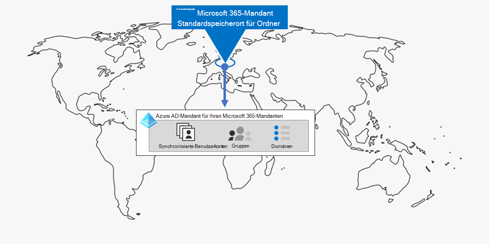
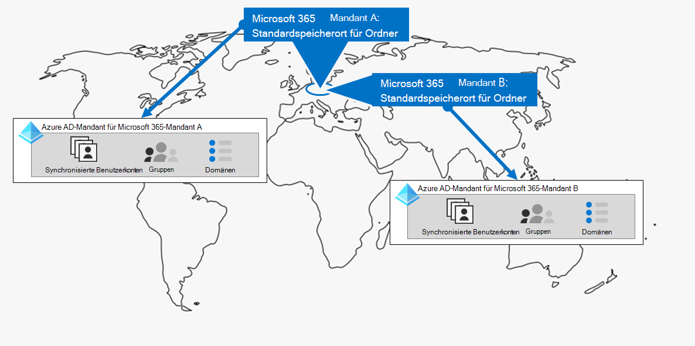
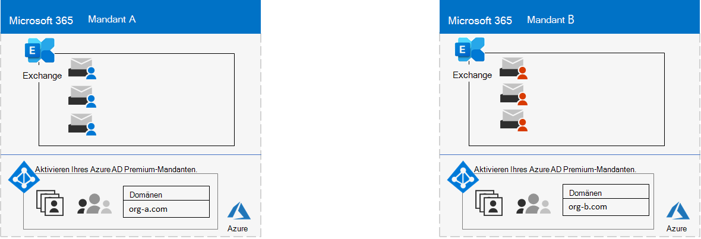
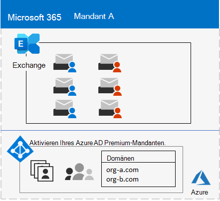
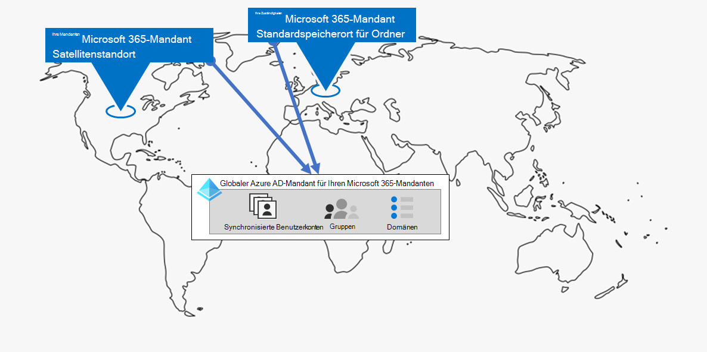
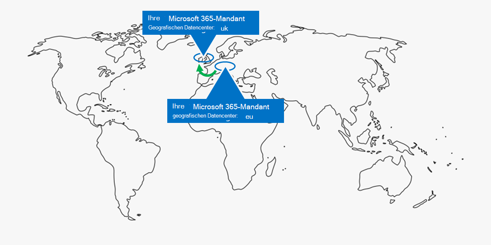
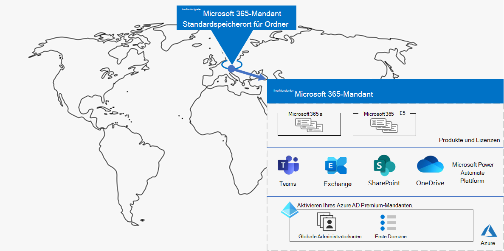
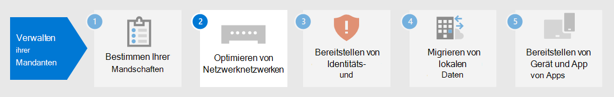

# Schritt 1. Ihre Microsoft 365 für Enterprise-Mandanten

Eine Ihrer ersten Mandantenentscheidungen ist, wie viele sie haben müssen. Jeder Microsoft 365 Mandanten ist unterschiedlich, eindeutig und von allen anderen Mandanten Microsoft 365 getrennt. Der entsprechende Azure AD-Mandant ist auch unterschiedlich, eindeutig und von allen anderen mandanten Microsoft 365 getrennt.

## Einzelner Mandant
Die Verwendung eines einzelnen Mandanten vereinfacht viele Aspekte der Verwendung von Microsoft 365. Ein einzelner Mandant bedeutet einen einzelnen Azure AD-Mandanten mit einem einzigen Satz von Konten, Gruppen und Richtlinien. Berechtigungen und die Freigabe von Ressourcen in Ihrer Organisation können über diesen zentralen Identitätsanbieter durchgeführt werden.

Ein einzelner Mandant bietet den Benutzern die funktionsreichste und vereinfachte Zusammenarbeit und Produktivität.

Im Folgenden finden Sie ein Beispiel, das den Standardspeicherort und den Azure AD-Mandanten eines Microsoft 365 zeigt.

## Mehrere Mandanten

Es gibt viele Gründe, warum Ihre Organisation mehrere Mandanten haben könnte:

- Administrative Isolation
- Dezentralisierte IT
- Historische Entscheidungen
- Fusionen, Übernahmen oder Abkäufe
- Klare Trennung des Brandings für Mischkonzerne
- Vorproduktions-, Test- oder Sandkasten-Mandanten

Hier ist ein Beispiel für eine Organisation mit zwei Mandanten (Mandant A und Mandant B) im gleichen Standarddatencenter-Geo. Jeder Mandant als separater Azure AD-Mandant.

Wenn Sie über mehrere Mandanten verfügen, gibt es Einschränkungen und zusätzliche Überlegungen beim Verwalten und Bereitstellen von Diensten für Ihre Benutzer.

### Zusammenarbeit zwischen Mandanten

Wenn Sie möchten, dass Ihre Benutzer auf sichere Weise zwischen verschiedenen Microsoft 365-Mandanten zusammenarbeiten, umfassen optionen für die mandantenübergreifende Zusammenarbeit die Verwendung eines zentralen Speicherorts für Dateien und Unterhaltungen, die Freigabe von Kalendern, die Verwendung von Chats, Audio-/Videoanrufe für die Kommunikation und das Sichern des Zugriffs auf Ressourcen und Anwendungen.

Weitere Informationen finden Sie unter [Microsoft 365 Zusammenarbeit zwischen Mandanten.](../enterprise/microsoft-365-inter-tenant-collaboration.md)

### Mandantenübergreifende Postfachmigration (Vorschau)

Vor der mandantenübergreifenden Postfachmigration (in der Vorschau) müssen Sie beim Verschieben von Exchange Online Postfächern zwischen Mandanten ein Benutzerpostfach vollständig aus dem aktuellen Mandanten (dem Quell-Mandanten) in den lokalen Mandanten verschieben und dann in einen neuen Mandanten (den Ziel mandanten) integrieren. Mit dem neuen mandantenübergreifenden Migrationsfeature können Mandantenadministratoren sowohl in Quell- als auch in Ziel mandanten Postfächer zwischen den Mandanten mit minimalen Infrastrukturabhängigkeiten in ihren lokalen Systemen verschieben. Dadurch wird die Notwendigkeit von Off-Board- und Onboardpostfächern entfernt.

Hier sind zwei Beispiel-Mandanten und ihre Postfächer vor der mandantenübergreifenden Postfachmigration.

In dieser Abbildung verfügen zwei separate Mandanten über eigene Domänen und eine Reihe von Exchange Postfächern.

Hier ist der Ziel-Mandant (Mandant A) nach der mandantenübergreifenden Postfachmigration.

In dieser Abbildung verfügt ein einzelner Mandant sowohl über Domänen als auch über beide Exchange Postfächer.

Weitere Informationen finden Sie unter [Mandantenübergreifende Postfachmigration](../enterprise/cross-tenant-mailbox-migration.md).

### Migrationen zwischen Mandanten

Es gibt verschiedene Architekturansätze für Fusionen, Übernahmen, Abgänge und andere Szenarien, die Sie dazu führen können, einen vorhandenen Microsoft 365 mandanten zu einem neuen Mandanten zu migrieren. 

Ausführliche Anleitungen finden Sie [unter Microsoft 365 Mandantenmigrationen](../enterprise/microsoft-365-tenant-to-tenant-migrations.md).

## Multi-Geo für einen Mandanten

Mit Microsoft 365 Multi-Geo können Sie Ruhedaten an den anderen geografischen Standorten des Rechenzentrums bereitstellen und speichern, die Sie ausgewählt haben, um die Anforderungen an die Datenresidenz zu erfüllen, und gleichzeitig Ihr globales Rollout moderner Produktivitätserfahrungen für Ihre Mitarbeiter entsperren.

In einer Multi-Geo-Umgebung besteht ihr Microsoft 365 aus einem Standard- oder zentralen Standort, an dem Ihr Microsoft 365-Abonnement ursprünglich erstellt wurde, und einem oder mehreren Satellitenstandorten. In einem Multi-Geo-Mandanten werden die Informationen zu geografischen Standorten, Gruppen und Benutzerinformationen in einem globalen Azure AD-Mandanten gemastert. Da Ihre Mandanteninformationen zentral gemastert und mit jedem geografischen Standort synchronisiert werden, werden Die Zusammenarbeitserfahrungen, an denen alle Personen aus Ihrem Unternehmen beteiligt sind, über die Standorte hinweg gemeinsam genutzt.

Im Folgenden finden Sie ein Beispiel für eine Organisation mit ihrem Standardstandort in Europa und einem Satellitenstandort in Nordamerika. Beide Standorte teilen sich denselben globalen Azure AD-Mandanten für den einzelnen Microsoft 365 Mandanten.

Mehr dazu unter [Microsoft 365 Multi-Geo](../enterprise/microsoft-365-multi-geo.md).

## Verschieben von Kerndaten in einen neuen Geografischen Datencenter

Microsoft öffnet weiterhin neue Datencenter-Geos für Microsoft 365 Dienste. Diese neuen Rechenzentrumsregionen erweitern Kapazitäten und Rechenleistung zur Unterstützung unserer laufenden Kundennachfrage und des Nutzungswachstums. Darüber hinaus bieten die neuen Rechenzentrumsregionen die Aufbewahrung von Kundenkerndaten innerhalb der Geografie.

Auch wenn das Öffnen eines neuen Geocenters keine Auswirkungen auf Sie und Ihre Kerndaten hat, die in einem bereits vorhandenen Rechenzentrums-Geo gespeichert sind, können Sie mit Microsoft eine frühzeitige Migration der ruhenden Kernkundendaten Ihrer Organisation zu einem neuen Geografischen Datencenter anfordern.

Hier ist ein Beispiel, in dem ein Microsoft 365 mandanten aus dem Geografischen Rechenzentrum der Europäischen Union (EU) in das Rechenzentrum im Vereinigten Königreich (Großbritannien) verschoben wurde.

Weitere Informationen finden Sie unter [Moving core data to new Microsoft 365 datacenter geos](../enterprise/moving-data-to-new-datacenter-geos.md).

## Produkte und Lizenzen für einen Mandanten

Ihr Microsoft 365-Mandant wird erstellt, wenn Sie Ihr erstes Produkt erwerben, z. B. Microsoft 365 E3. Zusammen mit dem Produkt sind Lizenzen, die eine monatliche oder jährliche Gebühr in Rechnung gestellt werden. Ein Administrator weist dann eine verfügbare Lizenz aus einem Ihrer Produkte einem Benutzerkonto zu, entweder direkt oder über die Gruppenmitgliedschaft. Je nach den Geschäftlichen Anforderungen Ihrer Organisation verfügen Sie möglicherweise über eine Reihe von Produkten, die jeweils über einen eigenen Pool von Lizenzen verfügen. 

Für die Bestimmung des Satz von Produkten und der Anzahl der Lizenzen für die einzelnen Produkte ist eine gewisse Planung erforderlich:

- Stellen Sie sicher, dass Sie über genügend Lizenzen für die Benutzerkonten verfügen, die erweiterte Features benötigen.
- Verhindern Sie, dass Ihnen lizenzen oder zu viele nicht zugewiesene Lizenzen aufgrund von Personaländerungen in Ihrer Organisation nicht zugewiesen werden.

## Ergebnisse von Schritt 1

Für Ihre Microsoft 365 für Enterprise-Mandanten haben Sie ermittelt:

- Wie viele Mandanten Sie haben oder benötigen.
- Für jeden Mandanten, welche Produkte und Lizenzen erworben werden müssen.
- Gibt an, ob ein Mandant Multi-Geo sein muss, um die Anforderungen an die Datenresidenz zu erfüllen.
- Gibt an, ob Sie eine mandantenübergreifende Zusammenarbeit einrichten müssen.
- Gibt an, ob Sie einen Mandanten zu einem anderen migrieren müssen.
- Gibt an, ob Sie Kerndaten aus einem Geografischen Datencenter in ein neues verschieben müssen.

Hier ist ein Beispiel für einen neuen Mandanten.

In dieser Abbildung verfügt der Mandant über:

- Ein Standardspeicherort, der einem geografischen Microsoft 365 datencenter entspricht.
- Eine Reihe von Produkten und Lizenzen.
- Der Satz von Cloudproduktivitäts-Apps, von denen einige spezifisch für Produkte sind.
- Ein Azure AD-Mandant, der globale Administratorkonten und einen anfänglichen DNS-Domänennamen enthält.

Wenn wir die zusätzlichen Schritte dieser Lösung durchziehen, werden wir diese Abbildung erstellen.

## Laufende Wartung für Mandanten

Auf fortlaufender Basis müssen Sie möglicherweise:

- Fügen Sie einen neuen Mandanten hinzu.
- Fügen Sie einem Mandanten mit einer anfänglichen Anzahl von Lizenzen neue Produkte hinzu.
- Ändern Sie den Satz von Lizenzen für ein Produkt in einem Mandanten, um die sich ändernden Personalanforderungen anzupassen.
- Verschieben Sie Ihre Kerndaten von einem Mandanten an einen neuen geografischen Standort des Rechenzentrums.
- Add Multi-Geo for data residency requirements.
- Einrichten der mandantenübergreifenden Zusammenarbeit.

## Nächster Schritt

Fahren Sie mit [dem Netzwerk](tenant-management-networking.md) fort, um optimale Netzwerke von Ihren Mitarbeitern zu Microsoft 365 bereitstellen.
