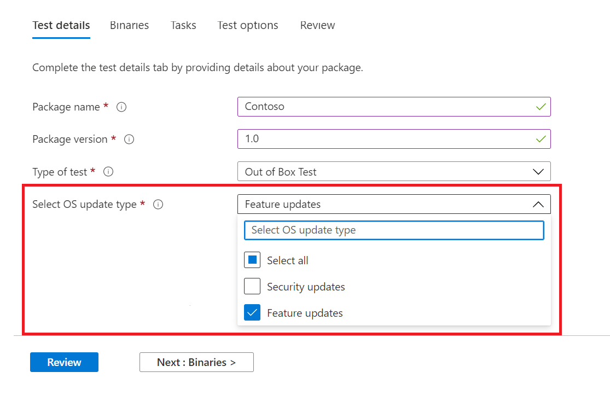

# <a name="windows-feature-update-validation"></a>Windows Überprüfung von Funktionsupdates

Benötigen Sie Einblicke in die Leistung Ihrer Anwendungen mit der nächsten Version von Windows 10 oder Windows 11 – ohne dass Sie eine Umgebung zum Überprüfen neuer Windows Features verwalten? 

Möchten Sie Ihre Validierungstests für Windows Insider-Programm-Builds in unserer Azure-Umgebung ausführen?

Die Validierung von **Funktionsupdates** auf der Testbasis für M365 kann Ihnen dabei helfen, all diese und mehr zu erreichen!

Sehen Sie sich die Schritt-für-Schritt-Gliederung unten an, um herauszufinden, wie Sie auf diese neue Funktion in Test Base für M365-Dienst zugreifen können.

Laden Sie ```Feature update validation``` Ihre Anwendungen (und zugehörige Dateien) über das Self-Service-Onboarding-Portal hoch, um mit der Testbasis für M365 zu beginnen. 

Nachfolgend sind die Schritte aufgeführt, die Sie ausführen müssen, wenn Sie die **Testdetails** ausfüllen:

1. Wählen Sie **"Funktionsupdate"** als Betriebssystemupdatetyp aus:



2. Wählen Sie den Windows Insider-Kanal aus, für den Ihre Anwendung überprüft werden soll.  


3. Wählen Sie eine In-Market-Version von Windows 10 oder Windows 11 als Basis für Ihren Test (und die resultierenden Erkenntnisse!) aus, und geben Sie die weiteren Details an, die zum erfolgreichen Onboarding Ihres Pakets erforderlich sind.


4. Um die Ergebnisse aus der Überprüfung Ihrer Anwendung für vorab veröffentlichte Windows 10 Featureupdates anzuzeigen, besuchen Sie die ```Feature Updates Test Results``` .


## <a name="next-steps"></a>Nächste Schritte

Wechseln Sie zum nächsten Artikel, um mit dem Verständnis der Memory-Regressionsanalyse zu beginnen.
> [!div class="nextstepaction"]
> [Nächster Schritt](memory.md)

<!---
Add button for next page
-->
