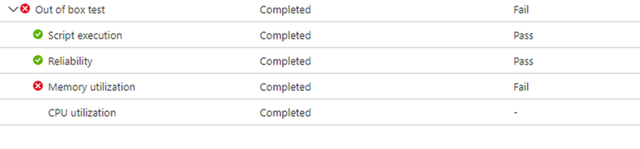
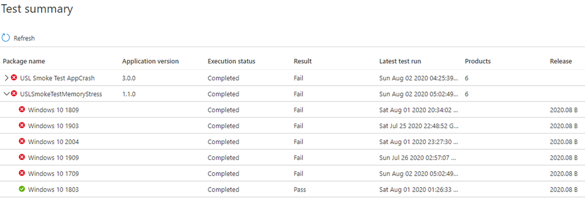

# <a name="memory-regression-analysis"></a><span data-ttu-id="90c26-103">Analyse der Speicherregression</span><span class="sxs-lookup"><span data-stu-id="90c26-103">Memory Regression Analysis</span></span>

<span data-ttu-id="90c26-104">Die Testbasis hilft Ihnen dabei, deutlich zu erkennen, dass die Auslastung des Arbeitsspeichers bei den virtuellen Testcomputern, auf denen Ihre Apps ausgeführt werden, deutlich zunimmt.</span><span class="sxs-lookup"><span data-stu-id="90c26-104">Test Base helps you more clearly notice significant memory usage increases in the test VMs running your apps.</span></span> <span data-ttu-id="90c26-105">Leistungsmetriken, z. B. die Speichernutzung, können ein Indikator für die allgemeine Anwendungsintegrität sein, und wir glauben, dass diese Ergänzung die optimale Leistung Ihrer Apps erheblich verbessern wird.</span><span class="sxs-lookup"><span data-stu-id="90c26-105">Performance metrics, such as memory usage, can be indicative of overall application health and we believe this addition will greatly help keep your apps performing optimally.</span></span>

<span data-ttu-id="90c26-106">Lesen Sie weiter, um weitere Details zu erhalten, oder sehen Sie sich dieses Video an, um einen kurzen Überblick über die neuesten Verbesserungen zu erhalten.</span><span class="sxs-lookup"><span data-stu-id="90c26-106">Read on for more details or watch this video for a quick walk through of the latest improvements.</span></span> 

<span data-ttu-id="90c26-107">Weitere Informationen zur Fähigkeit der Testbasis für M365 zur Unterstützung der Regressionsanalyse finden Sie unter Regressionsergebnisse basierend auf der Prozesszulässigkeit.</span><span class="sxs-lookup"><span data-stu-id="90c26-107">For more information on Test Base for M365's ability to help with regression analysis, see Regression results based on process reliability.</span></span>

<span data-ttu-id="90c26-108"><b>Genauerer Blick auf Speicherregressionen</b></span><span class="sxs-lookup"><span data-stu-id="90c26-108"><b>Looking closer at memory regressions</b></span></span>

<span data-ttu-id="90c26-109">Das Dashboard "TestBasis für M365" zeigt den von Ihrer Anwendung verbrauchten Speicher auf einer neuen vorab veröffentlichten Windows-Aktualisierung an und vergleicht ihn mit dem Speicher, der vom letzten freigegebenen Windows-Update verwendet wurde.</span><span class="sxs-lookup"><span data-stu-id="90c26-109">The Test Base for M365 dashboard shows the memory consumed by your application on a new pre-released Windows update and compares it with the memory used by the last released Windows update.</span></span> 

<span data-ttu-id="90c26-110">Mit den Verbesserungen dieses Monats wird die Speicherregressionsanalyse nun in Ihren bevorzugten Prozessen vorgestellt.</span><span class="sxs-lookup"><span data-stu-id="90c26-110">With this month’s enhancements, memory regression analysis is now featured in your favorited processes.</span></span> <span data-ttu-id="90c26-111">Anwendungen können mehrere Prozesse enthalten, und Sie können Ihre bevorzugten Prozesse manuell über die Registerkarte "Zuverlässigkeit" auswählen. Unser Dienst identifiziert dann Speicherregressionen in diesen bevorzugten Prozessen, während Testläufe in verschiedenen Windows Updateversionen verglichen werden.</span><span class="sxs-lookup"><span data-stu-id="90c26-111">Applications can contain multiple processes and you can manually select your favorite processes through the Reliability tab. Our service will then identify memory regressions in these favorited processes while comparing test runs across different Windows update releases.</span></span> <span data-ttu-id="90c26-112">Wenn eine Regression erkannt wird, sind Details zur Regression leicht verfügbar.</span><span class="sxs-lookup"><span data-stu-id="90c26-112">If a regression is detected, details about the regression are easily available.</span></span>

<span data-ttu-id="90c26-113">Sehen wir uns dieses Feature nun genauer an und erläutern, wie Sie Mithilfe von Windows Performance Analyzer Speicherregressionen beheben können.</span><span class="sxs-lookup"><span data-stu-id="90c26-113">Now let's look at this feature in detail and discuss how you can troubleshoot memory regressions using Windows Performance Analyzer.</span></span>

<span data-ttu-id="90c26-114">Das durch eine Speicherregression verursachte Fehlersignal wird im Dashboard "TestBasis für M365" auf der Seite "Testergebnisse" unter "Speicherauslastung" angezeigt:</span><span class="sxs-lookup"><span data-stu-id="90c26-114">The failure signal caused by a memory regression is shown in the Test Base for M365 dashboard on the Test results page under Memory Utilization:</span></span>




<span data-ttu-id="90c26-116">Fehler für die Anwendung aufgrund einer höheren Speicherauslastung, wird auch wie ```Fail``` auf der Seite "Testzusammenfassung" angezeigt:</span><span class="sxs-lookup"><span data-stu-id="90c26-116">Failure for the application due to higher memory consumption, will also be displayed as ```Fail``` on the Test Summary page:</span></span>



<span data-ttu-id="90c26-118">Indem wir diese Fehlersignale vorab bereitstellen, ist es unser Ziel, potenzielle Probleme deutlich zu kennzeichnen, die die Endbenutzererfahrung für Ihre Anwendung stören und beeinträchtigen können.</span><span class="sxs-lookup"><span data-stu-id="90c26-118">By providing these failure signals upfront, our goal is to clearly flag potential issues that can disrupt and impact the end user experience for your application.</span></span> 

<span data-ttu-id="90c26-119">Anschließend können Sie die Protokolldateien herunterladen und die Windows Performance Analyzer oder Ihr bevorzugtes Toolkit verwenden, um weitere Untersuchungen auszuführen.</span><span class="sxs-lookup"><span data-stu-id="90c26-119">You can then download the log files and use the Windows Performance Analyzer, or your preferred toolkit, to investigate further.</span></span> <span data-ttu-id="90c26-120">Sie können auch gemeinsam mit dem Test Base für M365-Team an der Behebung des Problems arbeiten und probleme vermeiden, die sich auf Endbenutzer auswirken.</span><span class="sxs-lookup"><span data-stu-id="90c26-120">You can also work jointly with the Test Base for M365 team on remediating the issue and help prevent issues impacting end users.</span></span>

<span data-ttu-id="90c26-121">Speichersignale werden auf der Registerkarte "Speicherauslastung" im Test base für M365-Dienst für alle Testläufe erfasst.</span><span class="sxs-lookup"><span data-stu-id="90c26-121">Memory signals are captured in the Memory Utilization tab in the Test Base for M365 service for all test runs.</span></span> <span data-ttu-id="90c26-122">Das folgende Beispiel zeigt eine kürzlich ausgeführte Testausführung mit der integrierten Anwendung "Memory Stress beim Qualmtest" gegen das Sicherheitsupdate vom August 2020 in der Vorabversion.</span><span class="sxs-lookup"><span data-stu-id="90c26-122">The example below shows a recent test run with the onboarded application “Smoke Test Memory Stress” against the pre-release August 2020 security update.</span></span> <span data-ttu-id="90c26-123">(Diese Anwendung wurde von unserem Team geschrieben, um Speicherregressionen zu veranschaulichen.)</span><span class="sxs-lookup"><span data-stu-id="90c26-123">(This application was written by our team to illustrate memory regressions.)</span></span>


<span data-ttu-id="90c26-125">In diesem Beispiel hat der Bevorzugte Prozess "USLTestMemoryStress.exe" im Vergleich zum veröffentlichten Juli-Update durchschnittlich ca. 100 MB für das August-Update vor der Veröffentlichung genutzt, daher hat die Testbasis für M365 eine Regression identifiziert.</span><span class="sxs-lookup"><span data-stu-id="90c26-125">In this example, the favorite process “USLTestMemoryStress.exe” process consumed an average of approximately 100 MB on the pre-release August update compared to the released July update, hence the Test Base for M365 identified a regression.</span></span> 

<span data-ttu-id="90c26-126">Die anderen Prozesse – hier als "USLTestMemoryStress_Aux1.exe" und "USLTestMemoryStress_Aux2.exe" dargestellt – gehören ebenfalls zur gleichen Anwendung, verbrauchten jedoch ungefähr die gleiche Menge an Arbeitsspeicher für die beiden Versionen, sodass sie "übergeben" wurden und als fehlerfrei betrachtet wurden.</span><span class="sxs-lookup"><span data-stu-id="90c26-126">The other processes—shown here as “USLTestMemoryStress_Aux1.exe” and “USLTestMemoryStress_Aux2.exe”—also belong to the same application, but consumed approximately the same amount of memory for the two releases so they "passed" and were considered healthy.</span></span>

<span data-ttu-id="90c26-127">Die Regression im Hauptprozess wurde als "statistische Bedeutung" ermittelt, sodass der Dienst diesen Unterschied für den Benutzer kommuniziert und hervorgehoben hat.</span><span class="sxs-lookup"><span data-stu-id="90c26-127">The regression on the main process was determined to be “statistically significant” so the service communicated and highlighted this difference to the user.</span></span> <span data-ttu-id="90c26-128">Wenn der Vergleich nicht von statistischer Bedeutung wäre, würde er nicht hervorgehoben.</span><span class="sxs-lookup"><span data-stu-id="90c26-128">If the comparison was not statistically significant, it would not be highlighted.</span></span> <span data-ttu-id="90c26-129">Die Speicherauslastung kann laut sein, daher verwenden wir statistische Modelle, um zwischen Builds und Versionen sinnvolle Unterschiede von unwichtigen Unterschieden zu unterscheiden.</span><span class="sxs-lookup"><span data-stu-id="90c26-129">Memory utilization can be noisy, so we use statistical models to distinguish, across builds and releases, meaningful differences from inconsequential differences.</span></span> 

<span data-ttu-id="90c26-130">Ein Vergleich kann selten gekennzeichnet werden, wenn kein wahrer Unterschied (ein falsch positives Ergebnis) vorliegt. Dies ist jedoch ein notwendiger Kompromiss, um die Wahrscheinlichkeit einer korrekten Identifizierung von Regressionen (oder wahr positiven Ergebnissen) zu verbessern.</span><span class="sxs-lookup"><span data-stu-id="90c26-130">A comparison may rarely be flagged when there is no true difference (a false positive), but this is a necessary tradeoff to improve the likelihood of correctly identifying regressions (or true positives.)</span></span>

<span data-ttu-id="90c26-131">Der nächste Schritt besteht darin, zu verstehen, was die Speicherregression verursacht hat.</span><span class="sxs-lookup"><span data-stu-id="90c26-131">The next step is to understand what caused the memory regression.</span></span> <span data-ttu-id="90c26-132">Sie können die ZIP-Dateien für beide Ausführungen wie unten dargestellt über die Option "Protokolldateien herunterladen" herunterladen.</span><span class="sxs-lookup"><span data-stu-id="90c26-132">You can download the zip files for both executions from the Download log files option, as shown below.</span></span> 

<span data-ttu-id="90c26-133">Diese ZIP-Dateien enthalten die Ergebnisse Ihrer Testausführung, einschließlich Skriptergebnisse sowie Speicher- und CPU-Leistungsdaten, die in der ETL-Datei enthalten sind.</span><span class="sxs-lookup"><span data-stu-id="90c26-133">These zip files contain the results of your test run, including script results and memory and CPU performance data which is included in the ETL file.</span></span>


<span data-ttu-id="90c26-135">Sie können die Protokolle für die beiden Testläufe herunterladen und entzippen, dann die ETL-Datei in jedem Ordner suchen und sie in "target.etl" (für den Testlauf im Vorabversionsupdate) und "baseline.etl" (für den Testlauf auf dem letzten veröffentlichten Update) umbenennen, um die Untersuchung und Navigation zu vereinfachen.</span><span class="sxs-lookup"><span data-stu-id="90c26-135">You can download and unzip the logs for the two test runs, then locate the ETL file within each folder and rename them as target.etl (for the test run on the pre-release update) and baseline.etl (for the test run on last released update) to simplify exploration and navigation.</span></span>
 
## <a name="next-steps"></a><span data-ttu-id="90c26-136">Nächste Schritte</span><span class="sxs-lookup"><span data-stu-id="90c26-136">Next steps</span></span>

<span data-ttu-id="90c26-137">Beginnen Sie mit dem nächsten Artikel, um mit dem Verständnis der intelligenten CPU-Regressionsanalyse zu beginnen.</span><span class="sxs-lookup"><span data-stu-id="90c26-137">Advance to the next article to get started with understanding intelligent CPU regression analysis.</span></span>
> [!div class="nextstepaction"]
> [<span data-ttu-id="90c26-138">Nächster Schritt</span><span class="sxs-lookup"><span data-stu-id="90c26-138">Next step</span></span>](cpu.md)

<!---
Add button for next page
-->
