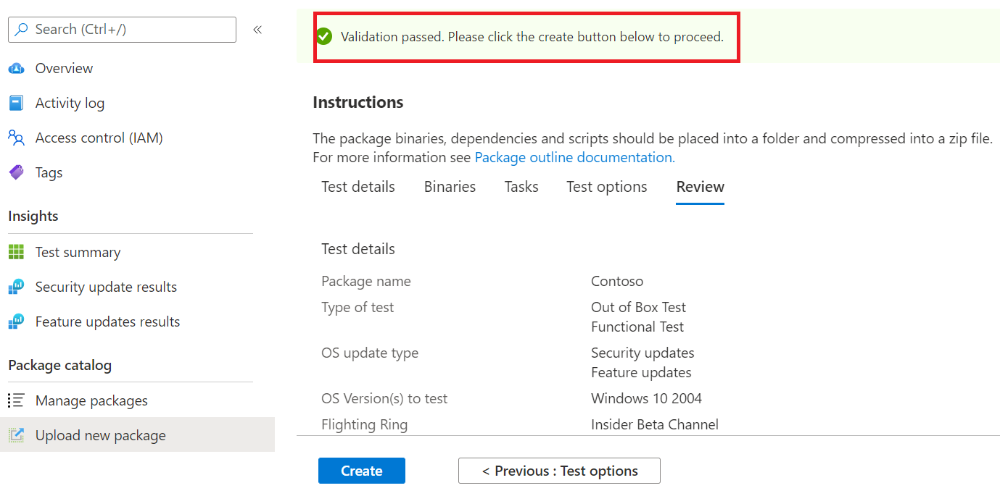

# <a name="step-6-review-your-selections-to-create-your-package"></a>Schritt 6: Überprüfen Sie Ihre Auswahl, um Ihr Paket zu erstellen.

1.  Auf dieser Registerkarte zeigt der Dienst Ihre Testdetails an und führt eine schnelle Überprüfung der Vollständigkeit aus. 

    Eine ```Validation passed``` oder eine Meldung zeigt ```Validation failed``` an, ob Sie mit den nächsten Schritten fortfahren können oder nicht.

2.  Überprüfen Sie Ihre Testdetails, und klicken Sie auf die Schaltfläche, wenn Sie zufrieden ```Create``` sind. 



3.  Dadurch wird ihr Paket in die Testbasisumgebung integriert. Wenn Ihr Paket erfolgreich erstellt wurde, wird ein automatisierter Test ausgelöst, der überprüft, ob Ihr Paket erfolgreich in Azure ausgeführt werden kann.


> [!Note]
> Sie erhalten eine Benachrichtigung vom Azure-Portal, um Sie über den Erfolg oder Misserfolg der Paketüberprüfung zu benachrichtigen. 
>
> Bitte beachten Sie, dass der Vorgang bis zu 24 Stunden dauern kann. Daher ist es wahrscheinlich, dass ihre Webseite ein Timeout aufweist, wenn Sie nicht aktiv sind. Daher werden Sie in der Benachrichtigung nicht über den Abschluss dieser Ausführung bei Bedarf informiert. 

  - Wenn dies geschieht, können Sie den Status Ihres Pakets auf der ```Manage packages``` Registerkarte anzeigen.


  - Bei erfolgreichen Tests können die Ergebnisse über die ```Test Summary``` ```Security Updates Results``` Seiten in ```Feature Updates Results``` geplanten Intervallen angezeigt werden, die häufig einige Tage nach dem Upload beginnen.
  
  - Bei fehlgeschlagenen Tests müssen Sie ein neues Paket hochladen. 
  
    Sie können die ```test logs``` zur weiteren Analyse von " und den Seiten ```Security update results``` ```Feature updates results``` herunterladen.

  - Wenn wiederholte Testfehler auftreten, wenden Sie sich an testbasepreview@microsoft.com, um Details zu Ihrem Fehler zu erhalten. 

## <a name="next-steps"></a>Nächste Schritte

Entdecken Sie unsere Inhaltsrichtlinien über den folgenden Link.
> [!div class="nextstepaction"]
> [Nächster Schritt](contentguideline.md)
