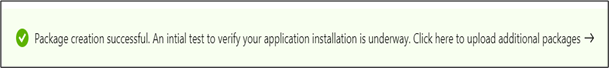

# <a name="step-6-review-your-selections-to-create-your-package"></a><span data-ttu-id="6ca9b-103">Schritt 6: Überprüfen Sie Ihre Auswahl, um Ihr Paket zu erstellen.</span><span class="sxs-lookup"><span data-stu-id="6ca9b-103">Step 6: Review your selections to create your package.</span></span>

1.  <span data-ttu-id="6ca9b-104">Auf dieser Registerkarte zeigt der Dienst Ihre Testdetails an und führt eine schnelle Überprüfung der Vollständigkeit aus.</span><span class="sxs-lookup"><span data-stu-id="6ca9b-104">On this tab, the service displays your test details and runs a quick completeness check.</span></span> 

    <span data-ttu-id="6ca9b-105">Eine ```Validation passed``` oder eine Meldung zeigt ```Validation failed``` an, ob Sie mit den nächsten Schritten fortfahren können oder nicht.</span><span class="sxs-lookup"><span data-stu-id="6ca9b-105">A ```Validation passed``` or ```Validation failed``` message shows whether you can proceed to next steps or not.</span></span>

2.  <span data-ttu-id="6ca9b-106">Überprüfen Sie Ihre Testdetails, und klicken Sie auf die Schaltfläche, wenn Sie zufrieden ```Create``` sind.</span><span class="sxs-lookup"><span data-stu-id="6ca9b-106">Review your test details and if satisfied, click on the ```Create``` button.</span></span> 


3.  <span data-ttu-id="6ca9b-108">Dadurch wird ihr Paket in die Testbasisumgebung integriert.</span><span class="sxs-lookup"><span data-stu-id="6ca9b-108">This will onboard your package to the Test Base environment.</span></span> <span data-ttu-id="6ca9b-109">Wenn Ihr Paket erfolgreich erstellt wurde, wird ein automatisierter Test ausgelöst, der überprüft, ob Ihr Paket erfolgreich in Azure ausgeführt werden kann.</span><span class="sxs-lookup"><span data-stu-id="6ca9b-109">If your package is successfully created, an automated test which verifys whether your package can be successfully executed on Azure will be triggered.</span></span>



> [!Note]
> <span data-ttu-id="6ca9b-111">Sie erhalten eine Benachrichtigung vom Azure-Portal, um Sie über den Erfolg oder Misserfolg der Paketüberprüfung zu benachrichtigen.</span><span class="sxs-lookup"><span data-stu-id="6ca9b-111">You will get a notification from the Azure portal to notify you on the success or failure of the package verification.</span></span> 
>
> <span data-ttu-id="6ca9b-112">Bitte beachten Sie, dass der Vorgang bis zu 24 Stunden dauern kann. Daher ist es wahrscheinlich, dass ihre Webseite ein Timeout aufweist, wenn Sie nicht aktiv sind. Daher werden Sie in der Benachrichtigung nicht über den Abschluss dieser Ausführung bei Bedarf informiert.</span><span class="sxs-lookup"><span data-stu-id="6ca9b-112">Please note that the process can take up to 24 hours, so it is likely your webpage will timeout if you are not active on it and hence, the notification will not inform you of the completion of this on-demand run.</span></span> 

  - <span data-ttu-id="6ca9b-113">Wenn dies geschieht, können Sie den Status Ihres Pakets auf der ```Manage packages``` Registerkarte anzeigen.</span><span class="sxs-lookup"><span data-stu-id="6ca9b-113">Peradventure this happens, you can view the status of your package on the ```Manage packages``` tab.</span></span>


  - <span data-ttu-id="6ca9b-115">Bei erfolgreichen Tests können die Ergebnisse über die ```Test Summary``` ```Security Updates Results``` Seiten in ```Feature Updates Results``` geplanten Intervallen angezeigt werden, die häufig einige Tage nach dem Upload beginnen.</span><span class="sxs-lookup"><span data-stu-id="6ca9b-115">For succesful tests, their results can be seen via the ```Test Summary```, ```Security Updates Results``` and ```Feature Updates Results``` pages at scheduled intervals, often starting a few days after your upload.</span></span>
  
  - <span data-ttu-id="6ca9b-116">Bei fehlgeschlagenen Tests müssen Sie ein neues Paket hochladen.</span><span class="sxs-lookup"><span data-stu-id="6ca9b-116">While failed tests, require you to upload a new package.</span></span> 
  
    <span data-ttu-id="6ca9b-117">Sie können die ```test logs``` zur weiteren Analyse von " und den Seiten ```Security update results``` ```Feature updates results``` herunterladen.</span><span class="sxs-lookup"><span data-stu-id="6ca9b-117">You can download the ```test logs``` for further analysis from the ‘```Security update results``` and ```Feature updates results``` pages.</span></span>

  - <span data-ttu-id="6ca9b-118">Wenn wiederholte Testfehler auftreten, wenden Sie sich an testbasepreview@microsoft.com, um Details zu Ihrem Fehler zu erhalten.</span><span class="sxs-lookup"><span data-stu-id="6ca9b-118">If you experience repeated test failures, please reach out to testbasepreview@microsoft.com with details of your error.</span></span> 

## <a name="next-steps"></a><span data-ttu-id="6ca9b-119">Nächste Schritte</span><span class="sxs-lookup"><span data-stu-id="6ca9b-119">Next steps</span></span>

<span data-ttu-id="6ca9b-120">Entdecken Sie unsere Inhaltsrichtlinien über den folgenden Link.</span><span class="sxs-lookup"><span data-stu-id="6ca9b-120">Discover our Content Guidelines via the link below.</span></span>
> [!div class="nextstepaction"]
> [<span data-ttu-id="6ca9b-121">Nächster Schritt</span><span class="sxs-lookup"><span data-stu-id="6ca9b-121">Next step</span></span>](contentguideline.md)
