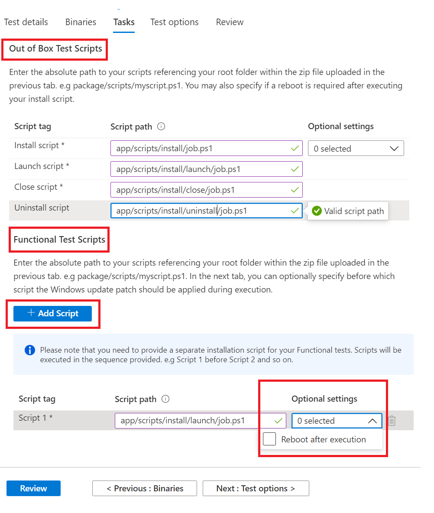

# <a name="step-4-the-tasks-tab"></a><span data-ttu-id="ea872-103">Schritt 4: Registerkarte "Aufgaben"</span><span class="sxs-lookup"><span data-stu-id="ea872-103">Step 4: The tasks tab</span></span>

<span data-ttu-id="ea872-104">Auf der Registerkarte "Aufgaben" müssen Sie die Pfade zu Ihren Testskripts angeben, die sich im ZIP-Ordner befinden, den Sie auf der Registerkarte "Binärdateien" hochgeladen haben.</span><span class="sxs-lookup"><span data-stu-id="ea872-104">On the tasks tab, you are expected to provide the paths to your test scripts which are in the zip folder you uploaded under the binaries tab.</span></span>

  - <span data-ttu-id="ea872-105">**Out-of-Box-Testskripts:** Geben Sie die relativen Pfade zu Ihren Installations-, Start-, Schließ- und Deinstallationsskripts ein.</span><span class="sxs-lookup"><span data-stu-id="ea872-105">**Out of Box Test Scripts:** Type in the relative paths to your install, launch, close and uninstall scripts.</span></span> <span data-ttu-id="ea872-106">Sie haben auch die Möglichkeit, zusätzliche Einstellungen für das Installationsskript auszuwählen.</span><span class="sxs-lookup"><span data-stu-id="ea872-106">You also have the option to select additional settings for the install script.</span></span>
  - <span data-ttu-id="ea872-107">**Funktionstestskripts:** Geben Sie den relativen Pfad zu jedem hochgeladenen Funktionstestskript ein.</span><span class="sxs-lookup"><span data-stu-id="ea872-107">**Functional Test Scripts:** Type in the relative path to each functional test script uploaded.</span></span> <span data-ttu-id="ea872-108">Mithilfe der Schaltfläche können zusätzliche funktionale Testskripts hinzugefügt ```Add Script``` werden.</span><span class="sxs-lookup"><span data-stu-id="ea872-108">Additional functional test scripts can be added using the ```Add Script``` button.</span></span> <span data-ttu-id="ea872-109">Sie benötigen mindestens ein Skript (1) und können bis zu acht (8) funktionale Testskripts hinzufügen.</span><span class="sxs-lookup"><span data-stu-id="ea872-109">You need a minimum of one (1) script and can add up to eight (8) functional test scripts.</span></span> 
  
    <span data-ttu-id="ea872-110">Die Skripts werden in der Uploadsequenz ausgeführt, und ein Fehler in einem bestimmten Skript hindert nachfolgende Skripts an der Ausführung.</span><span class="sxs-lookup"><span data-stu-id="ea872-110">The scripts are run in upload sequence and a failure in a particular script will stop subsequent scripts from executing.</span></span>
    <span data-ttu-id="ea872-111">Sie haben auch die Möglichkeit, zusätzliche Einstellungen für jedes bereitgestellte Skript auszuwählen.</span><span class="sxs-lookup"><span data-stu-id="ea872-111">You also have the option of selecting additional settings for each script provided.</span></span>

## <a name="set-script-path"></a><span data-ttu-id="ea872-112">Skriptpfad festlegen</span><span class="sxs-lookup"><span data-stu-id="ea872-112">Set script path</span></span>



<span data-ttu-id="ea872-114">Nachfolgend finden Sie ein Beispiel für die Bereitstellung des relativen Pfads für eine Ordnerstruktur:</span><span class="sxs-lookup"><span data-stu-id="ea872-114">Sample of how to provide the relative path on a folder structure is below:</span></span>

<span data-ttu-id="ea872-115">_**Zip_file_uploaded**_</span><span class="sxs-lookup"><span data-stu-id="ea872-115">_**Zip_file_uploaded**_</span></span>
~~~
├── file1.exe

├── ScriptX.ps1

├── folder1

│   ├── file3.exe

│   ├── script.ps1
~~~
  - <span data-ttu-id="ea872-116">**ScriptX.ps1.**</span><span class="sxs-lookup"><span data-stu-id="ea872-116">**ScriptX.ps1** would have.</span></span> <span data-ttu-id="ea872-117">_ScriptX.ps1_ als relativer Pfad.</span><span class="sxs-lookup"><span data-stu-id="ea872-117">_ScriptX.ps1_ as the relative path.</span></span>
  - <span data-ttu-id="ea872-118">**Script.ps1** würde _ordner1/script.ps1_ als relativen Pfad haben.</span><span class="sxs-lookup"><span data-stu-id="ea872-118">**Script.ps1** would have _folder1/script.ps1_ as the relative path.</span></span>


## <a name="next-steps"></a><span data-ttu-id="ea872-119">Nächste Schritte</span><span class="sxs-lookup"><span data-stu-id="ea872-119">Next steps</span></span>

<span data-ttu-id="ea872-120">Anzeigen von Details der Registerkarte "Testoptionen" im nächsten Artikel</span><span class="sxs-lookup"><span data-stu-id="ea872-120">View details of the Test Options tab in the next article</span></span> 
> [!div class="nextstepaction"]
> [<span data-ttu-id="ea872-121">Nächster Schritt</span><span class="sxs-lookup"><span data-stu-id="ea872-121">Next step</span></span>](testoptions.md)
