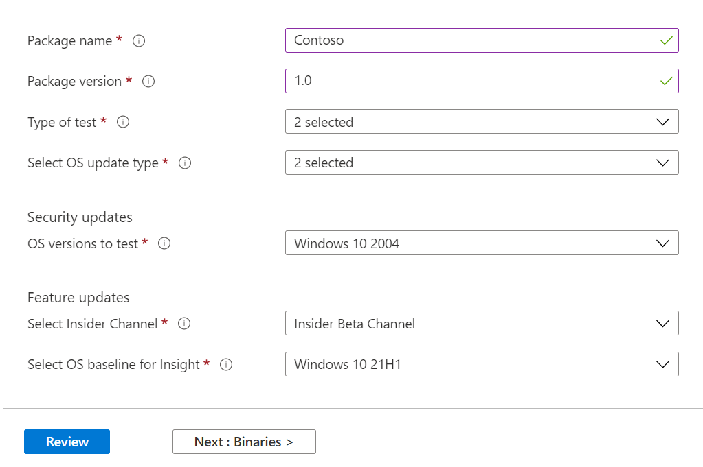

# <a name="step-2-uploading-a-package"></a><span data-ttu-id="23034-103">Schritt 2: Hochladen eines Pakets</span><span class="sxs-lookup"><span data-stu-id="23034-103">Step 2: Uploading a Package</span></span>

<span data-ttu-id="23034-104">Navigieren Sie auf der Seite "Testbasisportal" zur Option "Hochladen neues Paket" auf der linken Navigationsleiste, wie unten dargestellt: </span><span class="sxs-lookup"><span data-stu-id="23034-104">On the Test Base portal page, navigate to the ‘Upload new package option on the left navigation bar as shown below: </span></span>

<span data-ttu-id="23034-105">Führen Sie dort die folgenden Schritte aus, um ein neues Paket hochzuladen.</span><span class="sxs-lookup"><span data-stu-id="23034-105">Once there, follow the steps below to upload a new package.</span></span>

## <a name="enter-details-for-your-package"></a><span data-ttu-id="23034-106">Geben Sie Details für Ihr Paket ein.</span><span class="sxs-lookup"><span data-stu-id="23034-106">Enter details for your package</span></span>

<span data-ttu-id="23034-107">Geben Sie auf der Registerkarte "Testdetails" den Namen, die Version und andere Details des Pakets nach Bedarf ein.</span><span class="sxs-lookup"><span data-stu-id="23034-107">On the Test details tab, type in your package's name, version and other details as requested.</span></span> 

<span data-ttu-id="23034-108">**Out-of-Box-** und **Funktionstests** können über dieses Dashboard durchgeführt werden.</span><span class="sxs-lookup"><span data-stu-id="23034-108">**Out-of-Box** and **Functional testing** can be done via this dashboard.</span></span>

<span data-ttu-id="23034-109">Die folgenden Schritte enthalten eine Anleitung zum Ausfüllen ihrer Paketdetails:</span><span class="sxs-lookup"><span data-stu-id="23034-109">The steps below provides a guide on how to fill out your package details:</span></span>

1.  <span data-ttu-id="23034-110">**Geben Sie den Namen für ihr Paket in das ```“Package name``` Feld ein.**</span><span class="sxs-lookup"><span data-stu-id="23034-110">**Enter the name to be given your package in the ```“Package name``` field.**</span></span>

> [!Note]  
> <span data-ttu-id="23034-111">Der eingegebene Paketname und die eingegebene Versionskombination müssen innerhalb Ihrer Organisation eindeutig sein.</span><span class="sxs-lookup"><span data-stu-id="23034-111">The package name and version combination entered must be unique within your organization.</span></span> <span data-ttu-id="23034-112">Dies wird durch das Häkchen wie unten dargestellt überprüft.</span><span class="sxs-lookup"><span data-stu-id="23034-112">This is validated by the checkmark as shown below.</span></span>
  
  - <span data-ttu-id="23034-113">Wenn Sie den Namen eines Pakets wiederverwenden, muss die Versionsnummer eindeutig sein (d. h. nie mit einem Paket mit diesem bestimmten Namen verwendet).</span><span class="sxs-lookup"><span data-stu-id="23034-113">If you choose to re-use an package's name, then the version number must be unique (i.e. never been used with an package bearing that particular name).</span></span>
  - <span data-ttu-id="23034-114">Wenn die Kombination aus Paketname und Version die Eindeutigkeitsprüfung nicht besteht, wird die Fehlermeldung *"Paket mit dieser Paketversion ist bereits vorhanden" angezeigt.*</span><span class="sxs-lookup"><span data-stu-id="23034-114">If the combination of the package name + version does not pass the uniqueness check, you will see an error message which reads, *“Package with this package version already exists”*.</span></span> 


2. <span data-ttu-id="23034-116">**Geben Sie eine Version in das Feld "Paketversion" ein.**</span><span class="sxs-lookup"><span data-stu-id="23034-116">**Enter a version in the “Package version” field.**</span></span>


3.  <span data-ttu-id="23034-118">**Wählen Sie den Testtyp aus, den Sie für dieses Paket ausführen möchten.**</span><span class="sxs-lookup"><span data-stu-id="23034-118">**Select the type of test you want to run on this package**</span></span>

    <span data-ttu-id="23034-119">Bei einem **Out-of-Box (OOB)-Test** wird das Paket *installiert,* *gestartet,* *geschlossen* und *deinstalliert.*</span><span class="sxs-lookup"><span data-stu-id="23034-119">An **Out-of-Box (OOB)** test performs an *install*, *launch*, *close* and *uninstall* of your package.</span></span> <span data-ttu-id="23034-120">Nach der Installation wird die Start-Schließen-Routine 30 Mal wiederholt, bevor eine einzelne Deinstallation ausgeführt wird.</span><span class="sxs-lookup"><span data-stu-id="23034-120">After the install, the launch-close routine is repeated 30 times before a single uninstall is run.</span></span> 
    
    <span data-ttu-id="23034-121">Dieser OOB-Test bietet Ihnen standardisierte Telemetrie für Ihr Paket, die sie in Windows Builds vergleichen können.</span><span class="sxs-lookup"><span data-stu-id="23034-121">This OOB test provides you with standardized telemetry on your package to compare across Windows builds.</span></span>

    <span data-ttu-id="23034-122">Ein **Funktionstest** würde Ihre hochgeladenen Testskripts auf Ihrem Paket ausführen.</span><span class="sxs-lookup"><span data-stu-id="23034-122">A **Functional test** would execute your uploaded test script(s) on your package.</span></span> <span data-ttu-id="23034-123">Die Skripts werden in der Uploadsequenz ausgeführt, und ein Fehler in einem bestimmten Skript hindert nachfolgende Skripts an der Ausführung.</span><span class="sxs-lookup"><span data-stu-id="23034-123">The scripts are run in upload sequence and a failure in a particular script will stop subsequent scripts from executing.</span></span>

> [!Note]
> <span data-ttu-id="23034-124">**Alle** Skripts werden höchstens 80 Minuten lang ausgeführt.</span><span class="sxs-lookup"><span data-stu-id="23034-124">**All** scripts run for 80 minutes at the most.</span></span> 
    
4.  <span data-ttu-id="23034-125">**Auswählen des Betriebssystemupdatetyps**</span><span class="sxs-lookup"><span data-stu-id="23034-125">**Select the OS update type**</span></span>

   - <span data-ttu-id="23034-126">Mit den "Sicherheitsupdates" kann Ihr Paket gegen inkrementelle Änderungen von Windows monatlichen Sicherheitsupdates vor der Veröffentlichung getestet werden.</span><span class="sxs-lookup"><span data-stu-id="23034-126">The ‘Security updates’ enables your package to be tested against incremental churns of Windows pre-release monthly security updates.</span></span> 
   - <span data-ttu-id="23034-127">Die "Featureupdates" ermöglichen das Testen Ihres Pakets mit Windows halbjährlichen Vorabversionen von Featureupdates aus dem Windows-Insider-Programm.</span><span class="sxs-lookup"><span data-stu-id="23034-127">The ‘Feature updates’ enables your package to be tested against Windows pre-release bi-annual feature updates builds from the Windows Insider Program.</span></span>
<!---
Change to the correct picture
-->


5.  <span data-ttu-id="23034-129">**Wählen Sie die Betriebssystemversionen für Sicherheitsupdates aus.**</span><span class="sxs-lookup"><span data-stu-id="23034-129">**Select the OS version(s) for Security update tests.**</span></span>

<span data-ttu-id="23034-130">Wählen Sie in der Dropdownliste mit mehrfacher Auswahl die Betriebssystemversion(n) von Windows Ihr Paket installiert wird.</span><span class="sxs-lookup"><span data-stu-id="23034-130">In the multi-select dropdown, select the OS version(s) of Windows your package will be installed on.</span></span> 

  - <span data-ttu-id="23034-131">Um Ihr Paket nur mit Windows Client-OSes zu testen, wählen Sie in der Menüliste die zutreffenden Betriebssystemversionen Windows 11 aus.</span><span class="sxs-lookup"><span data-stu-id="23034-131">To test your package against Windows Client OSes only, select the applicable Windows 11 OS versions from the menu list.</span></span>
  - <span data-ttu-id="23034-132">Wenn Sie Ihr Paket nur mit Windows Server-OSes testen möchten, wählen Sie in der Menüliste die entsprechenden Windows Serverbetriebssystemversionen aus.</span><span class="sxs-lookup"><span data-stu-id="23034-132">To test your package against Windows Server OSes only, select the applicable Windows Server OS versions from the menu list.</span></span>
  - <span data-ttu-id="23034-133">Um Ihr Paket mit Windows Client- und Server-OSes zu testen, wählen Sie alle anwendbaren OSes aus der Menüliste aus.</span><span class="sxs-lookup"><span data-stu-id="23034-133">To test your package against Windows Client and Server OSes, select all applicable OSes from the menu list.</span></span> 

> [!Note]
> <span data-ttu-id="23034-134">Wenn Sie ihr Paket sowohl mit Server- als auch mit Client-OSes testen möchten, stellen Sie sicher, dass das Paket kompatibel ist und auf beiden OSes ausgeführt werden kann.</span><span class="sxs-lookup"><span data-stu-id="23034-134">If you select to test your package against both Server and Client OSes, please make sure that the package is compatible and can run on both OSes</span></span>


<!---
Change to the correct picture
-->
6.  <span data-ttu-id="23034-136">**Wählen Sie Optionen für Featureupdatetests aus:**</span><span class="sxs-lookup"><span data-stu-id="23034-136">**Select options for Feature update tests:**</span></span>

  - <span data-ttu-id="23034-137">Wählen Sie auf der Option "Insider-Kanal auswählen" den Build aus, auf ```Windows Insider Program Channel``` den Ihre Pakete getestet werden sollen.</span><span class="sxs-lookup"><span data-stu-id="23034-137">On the option to “Select Insider Channel”, select the ```Windows Insider Program Channel``` as the build which your packages should be tested against.</span></span>
  
    <span data-ttu-id="23034-138">Wir verwenden derzeit Builds mit Test-Flight im Insider Beta-Kanal.</span><span class="sxs-lookup"><span data-stu-id="23034-138">We currently use builds flighted in the Insider Beta Channel.</span></span>

  - <span data-ttu-id="23034-139">Wählen Sie bei der Option "BS-Basisplan für Insight auswählen" die Windows Betriebssystemversion aus, die als Basisplan für den Vergleich Ihrer Testergebnisse verwendet werden soll.</span><span class="sxs-lookup"><span data-stu-id="23034-139">On the option to “Select OS baseline for Insight”, select the Windows OS version to be used as a baseline in comparing your test results.</span></span> 

> [!Note]
> <span data-ttu-id="23034-140">Featureupdatetests für Server-OSes werden derzeit NICHT unterstützt.</span><span class="sxs-lookup"><span data-stu-id="23034-140">We DO NOT support Feature update testing for Server OSes at this time</span></span>
<!---
Note to actual note format for markdown
-->
<!---
Change to the correct picture
-->


7.  <span data-ttu-id="23034-142">Eine abgeschlossene Seite "Testdetails" sollte wie folgt aussehen:</span><span class="sxs-lookup"><span data-stu-id="23034-142">A completed Test details page should look like this:</span></span> 


## <a name="next-steps"></a><span data-ttu-id="23034-144">Nächste Schritte</span><span class="sxs-lookup"><span data-stu-id="23034-144">Next steps</span></span>

<span data-ttu-id="23034-145">Unser nächster Artikel behandelt das Hochladen Ihrer Binärdateien in unsere Serivce.</span><span class="sxs-lookup"><span data-stu-id="23034-145">Our next article covers Uploading your Binaries to our serivce.</span></span>
> [!div class="nextstepaction"]
> [<span data-ttu-id="23034-146">Nächster Schritt</span><span class="sxs-lookup"><span data-stu-id="23034-146">Next step</span></span>](binaries.md)

<!---
Add button for next page
-->

